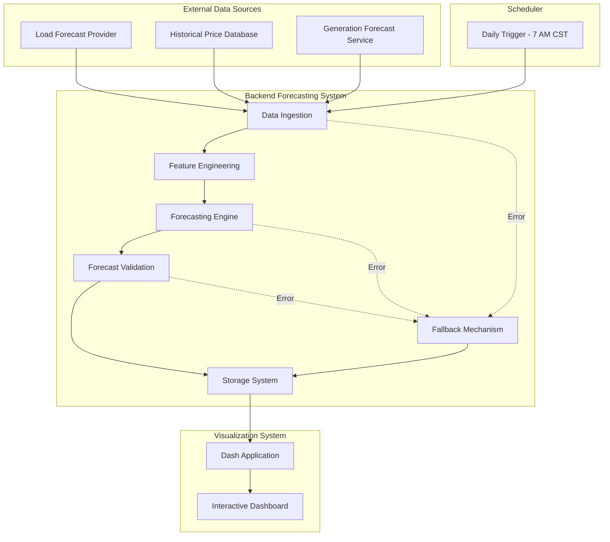
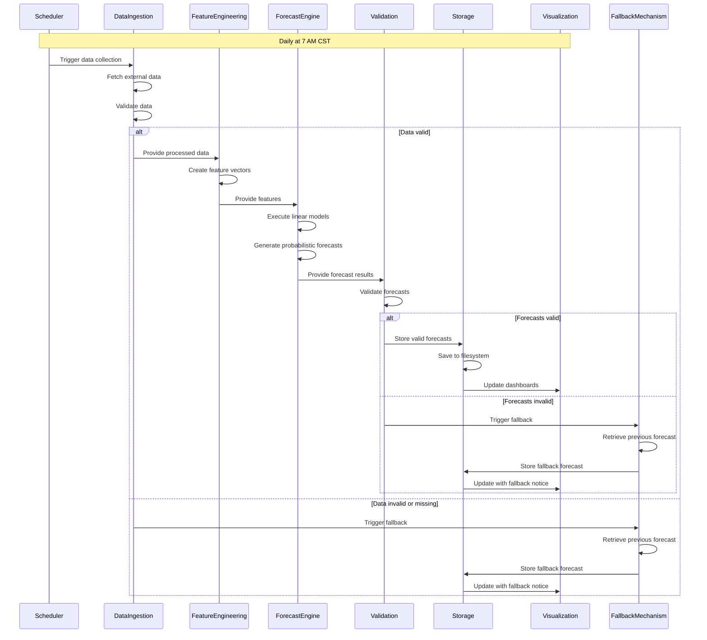
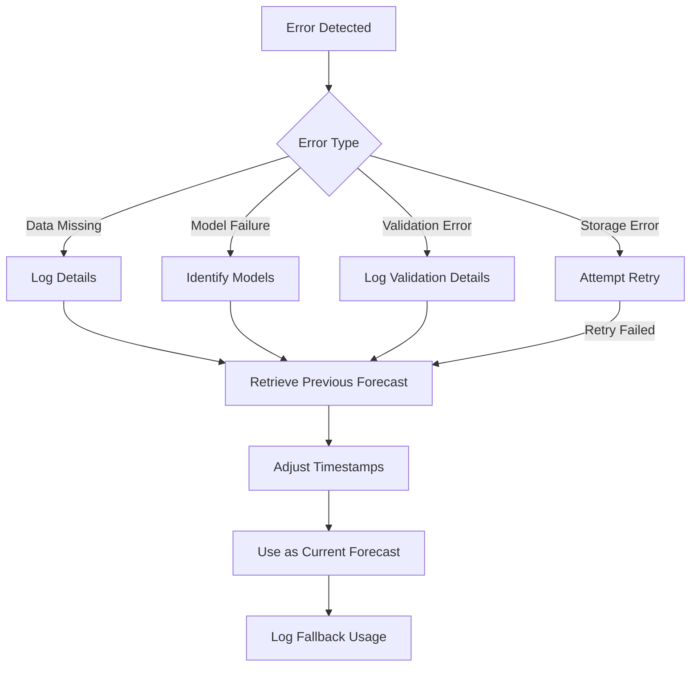
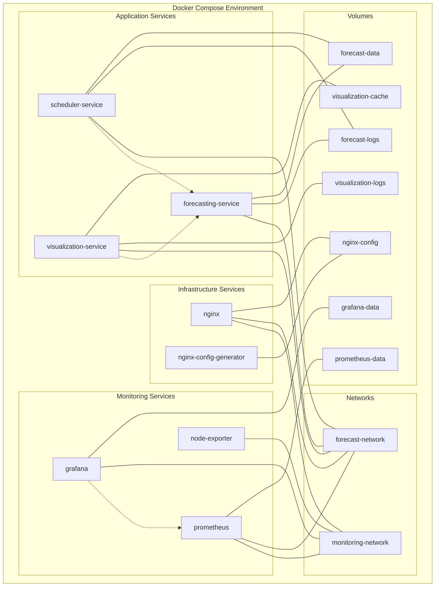

# Electricity Market Price Forecasting System Architecture

This document provides a comprehensive overview of the architecture for the Electricity Market Price Forecasting System, which generates probabilistic forecasts for electricity market prices with hourly granularity over a 72-hour horizon.

## 1. Architectural Overview

The system follows a functional programming approach with a modular pipeline architecture designed for reliability and maintainability. It operates as a scheduled batch process that runs daily at 7 AM CST to generate forecasts for the next 72 hours.

### 1.1 Architectural Style

The system uses a batch processing pipeline architecture with clear separation of concerns between data ingestion, processing, forecasting, and output generation. This aligns with the requirement for scheduled daily execution and functional programming approach.

### 1.2 Key Architectural Principles

- Functional composition of data transformations
- Stateless processing where possible
- Clear boundaries between system components
- Fallback mechanisms for reliability
- Schema validation for data quality assurance

### 1.3 System Boundaries

- Inputs: Load forecasts, historical prices, generation forecasts by fuel source
- Outputs: Probabilistic price forecasts for DALMP, RTLMP, and ancillary service products
- Interfaces: Data ingestion APIs, forecast storage interface, visualization dashboard

### 1.4 Architecture Diagram

## 2. Core Components

The system consists of several core components, each with specific responsibilities and interactions.

### 2.1 Data Ingestion Component

Responsible for collecting, validating, and standardizing input data from external sources.

- Fetches data from load forecast providers, historical price databases, and generation forecast services
- Validates data completeness and format
- Standardizes data for feature engineering
- Implements retry logic for external API connections
- Provides clear error signals for missing or invalid data

### 2.2 Feature Engineering Component

Transforms raw input data into feature vectors specifically tailored for each product/hour combination.

- Creates base features from raw data
- Generates lagged variables to capture temporal patterns
- Creates derived features that capture market dynamics
- Normalizes features for model input
- Selects relevant features for each product/hour combination

### 2.3 Forecasting Engine Component

Generates probabilistic price forecasts using linear models specific to each product/hour combination.

- Selects appropriate model for each product/hour pair
- Executes linear models with feature vectors
- Estimates forecast uncertainty based on historical performance
- Generates probabilistic samples to represent the forecast distribution
- Validates forecast outputs for physical plausibility

### 2.4 Forecast Validation Component

Ensures forecasts meet quality standards and physical constraints before being stored and distributed.

- Validates forecast completeness (all required hours and products)
- Checks physical plausibility of forecast values
- Verifies consistency across related products
- Validates compliance with the pandera schema
- Provides detailed validation error information

### 2.5 Forecast Storage Component

Saves forecasts as pandas dataframes with appropriate timestamps and metadata following the pandera schema.

- Validates forecasts against the pandera schema
- Adds metadata including generation timestamp and fallback status
- Determines appropriate storage path based on forecast date and product
- Saves dataframes in an efficient format (Parquet)
- Maintains an index of available forecasts for quick retrieval

### 2.6 Fallback Mechanism Component

Provides reliability by using previous day's forecast when current forecast generation fails.

- Detects failures in the forecasting pipeline
- Retrieves the most recent valid forecast
- Adjusts timestamps to maintain the correct forecast horizon
- Marks forecasts as fallbacks in metadata
- Logs detailed information about fallback activation

### 2.7 Visualization Component

Provides a Dash-based interface for displaying time vs. price forecasts.

- Displays time series plots of forecasts with uncertainty bands
- Shows probabilistic distributions for selected hours
- Provides tabular views of forecast data
- Enables comparison between different products
- Supports data export in various formats
- Implements responsive design for different screen sizes

### 2.8 Scheduler Component

Triggers daily forecast generation at 7 AM CST.

- Schedules daily execution at the specified time
- Monitors execution status and completion
- Handles execution failures and timeouts
- Logs execution details for monitoring
- Supports manual triggering for testing and recovery

## 3. Data Flow

The system's data flow follows a linear pipeline pattern with clear transformation stages.

### 3.1 Pipeline Stages

### 3.2 Data Transformation

Each stage in the pipeline transforms data in specific ways:

- Data Ingestion: Raw external data → Validated and standardized input data
- Feature Engineering: Standardized input data → Feature vectors by product/hour
- Forecasting Engine: Feature vectors → Probabilistic forecast ensembles
- Validation: Forecast ensembles → Validated forecast dataframes
- Storage: Validated dataframes → Persisted forecast files
- Visualization: Persisted forecasts → Interactive visualizations

### 3.3 Error Handling Flow

The system implements comprehensive error handling to ensure forecast availability:

## 4. Technology Stack

The system is built using a carefully selected technology stack that supports the functional programming approach and reliability requirements.

### 4.1 Programming Languages

Python 3.10+ is the sole programming language for this system as specified in the requirements. Its rich ecosystem of data science libraries makes it ideal for implementing linear models, data processing, and visualization components.

### 4.2 Core Libraries

- pandas 2.0.0+: Data manipulation and storage in dataframe format
- numpy 1.24.0+: Numerical computations and array operations
- scikit-learn 1.2.0+: Linear modeling implementation
- pandera 0.16.0+: Schema validation for forecast dataframes
- Dash 2.9.0+: Interactive visualization framework
- Plotly 5.14.0+: Underlying plotting library for Dash
- APScheduler 3.10.0+: Task scheduling for daily forecast generation
- loguru 0.7.0+: Enhanced logging capabilities

### 4.3 Storage Solution

The system uses the local file system for storing forecast dataframes, as this aligns with the requirement to save forecasts as pandas dataframes. Parquet format is used for efficient storage and retrieval.

### 4.4 Development Tools

- Poetry: Dependency management
- pytest: Testing framework
- black: Code formatting
- isort: Import sorting
- mypy: Static type checking
- Docker: Containerization for deployment

### 4.5 Monitoring Tools

- Prometheus: Metrics collection and storage
- Grafana: Visualization dashboards for system metrics
- Structured logging: Detailed logs for troubleshooting

## 5. Implementation Patterns

The system implements several key patterns to ensure reliability, maintainability, and performance.

### 5.1 Functional Programming Approach

The system follows a functional programming approach with these characteristics:

- Pure functions with explicit inputs and outputs
- Immutable data structures where possible
- Function composition for data transformations
- Minimal side effects
- Clear separation of data and behavior

### 5.2 Error Handling Strategy

The system implements a comprehensive error handling strategy centered around the fallback mechanism:

- Early detection of issues through validation
- Explicit error types for different failure scenarios
- Graceful degradation through fallback mechanism
- Detailed logging of errors for troubleshooting
- Automatic recovery where possible

### 5.3 Data Validation Approach

Data quality is ensured through multiple validation layers:

- Input data validation in the Data Ingestion component
- Feature validation in the Feature Engineering component
- Forecast validation for completeness and plausibility
- Schema validation using pandera for all stored forecasts
- Metadata validation for tracking and auditing

### 5.4 Modular Component Design

The system is designed with modular components that have clear responsibilities and interfaces:

- Single responsibility principle for each component
- Clear interfaces between components
- Dependency injection for component configuration
- Testable components with minimal dependencies
- Consistent error handling across components

## 6. Deployment Architecture

The system is deployed using Docker containers orchestrated with Docker Compose.

### 6.1 Container Architecture

### 6.2 Service Components

The deployment consists of the following services:

- forecasting-service: Main service for running the forecasting pipeline and API
- scheduler-service: Service dedicated to running the scheduler for forecast generation
- visualization-service: Dash-based visualization service for electricity market price forecasts
- prometheus: Prometheus monitoring service for metrics collection
- grafana: Grafana service for visualization of monitoring metrics
- node-exporter: Node exporter for system metrics collection
- nginx: Nginx reverse proxy for routing traffic to services
- nginx-config-generator: Service that generates the Nginx configuration on startup

### 6.3 Data Persistence

The system uses Docker volumes for data persistence:

- forecast-data: Persistent storage for forecast dataframes
- forecast-logs: Persistent storage for forecasting application logs
- visualization-cache: Persistent storage for visualization cache data
- visualization-logs: Persistent storage for visualization logs
- prometheus-data: Persistent storage for Prometheus metrics data
- grafana-data: Persistent storage for Grafana dashboards and settings
- nginx-config: Volume for Nginx configuration files

### 6.4 Network Configuration

The system uses two Docker networks for service communication:

- forecast-network: Network for forecast services communication
- monitoring-network: Network for monitoring services communication

## 7. Monitoring and Observability

The system implements comprehensive monitoring to ensure reliable operation.

### 7.1 Metrics Collection

Key metrics are collected to monitor system health and performance:

- Pipeline execution status, duration, and completion time
- Data quality metrics including completeness and validation errors
- Forecast performance metrics comparing to actual prices
- Resource utilization including memory, CPU, and storage
- API response times and availability

### 7.2 Logging Strategy

The system implements a structured logging approach with consistent formatting:

- INFO: Normal operations (pipeline start/completion, stage transitions)
- WARNING: Non-critical issues (data quality concerns, performance degradation)
- ERROR: Critical issues (pipeline failures, data unavailability)
- DEBUG: Detailed information (function parameters, intermediate results)

### 7.3 Alerting

Alerts are configured for critical aspects of the forecasting process:

- Execution Failure: Pipeline does not complete
- Fallback Activation: Fallback mechanism used
- Data Quality: Validation errors exceed threshold
- Resource Constraint: Memory/CPU/storage thresholds exceeded

### 7.4 Dashboards

Monitoring dashboards provide visibility into system health:

- Pipeline Status Dashboard: Current execution status and recent history
- Data Quality Dashboard: Validation metrics and error rates
- Forecast Performance Dashboard: Accuracy metrics and comparisons
- Resource Utilization Dashboard: System resource usage
- Alert Dashboard: Active alerts and resolution status

## 8. Security Considerations

While the system does not process sensitive data, basic security measures are implemented:

### 8.1 Authentication

Basic authentication is implemented for administrative access to the system.

### 8.2 Authorization

File system permissions are used to control access to forecast data.

### 8.3 Data Protection

Transport-level encryption (TLS) is used to protect data in transit.

### 8.4 Security Monitoring

Basic logging of access and operations is implemented to track system usage and detect anomalies.

## 9. Testing Strategy

The system implements a comprehensive testing strategy to ensure reliability and correctness.

### 9.1 Unit Testing

Each component has comprehensive unit tests for individual functions and classes.

Minimum 90% code coverage for core components, with 100% coverage for critical paths.

### 9.2 Integration Testing

Integration tests verify that components work together correctly through the entire forecasting pipeline.

### 9.3 End-to-End Testing

End-to-end tests validate the complete system behavior from scheduled execution to forecast visualization.

### 9.4 Performance Testing

Performance tests ensure the system completes forecasting within the required time window.

## 10. Future Considerations

While the current system meets all requirements, several areas could be considered for future enhancement:

### 10.1 Scalability Enhancements

Potential improvements for handling increased load or data volume:

- Distributed model execution for parallel processing
- Database storage for improved query capabilities
- Microservice architecture for independent scaling of components

### 10.2 Feature Enhancements

Potential new features that could be added:

- Real-time price forecasting updates
- Advanced visualization capabilities
- Automated model retraining based on performance
- Additional forecast products and timeframes

### 10.3 Integration Opportunities

Potential integrations with other systems:

- Trading execution systems
- Additional data sources for improved accuracy
- Enterprise monitoring and alerting systems
- Broader energy management platforms