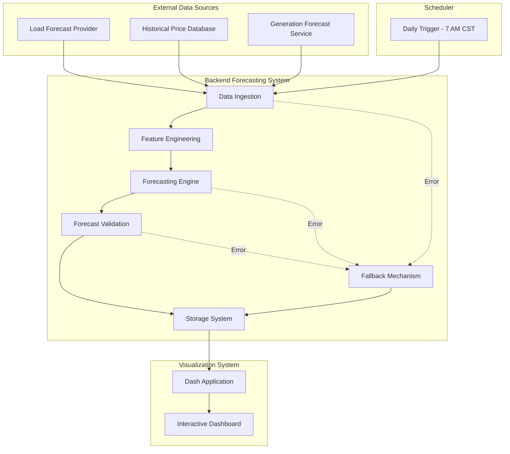

# Electricity Market Price Forecasting System


A high-accuracy day-ahead market price forecasting system for electricity traders and automated trading systems. The system generates probabilistic forecasts for Day-Ahead Locational Marginal Prices (DALMP), Real-Time Locational Marginal Prices (RTLMP), and all ancillary service products with hourly granularity over a 72-hour horizon.

## Key Features

- **Probabilistic Forecasting**: Generate sample-based probabilistic forecasts for electricity market products
- **Linear Modeling**: Separate linear models for each product/hour combination
- **72-Hour Horizon**: Forecasts extend 72 hours with hourly granularity
- **Daily Execution**: Automated forecast generation at 7 AM CST
- **Fallback Mechanism**: Automatic use of previous day's forecast when current generation fails
- **Interactive Visualization**: Dash-based dashboard for exploring forecasts
- **Data Quality**: Pandera schema validation for forecast data

## System Architecture

The system follows a functional programming approach with a modular pipeline architecture designed for reliability and maintainability. Key components include:

- **Backend Forecasting System**: Core pipeline for data processing and forecast generation
- **Visualization Interface**: Dash-based dashboard for exploring forecasts
- **Scheduler**: Triggers daily forecast generation at 7 AM CST
- **Storage System**: Manages forecast data persistence using pandas dataframes
- **Fallback Mechanism**: Provides previous day's forecast when current generation fails



The system is designed as a functional pipeline, with clear separation of concerns between data processing, forecasting, validation, and visualization components.

## Project Structure

The project is organized into the following main directories:

- `src/backend/`: Backend forecasting system components
- `src/web/`: Dash-based visualization interface
- `infrastructure/`: Deployment and infrastructure configuration
- `.github/`: GitHub workflows and templates

Each component has its own README with detailed documentation.

## Prerequisites

To run this system, you need:

- Python 3.10+
- Docker and Docker Compose (for containerized deployment)
- Access to electricity market data sources (load forecasts, historical prices, generation forecasts)

## Installation

You can install and run the system using Docker or directly with Python.

### Docker Installation

The recommended way to run the system is using Docker Compose:

```bash
# Clone the repository
git clone https://github.com/your-organization/electricity-market-price-forecasting.git
cd electricity-market-price-forecasting

# Configure environment variables
cp infrastructure/docker/.env.template infrastructure/docker/.env
# Edit .env with your configuration

# Start the system
docker-compose -f infrastructure/docker/docker-compose.full.yml up -d
```

### Python Installation

For development or running without Docker:

```bash
# Clone the repository
git clone https://github.com/your-organization/electricity-market-price-forecasting.git
cd electricity-market-price-forecasting

# Backend setup
cd src/backend
cp .env.example .env
# Edit .env with your configuration
pip install -r requirements.txt

# Web setup
cd ../web
cp .env.example .env
# Edit .env with your configuration
pip install -r requirements.txt
```

## Usage

The system can be used in several ways:

### Running the Backend

The backend system can be run in three modes:

```bash
# Generate a forecast immediately
python src/backend/main.py run --date 2023-06-01

# Start the scheduler service (runs daily at 7 AM CST)
python src/backend/main.py schedule

# Start the API server
python src/backend/main.py serve --port 8000
```

### Running the Visualization Interface

The Dash-based visualization interface can be started with:

```bash
# Start the Dash server
python src/web/app.py

# For production deployment
gunicorn --bind 0.0.0.0:8050 --workers 2 --timeout 120 src.web.wsgi:server
```

### Accessing the Dashboard

Once running, the visualization dashboard is available at:

```text
http://localhost:8050
```

The dashboard allows you to explore forecasts by product, view probabilistic distributions, and export forecast data.

## Development

This project uses modern Python development tools and follows a functional programming approach.

### Development Tools

The following tools are used for development:

- **Poetry**: Dependency management
- **pytest**: Testing framework
- **black**: Code formatting
- **isort**: Import sorting
- **mypy**: Static type checking
- **flake8**: Linting
- **pre-commit**: Pre-commit hooks

### Running Tests

Tests can be run using pytest:

```bash
# Run backend tests
cd src/backend
pytest

# Run web tests
cd src/web
pytest

# Run with coverage report
pytest --cov=. --cov-report=term
```

### Contributing

Contributions are welcome! Please see the contributing guidelines file in the repository root for more information on how to contribute to this project.

## Architectural Details

The system implements a comprehensive forecasting pipeline with the following components:

### Data Ingestion

Collects and validates input data from external sources including load forecasts, historical prices, and generation forecasts. Implements retry logic and validation checks.

### Feature Engineering

Transforms raw data into feature vectors tailored for each product/hour combination. Creates lagged variables, derived features, and normalized inputs for the models.

### Forecasting Engine

Generates probabilistic price forecasts using linear models. Implements separate models for each product/hour combination to capture unique market dynamics.

### Forecast Validation

Ensures forecasts meet quality standards and physical constraints. Validates completeness, plausibility, and consistency.

### Storage System

Saves forecasts as pandas dataframes with timestamps. Implements pandera schema validation and efficient retrieval mechanisms.

### Fallback Mechanism

Provides reliable service by using previous day's forecast when current generation fails. Detects failures and adjusts timestamps appropriately.

### Visualization System

Dash-based interactive dashboard for exploring forecasts. Displays time series, probabilistic distributions, and tabular data.

## Deployment

The system can be deployed using Docker Compose for a complete setup including monitoring:

```bash
# Deploy the full system with monitoring
docker-compose -f infrastructure/docker/docker-compose.full.yml up -d
```

This will start the forecasting system, visualization interface, and monitoring stack (Prometheus and Grafana).

## Monitoring

The system includes comprehensive monitoring capabilities:

- **Prometheus**: Metrics collection and storage
- **Grafana**: Visualization dashboards for system metrics
- **Structured Logging**: Detailed logs for troubleshooting

Monitoring dashboards are available at http://localhost:3000 when using the full Docker Compose setup.

## License

This project is licensed under the MIT License - see the [LICENSE](LICENSE) file for details.

## Acknowledgments

- This project uses data from various electricity market sources
- Built with open-source tools and libraries