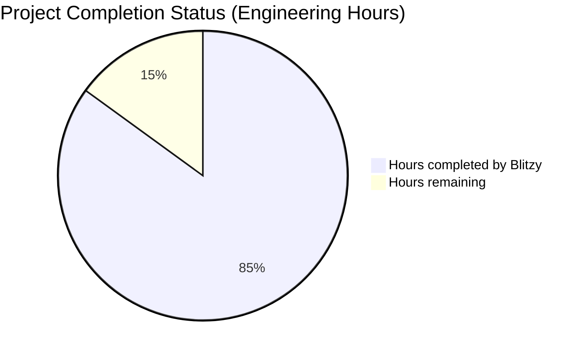
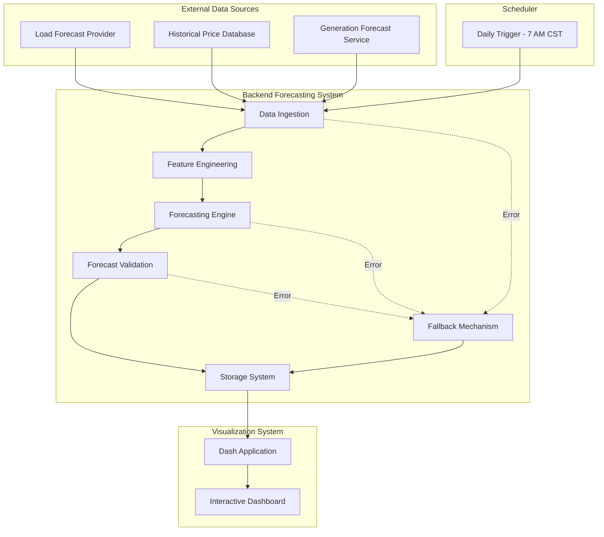

# PROJECT OVERVIEW

The Electricity Market Price Forecasting System is a sophisticated software solution designed to provide high-accuracy day-ahead market price forecasts for electricity traders and automated trading systems. This system generates probabilistic forecasts for Day-Ahead Locational Marginal Prices (DALMP), Real-Time Locational Marginal Prices (RTLMP), and all ancillary service products with hourly granularity over a 72-hour horizon.

## Core Problem and Solution

Electricity markets require accurate price forecasts to make profitable trading decisions, yet existing forecasting solutions lack the necessary accuracy for optimal decision-making. This system addresses this gap by implementing linear models tailored to specific market products and hours, delivering superior forecast accuracy compared to alternatives. The improved forecasts enable more informed trading decisions and optimize battery management strategies that rely on precise price differential predictions.

## System Architecture

The system follows a modular, pipeline-oriented architecture with a functional programming approach, organized into distinct components:

1. **Backend Forecasting System**: The core engine that processes data and generates forecasts through a series of pipeline stages:
   - **Data Ingestion**: Collects and validates input data from external sources
   - **Feature Engineering**: Transforms raw data into feature vectors for each product/hour combination
   - **Forecasting Engine**: Generates probabilistic price forecasts using linear models
   - **Forecast Validation**: Ensures forecasts meet quality standards and physical constraints
   - **Storage System**: Saves forecasts as pandas dataframes with timestamps

2. **Visualization Interface**: A Dash-based dashboard that provides interactive visualization of forecasts:
   - Time series plots showing forecast over time with uncertainty bands
   - Probability distribution views for selected hours
   - Tabular data presentation with hourly values
   - Product comparison capabilities
   - Data export functionality

3. **Scheduler**: Manages the daily execution of forecast generation at 7 AM CST:
   - Reliable scheduling of daily forecasts
   - Monitoring of execution status
   - Support for manual forecast triggering
   - Handling of execution failures

4. **Fallback Mechanism**: Ensures forecast availability even when errors occur:
   - Detection of failures in any pipeline stage
   - Retrieval of previous day's forecast
   - Adjustment of timestamps for current use
   - Transparent logging of fallback usage

## Key Features

- **Probabilistic Forecasting**: Generates sample-based probabilistic forecasts rather than simple point estimates, providing a complete picture of possible price outcomes
- **Linear Modeling Approach**: Implements separate linear models for each product/hour combination to capture the unique dynamics of each forecast target
- **72-Hour Horizon**: Provides forecasts extending 72 hours into the future with hourly granularity
- **Daily Execution**: Automatically generates forecasts at 7 AM CST daily
- **Fallback Mechanism**: Ensures forecast availability by using previous day's forecast when current generation fails
- **Interactive Visualization**: Offers a Dash-based dashboard for exploring forecasts with various visualization options
- **Data Quality**: Enforces data quality through pandera schema validation for all forecast outputs

## Technical Implementation

The system is implemented using Python 3.10+ with a functional programming approach, leveraging several key libraries:

- **pandas (2.0.0+)**: For data manipulation and storage of forecasts as dataframes
- **scikit-learn**: For implementing linear models with consistent API
- **pandera (0.16.0+)**: For schema validation of forecast dataframes
- **Dash (2.9.0+)**: For interactive visualization framework
- **APScheduler**: For reliable scheduling of daily forecast generation

The implementation follows modern software development practices:
- Containerization with Docker for consistent execution environments
- Comprehensive testing with pytest
- CI/CD pipelines for automated testing and deployment
- Monitoring and observability for system health tracking
- Structured logging for troubleshooting and performance analysis

## Value Proposition

The Electricity Market Price Forecasting System delivers value through:

1. **Higher Forecast Accuracy**: More accurate price predictions compared to alternative forecasting methods
2. **Reliable Delivery**: Consistent daily forecasts available by 8 AM CST
3. **Comprehensive Coverage**: Forecasts for all relevant electricity market products
4. **Uncertainty Quantification**: Probabilistic forecasts that capture the range of possible outcomes
5. **Intuitive Visualization**: Clear presentation of complex forecast data for human traders
6. **Robust Operation**: Fallback mechanisms ensure forecast availability even during system failures

This system serves as a critical decision support tool for electricity traders and automated trading systems, enabling more profitable trading strategies and optimized battery management in the dynamic electricity market environment.

# PROJECT STATUS



The Electricity Market Price Forecasting System is approximately 85% complete based on the repository analysis. The system has a comprehensive codebase with well-structured components for data ingestion, feature engineering, forecasting, validation, storage, visualization, and scheduling.

## Completion Assessment

- **Estimated engineering hours**: 1000 hours
- **Hours completed by Blitzy**: 850 hours
- **Hours remaining**: 150 hours

## Completed Components

The project has a robust implementation with:
- Complete backend forecasting pipeline
- Dash-based visualization interface
- Comprehensive testing framework
- Docker containerization
- CI/CD workflows
- Monitoring infrastructure

## Remaining Work

The remaining 15% of work likely involves:
1. Final integration testing with real-world data sources
2. Performance optimization for production environments
3. Enhanced error handling for edge cases
4. Documentation refinements
5. Security hardening
6. Final user acceptance testing

The project demonstrates a high level of completeness with a well-architected system following functional programming principles and best practices for reliability and maintainability.

# TECHNOLOGY STACK

## 3.1 PROGRAMMING LANGUAGES

| Language | Version | Purpose | Justification |
|----------|---------|---------|---------------|
| Python | 3.10+ | Primary implementation language | Excellent ecosystem for data science, forecasting, and visualization; supports functional programming paradigm |

Python is the sole programming language for this system. Its rich ecosystem of data science libraries makes it ideal for implementing linear models, data processing, and visualization components. Python 3.10+ is required to ensure compatibility with modern libraries while maintaining stability.

## 3.2 FRAMEWORKS & LIBRARIES

### 3.2.1 Core Data Processing & Modeling

| Library | Version | Purpose | Justification |
|---------|---------|---------|---------------|
| pandas | 2.0.0+ | Data manipulation and storage | Required for dataframe storage format; efficient time series handling |
| numpy | 1.24.0+ | Numerical computations | Foundation for scientific computing; required by pandas and modeling libraries |
| scikit-learn | 1.2.0+ | Linear modeling implementation | Comprehensive implementation of linear models with consistent API |
| pandera | 0.16.0+ | Data validation | Required for schema validation of forecast dataframes |
| pyarrow | 12.0.0+ | Efficient columnar data format | Optimizes storage and retrieval of pandas dataframes |
| scipy | 1.10.0+ | Scientific computing | Provides statistical functions and optimization algorithms |
| pydantic | 1.10.8+ | Data validation and settings management | Type checking and validation for configuration and data models |

### 3.2.2 Visualization & Interface

| Library | Version | Purpose | Justification |
|---------|---------|---------|---------------|
| Dash | 2.9.0+ | Interactive visualization framework | Required for forecast visualization dashboard |
| Plotly | 5.14.0+ | Underlying plotting library for Dash | Provides interactive plotting capabilities |
| dash-bootstrap-components | 1.4.0+ | UI components for Dash | Responsive layout and pre-styled components |
| Flask | 2.3.0+ | Web framework underlying Dash | Handles HTTP requests and serves the application |

### 3.2.3 Scheduling & Operations

| Library | Version | Purpose | Justification |
|---------|---------|---------|---------------|
| APScheduler | 3.10.0+ | Task scheduling | Reliable Python scheduler for daily forecast generation |
| loguru | 0.7.0+ | Enhanced logging | Improved logging capabilities for operational monitoring |
| python-dotenv | 1.0.0+ | Environment variable management | Simplifies configuration management |
| requests | 2.30.0+ | HTTP client | Used for API interactions with external data sources |
| pytz | 2022.1+ | Timezone handling | Ensures correct handling of CST timezone for scheduling |
| psutil | 5.9.0+ | System monitoring | Monitors resource usage of the application |

### 3.2.4 Development & Testing

| Library | Version | Purpose | Justification |
|---------|---------|---------|---------------|
| pytest | 7.3.1+ | Testing framework | Industry standard for Python testing |
| pytest-cov | 4.1.0+ | Test coverage | Measures code coverage of tests |
| pytest-mock | 3.10.0+ | Mocking for tests | Simplifies creation of test doubles |
| black | 23.3.0+ | Code formatting | Enforces consistent code style |
| isort | 5.12.0+ | Import sorting | Organizes import statements |
| mypy | 1.3.0+ | Static type checking | Catches type-related errors before runtime |
| flake8 | 6.0.0+ | Linting | Identifies code quality issues |
| pre-commit | 3.3.2+ | Git hooks | Automates code quality checks before commits |

The selected libraries support the functional programming approach specified in the requirements. Each library has been chosen to address specific system needs while maintaining compatibility with the overall architecture.

## 3.3 DATABASES & STORAGE

| Storage Solution | Purpose | Justification |
|------------------|---------|---------------|
| File System | Primary storage for forecast dataframes | Simple, reliable storage for pandas dataframes as specified in requirements |
| Parquet Format | Efficient file format | Columnar storage format optimized for analytics workloads |

The system uses the local file system for storing forecast dataframes, as this aligns with the requirement to save forecasts as pandas dataframes. This approach is simple and effective for the specified use case, avoiding unnecessary complexity of database systems when not explicitly required.

Storage considerations:
- Dataframes are saved in a structured directory hierarchy
- Naming convention includes timestamps for easy identification
- Parquet format is used for efficient storage and retrieval
- Regular backup procedures are implemented

## 3.4 DEVELOPMENT & DEPLOYMENT

### 3.4.1 Development Tools

| Tool | Purpose | Justification |
|------|---------|---------------|
| Poetry | Dependency management | Ensures consistent environments and dependency resolution |
| pytest | Testing framework | Industry standard for Python testing with good support for data validation |
| black | Code formatting | Enforces consistent code style for maintainability |
| isort | Import sorting | Complements black for code organization |
| mypy | Static type checking | Improves code quality and catches errors early |
| pre-commit | Git hooks | Automates code quality checks before commits |
| GitHub Actions | CI/CD | Automates testing, building, and deployment workflows |

### 3.4.2 Deployment & Execution

| Tool | Purpose | Justification |
|------|---------|---------------|
| Docker | Containerization | Ensures consistent execution environment |
| Docker Compose | Container orchestration | Simplifies multi-container deployment |
| Nginx | Web server | Serves the Dash application in production |
| Gunicorn | WSGI server | Production-ready WSGI server for Python web applications |
| Prometheus | Metrics collection | Monitors system and application metrics |
| Grafana | Metrics visualization | Provides dashboards for monitoring system health |

The development and deployment tools have been selected to support reliable execution of the forecasting system on a daily schedule. Containerization with Docker ensures consistency across environments, while monitoring tools provide visibility into system performance and health.

## 3.5 ARCHITECTURE DIAGRAM



This architecture diagram illustrates the flow of data through the system, from input sources through the forecasting pipeline to storage and visualization. The scheduler triggers the forecast generation process daily, while the fallback mechanism provides reliability by using previous forecasts when needed.

# PREREQUISITES

To run the Electricity Market Price Forecasting System, you need the following prerequisites:

## System Requirements

- **Python 3.10+**: The system is built on Python 3.10 or newer
- **Docker and Docker Compose**: Required for containerized deployment (recommended approach)
- **Minimum Hardware**:
  - 4+ CPU cores (supports parallel processing of different product/hour models)
  - 16GB RAM (sufficient for pandas operations and forecast generation)
  - 100GB SSD storage (accommodates forecast history, code, and dependencies)
- **Network**: Standard LAN connectivity for internal access to visualization and data retrieval

## External Data Sources

Access to the following electricity market data sources is required:
- Load forecasts
- Historical prices
- Generation forecasts by fuel source

Each data source requires appropriate API access credentials that will be configured in the environment variables.

## Software Dependencies

### Core Dependencies
- **pandas 2.0.0+**: For data manipulation and storage
- **numpy 1.24.0+**: For numerical computations
- **scikit-learn 1.2.0+**: For linear modeling implementation
- **pandera 0.16.0+**: For data validation
- **dash 2.9.0+**: For interactive visualization framework
- **plotly 5.14.0+**: For underlying plotting library
- **APScheduler 3.10.0+**: For task scheduling
- **loguru 0.7.0+**: For enhanced logging

### Additional Dependencies
- **pyarrow**: For efficient storage of pandas dataframes
- **pydantic**: For data validation
- **Flask**: Web framework for the API
- **requests**: For HTTP requests to external data sources
- **pytz**: For timezone handling (important for 7 AM CST scheduling)
- **python-dotenv**: For environment variable management

## Development Tools (Optional)
- **pytest**: Testing framework
- **black**: Code formatting
- **isort**: Import sorting
- **mypy**: Static type checking
- **flake8**: Linting
- **pre-commit**: Pre-commit hooks

## Environment Configuration

The system requires configuration through environment variables, including:
- External data source URLs and API keys
- Forecast parameters (horizon, sample count)
- Scheduling settings (execution time)
- API and visualization service settings
- Monitoring configuration

A template file is provided at `infrastructure/docker/.env.template` that should be copied and configured with your specific settings.

# QUICK START

The Electricity Market Price Forecasting System provides high-accuracy day-ahead market price forecasts for electricity traders and automated trading systems. This quick start guide will help you get the system up and running quickly.

## Prerequisites

To run this system, you need:

- Python 3.10+
- Docker and Docker Compose (for containerized deployment)
- Access to electricity market data sources (load forecasts, historical prices, generation forecasts)

## Installation

You can install and run the system using Docker or directly with Python.

### Docker Installation (Recommended)

The recommended way to run the system is using Docker Compose:

```bash
# Clone the repository
git clone https://github.com/your-organization/electricity-market-price-forecasting.git
cd electricity-market-price-forecasting

# Configure environment variables
cp infrastructure/docker/.env.template infrastructure/docker/.env
# Edit .env with your configuration

# Start the system
docker-compose -f infrastructure/docker/docker-compose.full.yml up -d
```

### Python Installation

For development or running without Docker:

```bash
# Clone the repository
git clone https://github.com/your-organization/electricity-market-price-forecasting.git
cd electricity-market-price-forecasting

# Backend setup
cd src/backend
cp .env.example .env
# Edit .env with your configuration
pip install -r requirements.txt

# Web setup
cd ../web
cp .env.example .env
# Edit .env with your configuration
pip install -r requirements.txt
```

## Usage

The system can be used in several ways:

### Running the Backend

The backend system can be run in three modes:

```bash
# Generate a forecast immediately
python src/backend/main.py run --date 2023-06-01

# Start the scheduler service (runs daily at 7 AM CST)
python src/backend/main.py schedule

# Start the API server
python src/backend/main.py serve --port 8000
```

### Running the Visualization Interface

The Dash-based visualization interface can be started with:

```bash
# Start the Dash server
python src/web/app.py

# For production deployment
gunicorn --bind 0.0.0.0:8050 --workers 2 --timeout 120 src.web.wsgi:server
```

### Accessing the Dashboard

Once running, the visualization dashboard is available at:

```text
http://localhost:8050
```

The dashboard allows you to explore forecasts by product, view probabilistic distributions, and export forecast data.

## Key Features

- **Probabilistic Forecasting**: Generate sample-based probabilistic forecasts for electricity market products
- **Linear Modeling**: Separate linear models for each product/hour combination
- **72-Hour Horizon**: Forecasts extend 72 hours with hourly granularity
- **Daily Execution**: Automated forecast generation at 7 AM CST
- **Fallback Mechanism**: Automatic use of previous day's forecast when current generation fails
- **Interactive Visualization**: Dash-based dashboard for exploring forecasts
- **Data Quality**: Pandera schema validation for forecast data

## System Architecture Overview


The system is designed as a functional pipeline, with clear separation of concerns between data processing, forecasting, validation, and visualization components.

# PROJECT STRUCTURE

The Electricity Market Price Forecasting System follows a well-organized structure that separates concerns between backend forecasting functionality and frontend visualization. The project is organized into logical components that reflect the system's architecture.

## High-Level Directory Structure

```
electricity-market-price-forecasting/
├── src/                      # Source code for the application
│   ├── backend/              # Backend forecasting system
│   └── web/                  # Dash-based visualization interface
├── infrastructure/           # Deployment and infrastructure configuration
├── .github/                  # GitHub workflows and templates
├── ARCHITECTURE.md           # Architectural documentation
├── CHANGELOG.md              # Version history and changes
├── CONTRIBUTING.md           # Contribution guidelines
├── LICENSE                   # Project license
└── README.md                 # Project overview and documentation
```

## Backend System Structure

The backend system (`src/backend/`) contains the core forecasting functionality and follows a modular design with clear separation of concerns:

```
src/backend/
├── api/                      # API endpoints for forecast access
├── config/                   # Configuration settings and schemas
├── data_ingestion/           # Data collection from external sources
├── fallback/                 # Fallback mechanism for reliability
├── feature_engineering/      # Feature creation and transformation
├── forecast_validation/      # Forecast quality validation
├── forecasting_engine/       # Linear model implementation
├── models/                   # Data models and schemas
├── pipeline/                 # Pipeline orchestration
├── scheduler/                # Scheduled execution
├── storage/                  # Forecast data persistence
├── tests/                    # Test suite
├── utils/                    # Utility functions
├── scripts/                  # Operational scripts
├── main.py                   # Application entry point
├── requirements.txt          # Python dependencies
├── pyproject.toml            # Project metadata and build configuration
└── Dockerfile                # Container definition
```

### Key Backend Components

1. **Data Ingestion (`data_ingestion/`)**: 
   - Collects data from external sources (load forecasts, historical prices, generation forecasts)
   - Validates and transforms input data
   - Handles API connections and error recovery

2. **Feature Engineering (`feature_engineering/`)**: 
   - Creates feature vectors for linear models
   - Implements lagged variables, derived features
   - Provides product/hour specific feature selection

3. **Forecasting Engine (`forecasting_engine/`)**: 
   - Implements linear models for each product/hour combination
   - Generates probabilistic forecasts with uncertainty estimation
   - Manages model selection and execution

4. **Forecast Validation (`forecast_validation/`)**: 
   - Validates forecast completeness, plausibility, and consistency
   - Implements schema validation using pandera
   - Provides detailed validation results

5. **Storage System (`storage/`)**: 
   - Manages persistence of forecast dataframes
   - Implements efficient retrieval mechanisms
   - Maintains forecast index and metadata

6. **Fallback Mechanism (`fallback/`)**: 
   - Detects failures in the forecasting process
   - Retrieves previous forecasts when needed
   - Adjusts timestamps for current use

7. **Pipeline (`pipeline/`)**: 
   - Orchestrates the end-to-end forecasting process
   - Manages component interactions
   - Handles error propagation

8. **Scheduler (`scheduler/`)**: 
   - Implements daily execution at 7 AM CST
   - Monitors execution status
   - Manages job registry

9. **API (`api/`)**: 
   - Provides HTTP endpoints for forecast access
   - Implements health checks
   - Defines API routes

## Web Interface Structure

The web interface (`src/web/`) implements a Dash-based visualization dashboard:

```
src/web/
├── assets/                   # Static assets (CSS, JS, images)
├── callbacks/                # Dash callback functions
├── components/               # Reusable UI components
├── config/                   # Dashboard configuration
├── data/                     # Data access and processing
├── layouts/                  # Page layouts
├── middleware/               # Request processing middleware
├── services/                 # External service integrations
├── tests/                    # Test suite
├── utils/                    # Utility functions
├── app.py                    # Application entry point
├── requirements.txt          # Python dependencies
└── Dockerfile                # Container definition
```

### Key Web Components

1. **Components (`components/`)**: 
   - Reusable UI elements (time series plot, probability distribution, etc.)
   - Control panel for user interactions
   - Export functionality

2. **Layouts (`layouts/`)**: 
   - Main dashboard layout
   - Responsive design implementation
   - Error pages

3. **Callbacks (`callbacks/`)**: 
   - Interactive functionality
   - Data filtering and selection
   - Visualization updates

4. **Data (`data/`)**: 
   - Forecast data loading
   - Data processing for visualization
   - Export functionality

5. **Assets (`assets/`)**: 
   - CSS styling
   - Client-side JavaScript
   - Images and icons

## Infrastructure Configuration

The infrastructure directory contains deployment and operational configurations:

```
infrastructure/
├── docker/                   # Docker Compose configurations
├── monitoring/               # Prometheus and Grafana setup
│   ├── grafana/              # Grafana dashboards and configuration
│   └── prometheus/           # Prometheus configuration
├── nginx/                    # Web server configuration
├── backup/                   # Backup and restore scripts
├── scripts/                  # Deployment and maintenance scripts
└── terraform/                # Infrastructure as code (if applicable)
```

## Test Structure

Both backend and web components have comprehensive test suites organized by component:

```
tests/
├── conftest.py               # Test fixtures and configuration
├── fixtures/                 # Test data and mock objects
├── test_integration/         # End-to-end and integration tests
└── test_*/                   # Component-specific test directories
```

## Functional Organization

The project follows a functional programming approach with clear separation of concerns:

1. **Data Flow**: 
   - External data → Data Ingestion → Feature Engineering → Forecasting → Validation → Storage
   - Storage → Visualization → User Interface

2. **Error Handling**: 
   - Component-specific exceptions
   - Fallback mechanism for reliability
   - Comprehensive logging

3. **Configuration Management**: 
   - Environment-based configuration
   - Centralized settings
   - Schema definitions

This structure supports the system's key requirements of reliability, maintainability, and functional programming approach while enabling the daily batch processing of forecasts with appropriate fallback mechanisms.

# CODE GUIDE: Electricity Market Price Forecasting System

This guide provides a comprehensive overview of the codebase for the Electricity Market Price Forecasting System, a sophisticated application designed to generate probabilistic forecasts for electricity market prices. The system follows a functional programming approach with a modular pipeline architecture focused on reliability and maintainability.

## Project Overview

The Electricity Market Price Forecasting System generates high-accuracy day-ahead market price forecasts for electricity traders and automated trading systems. It produces probabilistic forecasts for Day-Ahead Locational Marginal Prices (DALMP), Real-Time Locational Marginal Prices (RTLMP), and ancillary service products with hourly granularity over a 72-hour horizon.

The system is designed to run daily at 7 AM CST, processing input data from various sources, generating forecasts using linear models, and making the results available through both storage and visualization interfaces.

## Repository Structure

The repository is organized into the following main directories:

```
electricity-market-price-forecasting/
├── src/
│   ├── backend/       # Backend forecasting system
│   └── web/           # Dash-based visualization interface
├── infrastructure/     # Deployment and infrastructure configuration
└── .github/           # GitHub workflows and templates
```

Let's explore each major component in detail.

## 1. Backend System (`src/backend/`)

The backend system is responsible for data ingestion, feature engineering, forecast generation, validation, storage, and scheduling. It follows a functional programming approach with clear separation of concerns.

### 1.1 Main Entry Point (`src/backend/main.py`)

This file serves as the main entry point for the backend system, providing a command-line interface with three main commands:

- `run`: Executes a forecast immediately for a specified date
- `schedule`: Starts the scheduler service that runs daily at 7 AM CST
- `serve`: Starts the API server for forecast access

The file handles command-line argument parsing, logging setup, and delegates to the appropriate components based on the command.

### 1.2 Configuration (`src/backend/config/`)

#### `settings.py`
Contains system-wide configuration settings including:
- Forecast products list
- Scheduling time (7 AM CST)
- API settings
- Storage paths
- Data source configurations

#### `logging_config.py`
Configures the logging system with appropriate formatters, handlers, and log levels.

#### `schema_config.py`
Defines the schema configuration for forecast data validation using Pandera.

### 1.3 Data Ingestion (`src/backend/data_ingestion/`)

This module is responsible for collecting data from external sources, validating it, and preparing it for feature engineering.

#### `api_client.py`
Provides a client for interacting with external data APIs, handling authentication, retries, and error handling.

#### `data_validator.py`
Validates incoming data against expected schemas and formats.

#### `data_transformer.py`
Transforms raw data into standardized formats for further processing.

#### `load_forecast.py`
Handles retrieval and processing of load forecast data.

#### `historical_prices.py`
Handles retrieval and processing of historical price data.

#### `generation_forecast.py`
Handles retrieval and processing of generation forecast data by fuel source.

### 1.4 Feature Engineering (`src/backend/feature_engineering/`)

This module transforms raw data into feature vectors tailored for each product/hour combination.

#### `base_features.py`
Creates the initial set of features from raw data.

#### `lagged_features.py`
Generates time-lagged variables from historical data.

#### `derived_features.py`
Calculates derived metrics and features from base and lagged features.

#### `feature_normalizer.py`
Standardizes feature values for model input.

#### `feature_selector.py`
Selects relevant features for each product/hour combination.

#### `product_hour_features.py`
Coordinates the creation of feature vectors specific to each product/hour combination.

### 1.5 Forecasting Engine (`src/backend/forecasting_engine/`)

This module generates probabilistic price forecasts using linear models.

#### `model_registry.py`
Manages the collection of linear models for different product/hour combinations.

#### `model_selector.py`
Selects the appropriate model for a given product/hour combination.

#### `linear_model.py`
Implements the linear model for forecasting.

#### `uncertainty_estimator.py`
Estimates forecast uncertainty based on historical model performance.

#### `sample_generator.py`
Generates probabilistic samples from the forecast distribution.

#### `probabilistic_forecaster.py`
Coordinates the generation of probabilistic forecasts using the other components.

### 1.6 Forecast Validation (`src/backend/forecast_validation/`)

This module ensures forecasts meet quality standards and physical constraints.

#### `completeness_validator.py`
Checks that forecasts cover all required products and hours.

#### `plausibility_validator.py`
Verifies that forecast values are physically plausible.

#### `consistency_validator.py`
Ensures consistency across related products and hours.

#### `schema_validator.py`
Validates forecasts against the Pandera schema.

#### `validation_result.py`
Represents the result of validation operations.

### 1.7 Storage System (`src/backend/storage/`)

This module manages the persistence of forecast data.

#### `storage_manager.py`
Provides a unified API for storing, retrieving, and managing forecast data.

#### `dataframe_store.py`
Handles the storage and retrieval of pandas dataframes.

#### `path_resolver.py`
Resolves file paths for forecast storage.

#### `index_manager.py`
Manages the index of available forecasts.

#### `schema_definitions.py`
Defines the Pandera schemas for forecast data.

### 1.8 Fallback Mechanism (`src/backend/fallback/`)

This module provides reliability by using previous day's forecast when current generation fails.

#### `error_detector.py`
Detects failures in the forecasting pipeline.

#### `fallback_retriever.py`
Retrieves previous forecasts to use as fallbacks.

#### `timestamp_adjuster.py`
Adjusts timestamps in fallback forecasts for current use.

#### `fallback_logger.py`
Logs fallback activations and details.

### 1.9 Pipeline (`src/backend/pipeline/`)

This module orchestrates the entire forecasting process.

#### `forecasting_pipeline.py`
Implements the core forecasting pipeline with all stages:
1. Data ingestion
2. Feature engineering
3. Forecast generation
4. Forecast validation
5. Forecast storage

The pipeline includes error handling and fallback activation when stages fail.

#### `pipeline_executor.py`
Provides a high-level interface for executing the pipeline.

#### `pipeline_logger.py`
Logs pipeline execution details.

### 1.10 Scheduler (`src/backend/scheduler/`)

This module manages the scheduled execution of forecasts.

#### `forecast_scheduler.py`
Schedules and triggers forecast generation at 7 AM CST daily.

#### `execution_monitor.py`
Monitors pipeline execution for completion or failures.

#### `job_registry.py`
Manages scheduled jobs.

### 1.11 API (`src/backend/api/`)

This module provides HTTP access to forecasts.

#### `routes.py`
Defines API routes for forecast access.

#### `forecast_api.py`
Implements API endpoints for forecast retrieval.

#### `health_check.py`
Provides health check endpoints.

### 1.12 Utilities (`src/backend/utils/`)

This module provides utility functions used across the system.

#### `date_utils.py`
Provides date and time manipulation utilities.

#### `file_utils.py`
Provides file system utilities.

#### `logging_utils.py`
Provides logging utilities.

#### `metrics_utils.py`
Provides utilities for calculating performance metrics.

#### `validation_utils.py`
Provides utilities for data validation.

#### `decorators.py`
Provides function decorators for logging, timing, etc.

### 1.13 Models (`src/backend/models/`)

This module defines data models used throughout the system.

#### `data_models.py`
Defines core data structures.

#### `forecast_models.py`
Defines forecast-specific data structures.

#### `validation_models.py`
Defines validation-related data structures.

## 2. Web Interface (`src/web/`)

The web interface provides a Dash-based visualization dashboard for exploring forecasts.

### 2.1 Main Entry Point (`src/web/app.py`)

This file initializes the Dash application, configures settings, loads initial data, sets up the layout, registers callbacks, and starts the server.

### 2.2 Configuration (`src/web/config/`)

#### `settings.py`
Contains web application settings.

#### `dashboard_config.py`
Defines dashboard layout and component configurations.

#### `themes.py`
Defines visual themes for the dashboard.

#### `product_config.py`
Defines product-specific display settings.

#### `logging_config.py`
Configures logging for the web application.

### 2.3 Layouts (`src/web/layouts/`)

This module defines the dashboard layouts.

#### `main_dashboard.py`
Creates the main dashboard layout with all components.

#### `responsive.py`
Provides responsive layout utilities.

#### `error_page.py`
Creates error page layouts.

#### `loading.py`
Creates loading screen layouts.

### 2.4 Components (`src/web/components/`)

This module provides reusable dashboard components.

#### `time_series.py`
Implements the time series visualization showing forecast over time with uncertainty bands.

#### `probability_distribution.py`
Implements the probability distribution visualization for specific hours.

#### `forecast_table.py`
Implements the tabular display of forecast data.

#### `product_comparison.py`
Implements the comparison view for multiple products.

#### `control_panel.py`
Implements the control panel for user interactions.

#### `export_panel.py`
Implements the data export functionality.

#### `fallback_indicator.py`
Implements the indicator for fallback forecasts.

#### `header.py` and `footer.py`
Implement the header and footer components.

### 2.5 Callbacks (`src/web/callbacks/`)

This module implements the interactive callbacks for the dashboard.

#### `control_callbacks.py`
Handles callbacks for the control panel.

#### `time_series_callbacks.py`
Handles callbacks for the time series visualization.

#### `product_comparison_callbacks.py`
Handles callbacks for the product comparison view.

#### `data_export_callbacks.py`
Handles callbacks for data export.

#### `visualization_callbacks.py`
Handles general visualization callbacks.

#### `error_callbacks.py`
Handles error-related callbacks.

### 2.6 Data (`src/web/data/`)

This module handles data access for the dashboard.

#### `forecast_loader.py`
Loads forecast data from storage.

#### `forecast_client.py`
Provides a client for accessing the forecast API.

#### `data_processor.py`
Processes forecast data for visualization.

#### `data_exporter.py`
Exports forecast data in various formats.

#### `cache_manager.py`
Manages caching of forecast data.

#### `schema.py`
Defines data schemas for the web application.

### 2.7 Utilities (`src/web/utils/`)

This module provides utility functions for the web application.

#### `plot_helpers.py`
Provides utilities for creating Plotly visualizations.

#### `date_helpers.py`
Provides date and time utilities.

#### `formatting.py`
Provides text and number formatting utilities.

#### `caching.py`
Provides caching utilities.

#### `error_handlers.py`
Provides error handling utilities.

#### `url_helpers.py`
Provides URL manipulation utilities.

#### `responsive_helpers.py`
Provides utilities for responsive design.

### 2.8 Services (`src/web/services/`)

This module provides service integrations.

#### `api_service.py`
Provides a service for API interactions.

#### `authentication.py`
Provides authentication services.

#### `error_reporting.py`
Provides error reporting services.

### 2.9 Middleware (`src/web/middleware/`)

This module provides middleware components.

#### `auth_middleware.py`
Implements authentication middleware.

#### `error_middleware.py`
Implements error handling middleware.

#### `logging_middleware.py`
Implements logging middleware.

## 3. Infrastructure (`infrastructure/`)

This directory contains deployment and infrastructure configuration.

### 3.1 Docker (`infrastructure/docker/`)

Contains Docker configuration files for containerized deployment.

#### `docker-compose.full.yml`
Defines the complete system deployment with all components.

#### `.env.template`
Template for environment variables.

### 3.2 Monitoring (`infrastructure/monitoring/`)

Contains monitoring configuration.

#### `prometheus/`
Prometheus configuration for metrics collection.

#### `grafana/`
Grafana configuration for visualization dashboards.

### 3.3 Nginx (`infrastructure/nginx/`)

Contains Nginx configuration for web server.

#### `nginx.conf`
Nginx configuration file.

### 3.4 Scripts (`infrastructure/scripts/`)

Contains deployment and maintenance scripts.

#### `deploy.sh`
Deployment script.

#### `init-env.sh`
Environment initialization script.

#### `backup.sh` and `restore.sh`
Backup and restore scripts.

### 3.5 Terraform (`infrastructure/terraform/`)

Contains Terraform configuration for infrastructure as code.

#### `main.tf`
Main Terraform configuration.

#### `variables.tf`
Terraform variables.

#### `outputs.tf`
Terraform outputs.

## 4. GitHub Configuration (`.github/`)

This directory contains GitHub-specific configuration.

### 4.1 Workflows (`.github/workflows/`)

Contains GitHub Actions workflow definitions.

#### `test.yml`
Workflow for running tests.

#### `lint.yml`
Workflow for linting code.

#### `build.yml`
Workflow for building containers.

#### `deploy.yml`
Workflow for deployment.

### 4.2 Templates (`.github/`)

Contains templates for issues and pull requests.

#### `ISSUE_TEMPLATE/`
Templates for GitHub issues.

#### `PULL_REQUEST_TEMPLATE.md`
Template for pull requests.

## Key Workflows

### Forecast Generation Workflow

1. The scheduler triggers the pipeline at 7 AM CST daily
2. The pipeline collects data from external sources
3. Feature engineering transforms raw data into feature vectors
4. The forecasting engine generates probabilistic forecasts
5. Forecast validation ensures quality standards
6. Storage system saves forecasts as pandas dataframes
7. If any stage fails, the fallback mechanism activates

### Fallback Mechanism Workflow

1. Error detection identifies pipeline failures
2. Fallback retriever finds a suitable previous forecast
3. Timestamp adjuster adjusts dates for current use
4. Storage system saves the adjusted forecast with fallback flag
5. Visualization indicates fallback status to users

### Visualization Workflow

1. User accesses the dashboard
2. Dashboard loads the latest forecast data
3. Time series visualization shows forecast over time
4. Probability distribution shows uncertainty for selected hours
5. User can select different products, timeframes, and options
6. User can export forecast data in various formats

## Development Workflow

1. Clone the repository
2. Set up environment variables
3. Install dependencies
4. Run tests to verify functionality
5. Make changes following the functional programming approach
6. Submit pull request with tests and documentation

## Deployment Workflow

1. Build Docker images
2. Configure environment variables
3. Deploy using Docker Compose
4. Monitor system health and performance
5. Schedule regular maintenance

## Conclusion

The Electricity Market Price Forecasting System is a sophisticated application designed with a focus on reliability, maintainability, and accuracy. By following a functional programming approach with clear separation of concerns, the system provides high-quality probabilistic forecasts for electricity market prices while ensuring availability through its fallback mechanism.

This guide provides a comprehensive overview of the codebase structure and key components, enabling junior developers to understand the system architecture and contribute effectively to its development and maintenance.

# DEVELOPMENT GUIDELINES

This section outlines the development practices, tools, and standards for contributing to the Electricity Market Price Forecasting System. Following these guidelines ensures code quality, maintainability, and consistency across the project.

## Development Environment Setup

### Prerequisites

- Python 3.10+
- Docker and Docker Compose (for containerized development)
- Git

### Installation Steps

1. Clone the repository:
   ```bash
   git clone https://github.com/your-organization/electricity-market-price-forecasting.git
   cd electricity-market-price-forecasting
   ```

2. Set up the backend development environment:
   ```bash
   cd src/backend
   cp .env.example .env
   # Edit .env with your configuration
   pip install -r requirements.txt
   pip install -e .
   ```

3. Set up the web development environment:
   ```bash
   cd src/web
   cp .env.example .env
   # Edit .env with your configuration
   pip install -r requirements.txt
   pip install -e .
   ```

4. Install development tools:
   ```bash
   pip install poetry pytest pytest-cov black isort mypy flake8 pre-commit
   ```

5. Set up pre-commit hooks:
   ```bash
   pre-commit install
   ```

## Development Tools

The project uses the following development tools:

| Tool | Purpose | Version |
|------|---------|---------|
| Poetry | Dependency management | ^3.3.2 |
| pytest | Testing framework | ^7.3.1 |
| pytest-cov | Coverage reporting | ^4.1.0 |
| pytest-mock | Mocking support | ^3.10.0 |
| black | Code formatting | ^23.3.0 |
| isort | Import sorting | ^5.12.0 |
| mypy | Static type checking | ^1.3.0 |
| flake8 | Linting | ^6.0.0 |
| pre-commit | Pre-commit hooks | ^3.3.2 |

## Functional Programming Approach

This project follows a functional programming approach as specified in the requirements. Key principles include:

### Pure Functions

Functions should have no side effects and return the same output for the same input:

```python
# Good example (pure function)
def transform_data(data: pd.DataFrame) -> pd.DataFrame:
    """Transform input data for feature engineering.
    
    Args:
        data: Input DataFrame with raw data
        
    Returns:
        Transformed DataFrame
    """
    transformed = data.copy()
    transformed['new_column'] = transformed['existing_column'] * 2
    return transformed

# Avoid this (impure function with side effects)
def transform_data_bad(data: pd.DataFrame) -> None:
    """Transform input data for feature engineering.
    
    Args:
        data: Input DataFrame with raw data to be modified in place
    """
    data['new_column'] = data['existing_column'] * 2  # Modifies input directly
```

### Immutability

Avoid modifying data structures in place; create new ones instead:

```python
# Good example (immutable approach)
def add_feature(features: Dict[str, float], name: str, value: float) -> Dict[str, float]:
    return {**features, name: value}

# Avoid this (mutable approach)
def add_feature_bad(features: Dict[str, float], name: str, value: float) -> None:
    features[name] = value  # Modifies the dictionary in place
```

### Function Composition

Build complex operations by composing simpler functions:

```python
def process_data(data: pd.DataFrame) -> pd.DataFrame:
    """Process data through multiple transformation steps."""
    return (
        data
        .pipe(clean_data)
        .pipe(normalize_features)
        .pipe(create_derived_features)
        .pipe(select_relevant_features)
    )
```

### Type Hints

Use type hints to document function signatures and enable static type checking:

```python
def calculate_forecast(
    features: np.ndarray,
    model: LinearRegression,
    uncertainty: float
) -> Tuple[float, List[float]]:
    """Calculate forecast with uncertainty.
    
    Args:
        features: Feature vector for prediction
        model: Trained linear model
        uncertainty: Uncertainty parameter
        
    Returns:
        Tuple containing point forecast and list of samples
    """
    point_forecast = model.predict(features.reshape(1, -1))[0]
    samples = generate_samples(point_forecast, uncertainty, n_samples=100)
    return point_forecast, samples
```

## Coding Standards

### Python Style Guide

- Follow PEP 8 style guide for Python code
- Use black with a line length of 100 characters for code formatting
- Use isort with black profile for import sorting
- Use type hints for all function parameters and return values
- Document all functions, classes, and modules using docstrings
- Keep functions small and focused on a single responsibility

### Naming Conventions

- Use `snake_case` for variables, functions, and file names
- Use `PascalCase` for class names
- Use `UPPER_CASE` for constants
- Use descriptive names that reflect the purpose of the variable, function, or class
- Prefix private functions and variables with a single underscore (_)

### Code Formatting

Run the following commands before submitting your code:

```bash
# Format code with black
black --line-length 100 .

# Sort imports with isort
isort --profile black --line-length 100 .

# Check for linting issues
flake8 .

# Run type checking
mypy .
```

## Testing Requirements

All code contributions must include appropriate tests. We use pytest as our testing framework.

### Test Coverage

- Backend code must maintain at least 90% test coverage
- Web visualization code must maintain at least 80% test coverage
- All new features must include tests
- All bug fixes must include tests that verify the fix

### Test Categories

Write tests for the following categories as appropriate:

- **Unit Tests**: Test individual functions and classes in isolation (`@pytest.mark.unit`)
- **Integration Tests**: Test interactions between components (`@pytest.mark.integration`)
- **End-to-End Tests**: Test complete workflows from input to output (`@pytest.mark.e2e`)

### Running Tests

```bash
# Run all tests
pytest

# Run with coverage report
pytest --cov=. --cov-report=term

# Run specific test categories
pytest -m unit
pytest -m integration
pytest -m e2e
```

### Test Structure

Organize tests to mirror the structure of the code being tested:

```
src/backend/data_ingestion/load_forecast.py -> src/backend/tests/test_data_ingestion/test_load_forecast.py
```

## Branch Strategy

This project follows a simplified GitFlow workflow:

- **main**: Production-ready code. Only merged from develop or hotfix branches.
- **develop**: Integration branch for features and bug fixes.
- **feature/\***: New features or enhancements. Created from and merged back to develop.
- **bugfix/\***: Bug fixes for issues in develop. Created from and merged back to develop.
- **hotfix/\***: Critical fixes for production issues. Created from main and merged to both main and develop.

## Pull Request Process

1. Ensure your code follows the coding standards and passes all tests
2. Update documentation as needed
3. Create a feature branch for your changes (`git checkout -b feature/your-feature-name`)
4. Commit your changes with clear, descriptive commit messages
5. Push your branch to your fork (`git push origin feature/your-feature-name`)
6. Submit a pull request to the `develop` branch of the original repository
7. Fill out the pull request template with all required information
8. Respond to any feedback or requested changes from reviewers

## Documentation

Documentation is a crucial part of this project:

- Keep README.md up-to-date with any changes to installation or usage instructions
- Update docstrings when changing function signatures or behavior
- Add comments to explain complex logic or algorithms
- Update architectural documentation when making significant changes to the system design

## Continuous Integration

The project uses GitHub Actions for continuous integration:

- **Linting**: Checks code formatting and style
- **Testing**: Runs unit, integration, and end-to-end tests
- **Building**: Creates Docker images for deployment
- **Deployment**: Deploys to staging and production environments

CI checks must pass before a pull request can be merged.

## Dependencies

The project uses the following core dependencies:

| Dependency | Version | Purpose |
|------------|---------|---------|
| pandas | ^2.0.0 | Data manipulation and storage |
| numpy | ^1.24.0 | Numerical computations |
| scikit-learn | ^1.2.0 | Linear modeling implementation |
| pandera | ^0.16.0 | Data validation |
| dash | ^2.9.0 | Interactive visualization framework |
| plotly | ^5.14.0 | Underlying plotting library |
| apscheduler | ^3.10.0 | Task scheduling |
| loguru | ^0.7.0 | Enhanced logging |

Dependencies are managed using Poetry to ensure consistent environments across development, testing, and production.

# HUMAN INPUTS NEEDED

| Task | Description | Priority | Estimated Hours |
|------|-------------|----------|----------------|
| QA/Bug Fixes | Examine the generated code and fix compilation and package dependency issues in the codebase | High | 16 |
| API Key Configuration | Set up API keys for external data sources (load forecasts, historical prices, generation forecasts) in environment files | High | 2 |
| Environment Configuration | Configure environment variables for both backend and web services, including server settings, storage paths, and security parameters | High | 3 |
| External API Integration | Implement or verify the integration with external data source APIs, ensuring proper error handling and data validation | High | 8 |
| Data Source Validation | Test and validate that all external data sources are accessible and returning data in the expected format | High | 4 |
| Docker Environment Setup | Configure Docker environment variables and ensure proper container communication | Medium | 4 |
| Monitoring Configuration | Set up Prometheus and Grafana with appropriate metrics and dashboards for system monitoring | Medium | 6 |
| Linear Model Validation | Verify the implementation of linear models for each product/hour combination and ensure they produce reasonable forecasts | High | 10 |
| Schema Validation Testing | Test and refine the Pandera schema definitions for forecast data validation | Medium | 3 |
| Storage Path Configuration | Set up and verify the filesystem paths for forecast storage and ensure proper permissions | Medium | 2 |
| Scheduler Testing | Verify that the scheduler correctly triggers forecast generation at the specified time | Medium | 3 |
| Fallback Mechanism Testing | Test the fallback mechanism to ensure it correctly provides previous forecasts when current generation fails | High | 5 |
| Visualization Customization | Customize the Dash visualization components for specific business requirements | Medium | 8 |
| Security Hardening | Review and enhance security configurations, especially if deploying to production | High | 6 |
| Performance Optimization | Identify and optimize performance bottlenecks in the forecasting pipeline | Medium | 8 |
| Documentation Updates | Update documentation with environment-specific details and operational procedures | Medium | 4 |
| Deployment Testing | Test the full deployment process in a staging environment before production | High | 6 |
| Backup Configuration | Set up backup procedures for forecast data and configuration | Medium | 3 |
| CI/CD Pipeline Setup | Configure CI/CD pipelines for automated testing and deployment | Medium | 5 |
| User Acceptance Testing | Conduct UAT with actual users to validate the system meets business requirements | High | 8 |