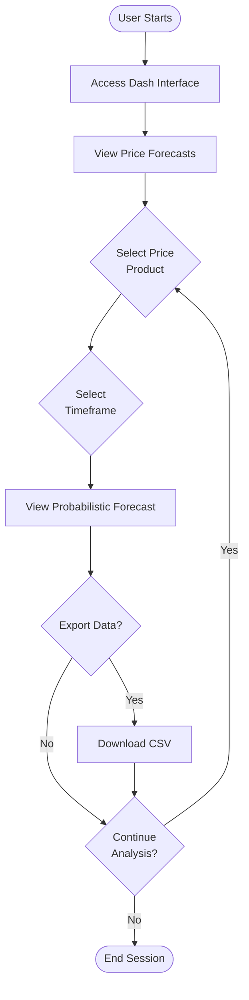

# Technical Specifications

## 1. INTRODUCTION

### 1.1 EXECUTIVE SUMMARY

The Electricity Market Price Forecasting System is designed to provide high-accuracy day-ahead market price forecasts for electricity traders and automated trading systems. The system will generate probabilistic forecasts for Day-Ahead Locational Marginal Prices (DALMP), Real-Time Locational Marginal Prices (RTLMP), and all ancillary service products with hourly granularity over a 72-hour horizon. By delivering superior forecast accuracy compared to alternatives, this system will enable more informed trading decisions and optimize battery management strategies.

| Key Aspect | Description |
|------------|-------------|
| Core Problem | Need for accurate electricity market price forecasts to inform trading decisions |
| Key Users | Human traders and downstream optimization algorithms for battery management |
| Value Proposition | Higher forecast accuracy than alternatives, enabling better trading decisions and battery optimization |
| Delivery Cadence | Daily forecasts at 7 AM CST |

### 1.2 SYSTEM OVERVIEW

#### 1.2.1 Project Context

The electricity trading market requires accurate price forecasts to make profitable trading decisions. Current forecasting solutions lack the accuracy needed for optimal decision-making, particularly for battery management systems that rely on precise price differential predictions. This system positions itself as a superior forecasting solution by implementing linear models tailored to specific market products and hours.

#### 1.2.2 High-Level Description

The system will generate daily probabilistic price forecasts for electricity market products using linear models. Each forecast will be specific to a unique combination of price product and target hour. The system will run on a scheduled basis, producing forecasts that start from the beginning of the next day after inference and extend for 72 hours with hourly granularity.

| Component | Description |
|-----------|-------------|
| Forecasting Engine | Linear models for each product/hour combination |
| Data Pipeline | Processes load forecasts, historical prices, and generation forecasts |
| Visualization System | Dash-based interface showing time vs. price forecasts |
| Storage System | Timestamped pandas dataframes following a pandera schema |

#### 1.2.3 Success Criteria

| Criterion | Measurement |
|-----------|-------------|
| Forecast Accuracy | Higher accuracy than alternative forecasting methods |
| System Reliability | Successful daily execution at 7 AM CST with fallback mechanisms |
| Data Quality | Adherence to pandera schema for all forecast outputs |
| Visualization Effectiveness | Clear representation of price forecasts over time |

### 1.3 SCOPE

#### 1.3.1 In-Scope

**Core Features and Functionalities:**
- Daily probabilistic price forecasts for DALMP, RTLMP, and all ancillary service products
- 72-hour forecast horizon with hourly granularity
- Linear modeling approach for each product/hour combination
- Fallback forecast mechanism using previous day's forecast
- Visualization of time vs. price forecasts
- Scheduled execution at 7 AM CST daily

**Implementation Boundaries:**
- Python-based implementation with functional programming approach
- Integration with existing data sources for load forecasts, historical prices, and generation forecasts
- Storage of forecasts as pandas dataframes with timestamp information
- Dash-based visualization system

#### 1.3.2 Out-of-Scope

- Real-time price forecasting or intraday updates
- Non-linear or deep learning modeling approaches
- Forecasts beyond 72-hour horizon
- Manual forecast triggering mechanisms
- Integration with trading execution systems
- User authentication and access control systems
- Historical forecast performance analytics
- Automated model retraining pipelines

## 2. PRODUCT REQUIREMENTS

### 2.1 FEATURE CATALOG

#### 2.1.1 Price Forecasting Engine

| Feature Metadata | Details |
|------------------|---------|
| ID | F-001 |
| Feature Name | Price Forecasting Engine |
| Feature Category | Core Functionality |
| Priority Level | Critical |
| Status | Proposed |

**Description:**
- **Overview:** Linear model-based forecasting engine that generates probabilistic price forecasts for electricity market products.
- **Business Value:** Enables more accurate trading decisions through superior forecast performance.
- **User Benefits:** Provides traders with reliable price predictions to optimize trading strategies.
- **Technical Context:** Implements separate linear models for each product/hour combination.

**Dependencies:**
- **Prerequisite Features:** None
- **System Dependencies:** Python environment, linear modeling libraries
- **External Dependencies:** Historical price data, load forecasts, generation forecasts
- **Integration Requirements:** Data pipeline for input processing

#### 2.1.2 Scheduled Forecast Generation

| Feature Metadata | Details |
|------------------|---------|
| ID | F-002 |
| Feature Name | Scheduled Forecast Generation |
| Feature Category | Operational |
| Priority Level | Critical |
| Status | Proposed |

**Description:**
- **Overview:** Automated daily execution of forecasting process at 7 AM CST.
- **Business Value:** Ensures timely availability of forecasts for trading decisions.
- **User Benefits:** Provides consistent, reliable forecast delivery without manual intervention.
- **Technical Context:** Scheduled task that triggers the forecasting pipeline.

**Dependencies:**
- **Prerequisite Features:** F-001 (Price Forecasting Engine)
- **System Dependencies:** Task scheduling system
- **External Dependencies:** None
- **Integration Requirements:** Notification system for execution status

#### 2.1.3 Forecast Data Storage

| Feature Metadata | Details |
|------------------|---------|
| ID | F-003 |
| Feature Name | Forecast Data Storage |
| Feature Category | Data Management |
| Priority Level | High |
| Status | Proposed |

**Description:**
- **Overview:** Storage system for timestamped forecast data in pandas dataframes.
- **Business Value:** Maintains structured historical record of forecasts for analysis.
- **User Benefits:** Enables access to forecast history and comparison over time.
- **Technical Context:** Implements pandera schema validation for data quality.

**Dependencies:**
- **Prerequisite Features:** F-001 (Price Forecasting Engine)
- **System Dependencies:** Pandas, Pandera
- **External Dependencies:** None
- **Integration Requirements:** File system or database for persistent storage

#### 2.1.4 Forecast Visualization

| Feature Metadata | Details |
|------------------|---------|
| ID | F-004 |
| Feature Name | Forecast Visualization |
| Feature Category | User Interface |
| Priority Level | High |
| Status | Proposed |

**Description:**
- **Overview:** Dash-based visualization system showing time vs. price forecasts.
- **Business Value:** Improves forecast interpretation and decision-making.
- **User Benefits:** Provides intuitive visual representation of forecast data.
- **Technical Context:** Interactive dashboard for exploring forecast results.

**Dependencies:**
- **Prerequisite Features:** F-003 (Forecast Data Storage)
- **System Dependencies:** Dash, Plotly
- **External Dependencies:** None
- **Integration Requirements:** Web server for dashboard hosting

#### 2.1.5 Fallback Mechanism

| Feature Metadata | Details |
|------------------|---------|
| ID | F-005 |
| Feature Name | Fallback Mechanism |
| Feature Category | Reliability |
| Priority Level | High |
| Status | Proposed |

**Description:**
- **Overview:** System to use previous day's forecast when current forecast generation fails.
- **Business Value:** Ensures forecast availability even during system failures.
- **User Benefits:** Provides continuity of service for trading operations.
- **Technical Context:** Implements error handling and fallback logic.

**Dependencies:**
- **Prerequisite Features:** F-001 (Price Forecasting Engine), F-003 (Forecast Data Storage)
- **System Dependencies:** Error handling framework
- **External Dependencies:** None
- **Integration Requirements:** Monitoring system for failure detection

### 2.2 FUNCTIONAL REQUIREMENTS TABLE

#### 2.2.1 Price Forecasting Engine Requirements

| Requirement Details | Specifications |
|---------------------|----------------|
| ID | F-001-RQ-001 |
| Description | Generate probabilistic forecasts for DALMP, RTLMP, and all ancillary service products |
| Acceptance Criteria | System produces sample-based probabilistic forecasts for all specified products |
| Priority | Must-Have |
| Complexity | High |

**Technical Specifications:**
- **Input Parameters:** Historical price data, load forecasts, generation forecasts by fuel source
- **Output/Response:** Probabilistic forecasts for each product/hour combination
- **Performance Criteria:** Higher accuracy than alternative forecasting methods
- **Data Requirements:** Historical data for model training, current data for forecasting

**Validation Rules:**
- **Business Rules:** Forecasts must be physically plausible (non-negative prices for most products)
- **Data Validation:** Input data must be complete and within expected ranges
- **Security Requirements:** None specified
- **Compliance Requirements:** None specified

| Requirement Details | Specifications |
|---------------------|----------------|
| ID | F-001-RQ-002 |
| Description | Implement linear models for each product/hour combination |
| Acceptance Criteria | Separate linear models exist and function for each unique product/hour pair |
| Priority | Must-Have |
| Complexity | Medium |

**Technical Specifications:**
- **Input Parameters:** Feature vectors specific to each product/hour combination
- **Output/Response:** Coefficient values and prediction results
- **Performance Criteria:** Models must train in reasonable time
- **Data Requirements:** Sufficient historical data for each product/hour combination

**Validation Rules:**
- **Business Rules:** Models should capture relevant market dynamics
- **Data Validation:** Feature selection based on domain knowledge
- **Security Requirements:** None specified
- **Compliance Requirements:** None specified

| Requirement Details | Specifications |
|---------------------|----------------|
| ID | F-001-RQ-003 |
| Description | Generate forecasts with 72-hour horizon and hourly granularity |
| Acceptance Criteria | Forecasts cover 72 hours with distinct values for each hour |
| Priority | Must-Have |
| Complexity | Medium |

**Technical Specifications:**
- **Input Parameters:** Time range for forecast generation
- **Output/Response:** 72 hourly forecasts starting from the beginning of the next day
- **Performance Criteria:** Complete forecast generation within reasonable time
- **Data Requirements:** Sufficient input data to cover forecast horizon

**Validation Rules:**
- **Business Rules:** Forecast horizon must align with trading requirements
- **Data Validation:** Complete coverage of forecast period
- **Security Requirements:** None specified
- **Compliance Requirements:** None specified

#### 2.2.2 Scheduled Forecast Generation Requirements

| Requirement Details | Specifications |
|---------------------|----------------|
| ID | F-002-RQ-001 |
| Description | Execute forecast generation daily at 7 AM CST |
| Acceptance Criteria | System automatically runs at specified time each day |
| Priority | Must-Have |
| Complexity | Low |

**Technical Specifications:**
- **Input Parameters:** Scheduling parameters
- **Output/Response:** Execution logs and status notifications
- **Performance Criteria:** Reliable execution at scheduled time
- **Data Requirements:** Current system time

**Validation Rules:**
- **Business Rules:** Execution must complete before market trading decisions
- **Data Validation:** Verification of successful execution
- **Security Requirements:** None specified
- **Compliance Requirements:** None specified

#### 2.2.3 Forecast Data Storage Requirements

| Requirement Details | Specifications |
|---------------------|----------------|
| ID | F-003-RQ-001 |
| Description | Store forecasts as timestamped pandas dataframes |
| Acceptance Criteria | Forecasts are saved with appropriate timestamps and accessible for retrieval |
| Priority | Must-Have |
| Complexity | Low |

**Technical Specifications:**
- **Input Parameters:** Forecast results, timestamp information
- **Output/Response:** Stored dataframe files or database records
- **Performance Criteria:** Efficient storage and retrieval
- **Data Requirements:** Forecast data, timestamp information

**Validation Rules:**
- **Business Rules:** Retention policy for historical forecasts
- **Data Validation:** Timestamp accuracy and completeness
- **Security Requirements:** None specified
- **Compliance Requirements:** None specified

| Requirement Details | Specifications |
|---------------------|----------------|
| ID | F-003-RQ-002 |
| Description | Implement pandera schema validation for forecast data |
| Acceptance Criteria | All stored forecasts conform to defined schema |
| Priority | Must-Have |
| Complexity | Medium |

**Technical Specifications:**
- **Input Parameters:** Forecast dataframes
- **Output/Response:** Validation results
- **Performance Criteria:** Efficient schema validation
- **Data Requirements:** Schema definition

**Validation Rules:**
- **Business Rules:** Schema must capture all required forecast attributes
- **Data Validation:** Type checking, range validation, structural validation
- **Security Requirements:** None specified
- **Compliance Requirements:** None specified

#### 2.2.4 Forecast Visualization Requirements

| Requirement Details | Specifications |
|---------------------|----------------|
| ID | F-004-RQ-001 |
| Description | Implement Dash-based visualization of time vs. price forecasts |
| Acceptance Criteria | Interactive dashboard showing forecast data over time |
| Priority | Must-Have |
| Complexity | Medium |

**Technical Specifications:**
- **Input Parameters:** Forecast dataframes
- **Output/Response:** Interactive visualization
- **Performance Criteria:** Responsive user interface
- **Data Requirements:** Processed forecast data

**Validation Rules:**
- **Business Rules:** Visualization must clearly represent forecast uncertainty
- **Data Validation:** Correct mapping of data to visual elements
- **Security Requirements:** None specified
- **Compliance Requirements:** None specified

#### 2.2.5 Fallback Mechanism Requirements

| Requirement Details | Specifications |
|---------------------|----------------|
| ID | F-005-RQ-001 |
| Description | Implement fallback to previous day's forecast when current forecast fails |
| Acceptance Criteria | System automatically uses previous forecast when current generation fails |
| Priority | Must-Have |
| Complexity | Low |

**Technical Specifications:**
- **Input Parameters:** Error status, previous forecast data
- **Output/Response:** Fallback forecast with notification
- **Performance Criteria:** Quick detection and response to failures
- **Data Requirements:** Access to previous forecast data

**Validation Rules:**
- **Business Rules:** Clear indication that fallback forecast is being used
- **Data Validation:** Verification of previous forecast availability
- **Security Requirements:** None specified
- **Compliance Requirements:** None specified

### 2.3 FEATURE RELATIONSHIPS


**Integration Points:**
- Price Forecasting Engine outputs to Forecast Data Storage
- Forecast Data Storage provides data to Visualization
- Fallback Mechanism accesses both Forecasting Engine and Data Storage
- Scheduled Generation triggers the Forecasting Engine

**Shared Components:**
- Data schema definitions used by both Forecasting Engine and Storage
- Time series processing utilities used across multiple features

### 2.4 IMPLEMENTATION CONSIDERATIONS

#### 2.4.1 Price Forecasting Engine

- **Technical Constraints:** Must use linear models only, functional programming approach
- **Performance Requirements:** Must complete daily forecast generation within reasonable time
- **Scalability Considerations:** Should handle increasing number of product/hour combinations
- **Security Implications:** None specified
- **Maintenance Requirements:** Regular evaluation of model performance

#### 2.4.2 Scheduled Forecast Generation

- **Technical Constraints:** Must integrate with existing scheduling infrastructure
- **Performance Requirements:** Reliable execution at specified time
- **Scalability Considerations:** Should handle potential increases in forecast complexity
- **Security Implications:** None specified
- **Maintenance Requirements:** Monitoring of execution success/failure

#### 2.4.3 Forecast Data Storage

- **Technical Constraints:** Must use pandas dataframes with pandera schema
- **Performance Requirements:** Efficient storage and retrieval of forecast data
- **Scalability Considerations:** Should handle growing historical forecast database
- **Security Implications:** None specified
- **Maintenance Requirements:** Data archiving and cleanup procedures

#### 2.4.4 Forecast Visualization

- **Technical Constraints:** Must use Dash framework
- **Performance Requirements:** Responsive interface even with large datasets
- **Scalability Considerations:** Should handle multiple concurrent users
- **Security Implications:** None specified
- **Maintenance Requirements:** Regular updates to maintain compatibility with data schema

#### 2.4.5 Fallback Mechanism

- **Technical Constraints:** Must integrate with main forecasting pipeline
- **Performance Requirements:** Quick detection and response to failures
- **Scalability Considerations:** Should handle various failure scenarios
- **Security Implications:** None specified
- **Maintenance Requirements:** Regular testing of fallback functionality

### 2.5 TRACEABILITY MATRIX

| Requirement ID | Feature ID | Business Need | Validation Method |
|----------------|------------|---------------|-------------------|
| F-001-RQ-001 | F-001 | Accurate price forecasts | Accuracy metrics comparison |
| F-001-RQ-002 | F-001 | Model per product/hour | Code inspection |
| F-001-RQ-003 | F-001 | 72-hour forecast horizon | Output verification |
| F-002-RQ-001 | F-002 | Daily forecast at 7 AM CST | Schedule verification |
| F-003-RQ-001 | F-003 | Timestamped storage | Data inspection |
| F-003-RQ-002 | F-003 | Schema validation | Validation testing |
| F-004-RQ-001 | F-004 | Visualization | UI testing |
| F-005-RQ-001 | F-005 | Fallback mechanism | Failure simulation |

## 3. TECHNOLOGY STACK

### 3.1 PROGRAMMING LANGUAGES

| Language | Version | Purpose | Justification |
|----------|---------|---------|---------------|
| Python | 3.10+ | Primary implementation language | Specified in requirements; excellent ecosystem for data science, forecasting, and visualization; supports functional programming paradigm |

Python is the sole programming language for this system as specified in the requirements. Its rich ecosystem of data science libraries makes it ideal for implementing linear models, data processing, and visualization components. Python 3.10+ is recommended to ensure compatibility with modern libraries while maintaining stability.

### 3.2 FRAMEWORKS & LIBRARIES

#### 3.2.1 Core Data Processing & Modeling

| Library | Version | Purpose | Justification |
|---------|---------|---------|---------------|
| pandas | 2.0.0+ | Data manipulation and storage | Required for dataframe storage format; efficient time series handling |
| numpy | 1.24.0+ | Numerical computations | Foundation for scientific computing; required by pandas and modeling libraries |
| scikit-learn | 1.2.0+ | Linear modeling implementation | Comprehensive implementation of linear models with consistent API |
| pandera | 0.16.0+ | Data validation | Explicitly required for schema validation of forecast dataframes |

#### 3.2.2 Visualization & Interface

| Library | Version | Purpose | Justification |
|---------|---------|---------|---------------|
| Dash | 2.9.0+ | Interactive visualization framework | Explicitly required for forecast visualization |
| Plotly | 5.14.0+ | Underlying plotting library for Dash | Required dependency for Dash; provides interactive plotting capabilities |

#### 3.2.3 Scheduling & Operations

| Library | Version | Purpose | Justification |
|---------|---------|---------|---------------|
| APScheduler | 3.10.0+ | Task scheduling | Reliable Python scheduler for daily forecast generation |
| loguru | 0.7.0+ | Logging | Enhanced logging capabilities for operational monitoring |

The selected libraries support the functional programming approach specified in the requirements. Each library has been chosen to address specific system needs while maintaining compatibility with the overall architecture.

### 3.3 DATABASES & STORAGE

| Storage Solution | Purpose | Justification |
|------------------|---------|---------------|
| File System | Primary storage for forecast dataframes | Simple, reliable storage for pandas dataframes as specified in requirements |

The system will use the local file system for storing forecast dataframes, as this aligns with the requirement to save forecasts as pandas dataframes. This approach is simple and effective for the specified use case, avoiding unnecessary complexity of database systems when not explicitly required.

Storage considerations:
- Dataframes will be saved in a structured directory hierarchy
- Naming convention will include timestamps for easy identification
- Parquet format recommended for efficient storage and retrieval
- Regular backup procedures should be implemented

### 3.4 DEVELOPMENT & DEPLOYMENT

#### 3.4.1 Development Tools

| Tool | Purpose | Justification |
|------|---------|---------------|
| Poetry | Dependency management | Ensures consistent environments and dependency resolution |
| pytest | Testing framework | Industry standard for Python testing with good support for data validation |
| black | Code formatting | Enforces consistent code style for maintainability |
| isort | Import sorting | Complements black for code organization |
| mypy | Static type checking | Improves code quality and catches errors early |

#### 3.4.2 Deployment & Execution

| Tool | Purpose | Justification |
|------|---------|---------------|
| cron | Scheduling (alternative to APScheduler) | System-level scheduling for reliable execution at 7 AM CST |
| Docker | Containerization | Ensures consistent execution environment |
| Supervisor | Process management | Monitors application processes and handles restarts |

The development and deployment tools have been selected to support reliable execution of the forecasting system on a daily schedule. Containerization with Docker ensures consistency across environments, while process management tools provide monitoring and automatic recovery capabilities.

### 3.5 ARCHITECTURE DIAGRAM


This architecture diagram illustrates the flow of data through the system, from input sources through the forecasting pipeline to storage and visualization. The scheduler triggers the forecast generation process daily, while the fallback mechanism provides reliability by using previous forecasts when needed.

## 4. PROCESS FLOWCHART

### 4.1 SYSTEM WORKFLOWS

#### 4.1.1 Core Business Processes

##### Daily Forecast Generation Workflow


##### User Interaction Workflow



#### 4.1.2 Integration Workflows

##### Data Integration Flow


##### Batch Processing Sequence


### 4.2 FLOWCHART REQUIREMENTS

#### 4.2.1 Detailed Feature Workflows

##### Price Forecasting Engine Workflow


##### Forecast Storage Workflow


#### 4.2.2 Error Handling Flows

##### Fallback Mechanism Workflow


### 4.3 TECHNICAL IMPLEMENTATION

#### 4.3.1 State Management


#### 4.3.2 Integration Sequence

```mermaid
sequenceDiagram
    participant Scheduler
    participant DataPipeline
    participant ForecastEngine
    participant Storage
    participant Visualization
    participant ErrorHandler
    
    Scheduler->>+DataPipeline: Initiate forecast process
    
    DataPipeline->>DataPipeline: Collect external data
    
    alt Data collection successful
        DataPipeline->>+ForecastEngine: Provide processed data
        ForecastEngine->>ForecastEngine: Execute linear models
        ForecastEngine->>ForecastEngine: Generate probabilistic forecasts
        
        alt Forecast generation successful
            ForecastEngine->>+Storage: Store forecast results
            Storage->>Storage: Validate against schema
            Storage->>Storage: Save dataframe
            
            alt Storage successful
                Storage->>+Visualization: Update dashboards
                Storage-->>-ForecastEngine: Storage confirmation
                ForecastEngine-->>-DataPipeline: Process complete
                DataPipeline-->>-Scheduler: Execution successful
                Visualization->>Visualization: Refresh dashboards
                Visualization-->>-Storage: Dashboard updated
            else Storage failed
                Storage->>+ErrorHandler: Report storage error
                ErrorHandler->>+Storage: Attempt recovery
                
                alt Recovery successful
                    Storage->>+Visualization: Update dashboards
                    Storage-->>-ErrorHandler: Storage confirmation
                    ErrorHandler-->>-Storage: Recovery complete
                    Storage-->>-ForecastEngine: Storage confirmation
                    ForecastEngine-->>-DataPipeline: Process complete
                    DataPipeline-->>-Scheduler: Execution successful
                    Visualization->>Visualization: Refresh dashboards
                    Visualization-->>-Storage: Dashboard updated
                else Recovery failed
                    ErrorHandler->>ErrorHandler: Activate fallback
                    ErrorHandler-->>-Storage: Use fallback storage
                end
            end
            
        else Forecast generation failed
            ForecastEngine->>+ErrorHandler: Report model error
            ErrorHandler->>ErrorHandler: Retrieve previous forecast
            ErrorHandler->>+Storage: Store fallback forecast
            Storage-->>-ErrorHandler: Storage confirmation
            ErrorHandler-->>-ForecastEngine: Fallback complete
            ForecastEngine-->>-DataPipeline: Process complete with fallback
            DataPipeline-->>-Scheduler: Execution completed with fallback
        end
        
    else Data collection failed
        DataPipeline->>+ErrorHandler: Report data error
        ErrorHandler->>ErrorHandler: Retrieve previous data
        ErrorHandler->>+ForecastEngine: Use fallback data
        ForecastEngine->>ForecastEngine: Generate fallback forecast
        ForecastEngine->>+Storage: Store fallback forecast
        Storage-->>-ForecastEngine: Storage confirmation
        ForecastEngine-->>-ErrorHandler: Fallback complete
        ErrorHandler-->>-DataPipeline: Recovery complete
        DataPipeline-->>-Scheduler: Execution completed with fallback
    end
```

### 4.4 CROSS-FUNCTIONAL WORKFLOW


### 4.5 TIMING AND SLA CONSIDERATIONS


## 5. SYSTEM ARCHITECTURE

### 5.1 HIGH-LEVEL ARCHITECTURE

#### 5.1.1 System Overview

The Electricity Market Price Forecasting System follows a modular, pipeline-oriented architecture designed to support daily forecasting operations with high reliability. The system employs a functional programming approach as specified in the requirements, organizing components into distinct stages of data processing, forecasting, and output generation.

- **Architectural Style**: The system uses a batch processing pipeline architecture with clear separation of concerns between data ingestion, processing, forecasting, and output generation. This aligns with the requirement for scheduled daily execution and functional programming approach.

- **Key Architectural Principles**:
  - Functional composition of data transformations
  - Stateless processing where possible
  - Clear boundaries between system components
  - Fallback mechanisms for reliability
  - Schema validation for data quality assurance

- **System Boundaries**:
  - **Inputs**: Load forecasts, historical prices, generation forecasts by fuel source
  - **Outputs**: Probabilistic price forecasts for DALMP, RTLMP, and ancillary service products
  - **Interfaces**: Data ingestion APIs, forecast storage interface, visualization dashboard

#### 5.1.2 Core Components Table

| Component Name | Primary Responsibility | Key Dependencies | Critical Considerations |
|----------------|------------------------|------------------|-------------------------|
| Data Ingestion | Collect and validate input data from external sources | External data providers, Data validation schemas | Must handle missing or delayed data gracefully |
| Feature Engineering | Transform raw data into model-ready features | Data Ingestion, Feature transformation rules | Features must be tailored to each product/hour combination |
| Forecasting Engine | Generate probabilistic forecasts using linear models | Feature Engineering, Model specifications | Separate models for each product/hour combination |
| Forecast Validation | Ensure forecasts meet quality standards | Forecasting Engine, Validation rules | Must detect physically implausible forecasts |
| Forecast Storage | Save forecasts as pandas dataframes with timestamps | Forecasting Engine, Pandera schema | Must maintain consistent schema across all forecasts |
| Fallback Mechanism | Provide previous day's forecast when current generation fails | Forecast Storage, Error detection | Must activate automatically upon failure detection |
| Visualization | Display time vs. price forecasts via Dash | Forecast Storage, Dash framework | Must present probabilistic nature of forecasts clearly |
| Scheduler | Trigger daily forecast generation at 7 AM CST | All components, System clock | Must ensure reliable execution |

#### 5.1.3 Data Flow Description

The system's data flow follows a linear pipeline pattern with clear transformation stages:

1. **Data Acquisition**: External data sources (load forecasts, historical prices, generation forecasts) are collected through the Data Ingestion component at the scheduled time (7 AM CST).

2. **Data Validation and Preparation**: Raw input data is validated against expected schemas and prepared for feature engineering. Any data quality issues are detected at this stage.

3. **Feature Engineering**: Valid input data is transformed into feature vectors specific to each product/hour combination. This includes creating lagged variables, calculating derived features, and normalizing values.

4. **Model Selection and Execution**: For each product/hour combination, the appropriate linear model is selected and executed with the engineered features to generate probabilistic forecasts.

5. **Forecast Validation**: Generated forecasts are validated for completeness, physical plausibility, and adherence to expected patterns. Anomalous forecasts trigger the fallback mechanism.

6. **Storage and Distribution**: Valid forecasts are stored as pandas dataframes following the pandera schema, with appropriate timestamps. These are then made available to the visualization system and downstream consumers.

7. **Visualization Update**: The Dash-based visualization system is updated with the latest forecast data, displaying time vs. price relationships for all products.

In case of failures at any stage, the fallback mechanism retrieves the previous day's forecast, adjusts timestamps, and uses it as a substitute for the current day's forecast.

#### 5.1.4 External Integration Points

| System Name | Integration Type | Data Exchange Pattern | Protocol/Format | SLA Requirements |
|-------------|------------------|------------------------|-----------------|------------------|
| Load Forecast Provider | Data Source | Pull, Daily | CSV/JSON | Available by 6:45 AM CST |
| Historical Price Database | Data Source | Pull, Daily | CSV/JSON | Available 24/7 |
| Generation Forecast Service | Data Source | Pull, Daily | CSV/JSON | Available by 6:45 AM CST |
| Battery Management System | Data Consumer | Push, Daily | Pandas DataFrame | Delivery by 8:00 AM CST |
| Trading Decision Support | Data Consumer | Pull, On-demand | Dash Visualization | Available by 8:00 AM CST |

### 5.2 COMPONENT DETAILS

#### 5.2.1 Data Ingestion Component

- **Purpose**: Collect, validate, and standardize input data from external sources
- **Technologies**: Python, pandas, requests, pandera
- **Key Interfaces**:
  - `fetch_load_forecast()`: Retrieves load forecast data
  - `fetch_historical_prices()`: Retrieves historical price data
  - `fetch_generation_forecasts()`: Retrieves generation forecasts by fuel source
  - `validate_input_data()`: Validates all input data against schemas
- **Data Persistence**: Temporary in-memory storage during processing
- **Scaling Considerations**: Designed for daily batch processing, not requiring high-throughput scaling


#### 5.2.2 Feature Engineering Component

- **Purpose**: Transform raw data into feature vectors for linear models
- **Technologies**: Python, pandas, numpy, scikit-learn
- **Key Interfaces**:
  - `create_feature_vectors()`: Creates feature vectors for all product/hour combinations
  - `generate_lagged_features()`: Creates lagged variables from historical data
  - `normalize_features()`: Standardizes feature values for model input
- **Data Persistence**: In-memory processing only
- **Scaling Considerations**: Parallelization potential for processing different product/hour combinations


#### 5.2.3 Forecasting Engine Component

- **Purpose**: Generate probabilistic price forecasts using linear models
- **Technologies**: Python, scikit-learn, numpy, pandas
- **Key Interfaces**:
  - `select_model()`: Selects appropriate model for product/hour combination
  - `generate_forecast()`: Executes model and generates probabilistic forecast
  - `create_samples()`: Creates sample-based representation of probabilistic forecast
- **Data Persistence**: In-memory processing with results passed to storage
- **Scaling Considerations**: Independent models can be executed in parallel


#### 5.2.4 Forecast Validation Component

- **Purpose**: Ensure forecasts meet quality standards and physical constraints
- **Technologies**: Python, pandas, numpy, pandera
- **Key Interfaces**:
  - `validate_forecast_completeness()`: Ensures all required forecasts are present
  - `validate_forecast_plausibility()`: Checks for physically plausible values
  - `validate_forecast_consistency()`: Ensures consistency across related products
- **Data Persistence**: In-memory processing only
- **Scaling Considerations**: Validation rules can be applied in parallel


#### 5.2.5 Forecast Storage Component

- **Purpose**: Save forecasts as pandas dataframes with timestamps following pandera schema
- **Technologies**: Python, pandas, pandera
- **Key Interfaces**:
  - `store_forecast()`: Saves forecast dataframe with timestamp
  - `retrieve_forecast()`: Retrieves stored forecast by timestamp
  - `validate_schema()`: Validates forecast against pandera schema
- **Data Persistence**: File system storage of pandas dataframes
- **Scaling Considerations**: Efficient storage and retrieval mechanisms for growing historical data


#### 5.2.6 Fallback Mechanism Component

- **Purpose**: Provide previous day's forecast when current generation fails
- **Technologies**: Python, pandas
- **Key Interfaces**:
  - `detect_failure()`: Identifies failure in forecast generation
  - `retrieve_previous_forecast()`: Gets previous day's forecast
  - `adjust_timestamps()`: Updates timestamps for current use
- **Data Persistence**: Relies on Forecast Storage for accessing previous forecasts
- **Scaling Considerations**: Simple mechanism with minimal scaling requirements


#### 5.2.7 Visualization Component

- **Purpose**: Display time vs. price forecasts via Dash interface
- **Technologies**: Python, Dash, Plotly
- **Key Interfaces**:
  - `create_dashboard()`: Initializes Dash application
  - `update_visualization()`: Updates visualization with new forecast data
  - `display_probabilistic_forecast()`: Shows probabilistic nature of forecasts
- **Data Persistence**: In-memory for visualization purposes
- **Scaling Considerations**: Designed for moderate user load, can be scaled with web server


#### 5.2.8 Scheduler Component

- **Purpose**: Trigger daily forecast generation at 7 AM CST
- **Technologies**: Python, APScheduler or cron
- **Key Interfaces**:
  - `schedule_forecast()`: Sets up daily execution schedule
  - `trigger_forecast_generation()`: Initiates the forecasting pipeline
  - `monitor_execution()`: Tracks execution status
- **Data Persistence**: Minimal state for scheduling information
- **Scaling Considerations**: Single scheduler instance sufficient for requirements

```mermaid
stateDiagram-v2
    [*] --> Idle
    
    Idle --> Triggering: 7 AM CST
    Triggering --> Monitoring
    
    Monitoring --> Idle: Successful completion
    Monitoring --> ErrorHandling: Execution failure
    
    ErrorHandling --> Idle
    
    state Monitoring {
        [*] --> CheckProgress
        CheckProgress --> TimeoutCheck
        TimeoutCheck --> [*]: Within SLA
        TimeoutCheck --> Timeout: Exceeds SLA
        Timeout --> [*]
    }
```

### 5.3 TECHNICAL DECISIONS

#### 5.3.1 Architecture Style Decisions

| Decision | Options Considered | Selected Approach | Rationale |
|----------|-------------------|-------------------|-----------|
| Overall Architecture | Microservices, Monolithic, Pipeline | Functional Pipeline | Aligns with functional programming requirement and batch processing nature |
| Processing Paradigm | Real-time, Batch | Batch Processing | Matches requirement for daily forecasts at 7 AM CST |
| Programming Model | Object-Oriented, Functional | Functional | Explicitly required in specifications |
| Deployment Model | Containerized, Bare Metal | Containerized | Ensures consistent execution environment |

The system architecture follows a functional pipeline approach, organizing processing into distinct stages with clear data transformations between them. This aligns perfectly with the requirement for a functional programming approach while supporting the batch nature of the forecasting process. The pipeline architecture also simplifies error handling and fallback mechanisms, as failures can be detected at specific stages and appropriate recovery actions taken.

#### 5.3.2 Communication Pattern Choices

| Pattern | Use Case | Implementation | Justification |
|---------|----------|----------------|---------------|
| Function Composition | Core Data Pipeline | Pure functions with explicit inputs/outputs | Supports functional programming requirement |
| File-Based Exchange | Forecast Storage | Pandas dataframes saved to filesystem | Simple, reliable for batch processing needs |
| HTTP/REST | External Data Sources | Python requests library | Standard approach for external API integration |
| In-Memory | Component Interactions | Direct function calls with immutable data | Performance and simplicity for single process |

The system primarily uses function composition for internal communication, passing immutable data structures between processing stages. This supports the functional programming requirement while maintaining simplicity. For external integrations, standard HTTP/REST patterns are used to fetch input data. Storage uses file-based exchange patterns, saving pandas dataframes to the filesystem as specified in the requirements.

#### 5.3.3 Data Storage Solution Rationale

| Requirement | Selected Solution | Alternatives Considered | Justification |
|-------------|-------------------|-------------------------|---------------|
| Forecast Storage | File-based pandas dataframes | Database, Cloud Storage | Explicitly required in specifications |
| Schema Validation | Pandera | JSON Schema, Pydantic | Explicitly required in specifications |
| Temporary Data | In-memory pandas | Temporary files, Redis | Simplicity and performance for batch process |
| Historical Access | Filesystem directory structure | Time-series database, S3 | Simplicity and alignment with dataframe storage |

The system uses file-based storage of pandas dataframes as explicitly required in the specifications. This approach is simple and effective for the batch processing nature of the system. Pandera is used for schema validation, ensuring data quality and consistency. The directory structure is organized to facilitate easy retrieval of historical forecasts when needed for the fallback mechanism.

```mermaid
flowchart TD
    A[Forecast Generated] --> B{Schema Valid?}
    B -->|Yes| C[Add Timestamp]
    B -->|No| D[Trigger Fallback]
    
    C --> E[Determine File Path]
    E --> F[Save Dataframe]
    F --> G[Update Index]
    
    subgraph "Storage Structure"
        S1[Root Directory]
        S2[Year Subdirectories]
        S3[Month Subdirectories]
        S4[Day Files]
        S5[Index File]
        
        S1 --- S2
        S2 --- S3
        S3 --- S4
        S1 --- S5
    end
```

#### 5.3.4 Error Handling Strategy

| Error Scenario | Handling Approach | Recovery Mechanism | Notification |
|----------------|-------------------|-------------------|--------------|
| Missing Input Data | Detect early, log details | Use fallback forecast | Log warning |
| Model Execution Failure | Catch exceptions, identify affected models | Use fallback for affected products | Log error |
| Schema Validation Failure | Detailed validation errors | Use fallback forecast | Log error |
| Storage Failure | Retry with backoff | In-memory cache, then retry | Log error |

The system implements a comprehensive error handling strategy centered around the fallback mechanism. Each component detects failures specific to its responsibilities and triggers the fallback mechanism when necessary. The fallback approach of using the previous day's forecast provides a simple but effective recovery mechanism that ensures forecast availability even when errors occur.

```mermaid
flowchart TD
    A[Error Detected] --> B{Error Type}
    
    B -->|Data Missing| C[Log Details]
    B -->|Model Failure| D[Identify Models]
    B -->|Validation Error| E[Log Validation Details]
    B -->|Storage Error| F[Attempt Retry]
    
    C --> G[Retrieve Previous Forecast]
    D --> G
    E --> G
    F -->|Retry Failed| G
    
    G --> H[Adjust Timestamps]
    H --> I[Use as Current Forecast]
    I --> J[Log Fallback Usage]
```

### 5.4 CROSS-CUTTING CONCERNS

#### 5.4.1 Monitoring and Observability

| Aspect | Approach | Implementation | Purpose |
|--------|----------|----------------|---------|
| Execution Monitoring | Logging key events | Python logging module | Track pipeline execution |
| Performance Metrics | Timing critical operations | Time measurement decorators | Identify bottlenecks |
| Data Quality | Schema validation | Pandera | Ensure forecast quality |
| Fallback Usage | Explicit logging | Dedicated log messages | Track reliability issues |

The system implements a comprehensive monitoring approach focused on execution tracking, performance measurement, and data quality validation. Key events in the pipeline are logged with appropriate context, allowing for troubleshooting and performance analysis. The use of Pandera for schema validation provides strong data quality guarantees, while explicit logging of fallback usage helps track reliability issues.

#### 5.4.2 Logging Strategy

- **Log Levels**:
  - INFO: Normal operation events (pipeline stages, successful completions)
  - WARNING: Non-critical issues (minor data quality concerns, performance degradation)
  - ERROR: Critical issues requiring attention (model failures, data unavailability)
  - DEBUG: Detailed information for troubleshooting

- **Log Content**:
  - Timestamp and log level
  - Component/function identifier
  - Operation being performed
  - Outcome or error details
  - Context information (product, hour, etc.)

- **Implementation**:
  - Python's logging module with structured formatting
  - Log rotation to manage file sizes
  - Console output for immediate visibility
  - File output for historical record

#### 5.4.3 Error Handling Patterns

The system implements several error handling patterns to ensure reliability:

1. **Early Detection**: Validate inputs at the earliest possible point to fail fast
2. **Graceful Degradation**: Use fallback mechanism to provide service even during failures
3. **Retry with Backoff**: For transient errors like network issues
4. **Comprehensive Logging**: Detailed error information for troubleshooting
5. **Isolation**: Errors in one product/hour model don't affect others

```mermaid
flowchart TD
    A[Error Occurs] --> B{Error Type}
    
    B -->|Transient| C[Retry with Backoff]
    C -->|Success| D[Continue Processing]
    C -->|Failure| E[Fallback Mechanism]
    
    B -->|Permanent| E
    
    E --> F[Retrieve Previous Forecast]
    F --> G[Adjust for Current Use]
    G --> H[Log Fallback Usage]
    H --> I[Continue with Fallback]
    
    subgraph "Error Isolation"
        J[Product A Error] --> K[Use Fallback for Product A]
        L[Product B Processing] --> M[Normal Output for Product B]
    end
```

#### 5.4.4 Performance Requirements and SLAs

| Requirement | Target | Measurement | Recovery Action |
|-------------|--------|-------------|----------------|
| Forecast Availability | By 8:00 AM CST daily | Timestamp of completed forecast | Fallback to previous forecast |
| Processing Time | Complete within 30 minutes | Execution duration | Optimize bottlenecks |
| Forecast Accuracy | Better than alternatives | Comparison metrics | Model refinement |
| System Uptime | 99.9% | Successful daily executions | Automated recovery |

The system's primary SLA is to deliver forecasts by 8:00 AM CST daily, giving a one-hour window from the 7:00 AM CST execution trigger. This allows sufficient time for data collection, processing, and fallback mechanisms if needed. The fallback approach ensures forecast availability even when issues occur, maintaining the critical SLA of providing forecasts for trading decisions.

#### 5.4.5 Disaster Recovery Procedures

1. **Data Source Unavailability**:
   - Detect missing data sources early in pipeline
   - Log detailed information about unavailable sources
   - Activate fallback mechanism to use previous day's forecast
   - Continue monitoring for source availability for next execution

2. **Processing Infrastructure Failure**:
   - Implement monitoring to detect execution failures
   - Provide mechanism to manually trigger forecast generation on backup infrastructure
   - Ensure forecast data is backed up regularly
   - Document recovery procedures for different failure scenarios

3. **Storage System Failure**:
   - Implement retry logic for storage operations
   - Maintain in-memory copy of forecast until storage confirmation
   - Provide alternative storage location for emergencies
   - Ensure visualization can access forecasts from alternative location

The disaster recovery approach focuses on maintaining forecast availability through the fallback mechanism, which provides a simple but effective way to continue operations even during significant failures. Regular backups of forecast data ensure historical forecasts are available for the fallback mechanism.

## 6. SYSTEM COMPONENTS DESIGN

### 6.1 DATA INGESTION COMPONENT

#### 6.1.1 Component Overview

The Data Ingestion component is responsible for collecting, validating, and preparing all input data required for the forecasting process. It serves as the entry point for external data sources and ensures that all necessary data is available and properly formatted before proceeding to feature engineering.

| Aspect | Description |
|--------|-------------|
| Primary Function | Collect and validate input data from external sources |
| Input Sources | Load forecasts, historical prices, generation forecasts by fuel source |
| Output | Validated and standardized dataset ready for feature engineering |
| Execution Frequency | Daily at 7 AM CST |
| Dependencies | External data providers, validation schemas |

#### 6.1.2 Functional Design

The Data Ingestion component follows a functional programming approach with pure functions that handle specific aspects of data collection and validation:

```mermaid
flowchart TD
    A[Scheduler Trigger] --> B[fetch_input_data]
    B --> C{validate_data_completeness}
    C -->|Complete| D[standardize_data_format]
    C -->|Incomplete| E[log_data_issues]
    E --> F[trigger_fallback]
    D --> G[prepare_for_feature_engineering]
    G --> H[To Feature Engineering]
    F --> I[Use Previous Day's Data]
    I --> J[To Fallback Processing]
```

#### 6.1.3 Key Functions

| Function Name | Purpose | Input Parameters | Output | Error Handling |
|---------------|---------|------------------|--------|----------------|
| `fetch_load_forecast()` | Retrieve load forecast data | Date range, region | DataFrame of load forecasts | Retry logic, logs errors |
| `fetch_historical_prices()` | Retrieve historical price data | Date range, products | DataFrame of historical prices | Retry logic, logs errors |
| `fetch_generation_forecasts()` | Retrieve generation forecasts | Date range, fuel types | DataFrame of generation forecasts | Retry logic, logs errors |
| `validate_data_completeness()` | Check if all required data is available | Input DataFrames | Boolean validation result | Logs specific missing data |
| `standardize_data_format()` | Normalize data formats | Raw DataFrames | Standardized DataFrames | Handles format inconsistencies |
| `prepare_for_feature_engineering()` | Final preparation of data | Standardized DataFrames | Combined DataFrame | Logs preparation issues |

#### 6.1.4 Data Schemas

**Load Forecast Schema**

| Field | Type | Description | Validation Rules |
|-------|------|-------------|------------------|
| timestamp | datetime64[ns] | Forecast timestamp | Must be hourly, no gaps |
| load_mw | float64 | Forecasted load in MW | Must be positive |
| region | string | Geographic region | Must be valid region code |

**Historical Price Schema**

| Field | Type | Description | Validation Rules |
|-------|------|-------------|------------------|
| timestamp | datetime64[ns] | Price timestamp | Must be hourly, no gaps |
| product | string | Price product (DALMP, RTLMP, etc.) | Must be valid product code |
| price | float64 | Historical price value | No validation on range (can be negative) |
| node | string | Pricing node | Must be valid node identifier |

**Generation Forecast Schema**

| Field | Type | Description | Validation Rules |
|-------|------|-------------|------------------|
| timestamp | datetime64[ns] | Forecast timestamp | Must be hourly, no gaps |
| fuel_type | string | Generation fuel source | Must be valid fuel type |
| generation_mw | float64 | Forecasted generation in MW | Must be non-negative |
| region | string | Geographic region | Must be valid region code |

#### 6.1.5 Error Handling Strategy

The Data Ingestion component implements a comprehensive error handling strategy to ensure reliability:

1. **Connection Issues**: Implement retry logic with exponential backoff for external data source connections
2. **Missing Data**: Detect and log specific missing data points or time periods
3. **Format Inconsistencies**: Apply standardization functions to handle varying formats
4. **Validation Failures**: Log detailed validation errors and trigger fallback mechanism when necessary
5. **Partial Data Availability**: Determine if available data is sufficient for proceeding or if fallback is needed

#### 6.1.6 Performance Considerations

| Consideration | Approach | Metrics |
|---------------|----------|---------|
| Data Retrieval Speed | Parallel fetching of different data sources | Total retrieval time < 5 minutes |
| Memory Efficiency | Stream large datasets when possible | Peak memory usage < 2GB |
| Error Recovery | Quick detection and fallback activation | Fallback decision time < 30 seconds |
| Data Validation | Efficient schema validation | Validation time < 1 minute |

### 6.2 FEATURE ENGINEERING COMPONENT

#### 6.2.1 Component Overview

The Feature Engineering component transforms raw input data into feature vectors specifically tailored for each product/hour combination. It applies domain knowledge to create relevant features that capture market dynamics and temporal patterns.

| Aspect | Description |
|--------|-------------|
| Primary Function | Transform raw data into model-ready feature vectors |
| Input | Validated and standardized data from Data Ingestion |
| Output | Feature vectors for each product/hour combination |
| Key Transformations | Lagged variables, derived features, normalization |
| Dependencies | Data Ingestion component, feature definitions |

#### 6.2.2 Functional Design

The Feature Engineering component uses a functional approach with pure functions for each transformation step:

```mermaid
flowchart TD
    A[Validated Input Data] --> B[create_base_features]
    B --> C[generate_lagged_features]
    C --> D[create_derived_features]
    D --> E[normalize_features]
    E --> F[select_features_by_product_hour]
    F --> G[Feature Vectors]
    
    subgraph "For Each Product/Hour Combination"
        F1[DALMP, Hour 1] --> V1[Feature Vector]
        F2[DALMP, Hour 2] --> V2[Feature Vector]
        F3[RTLMP, Hour 1] --> V3[Feature Vector]
        F4[AS Product, Hour 1] --> V4[Feature Vector]
    end
```

#### 6.2.3 Key Functions

| Function Name | Purpose | Input Parameters | Output | Complexity |
|---------------|---------|------------------|--------|------------|
| `create_base_features()` | Create initial feature set | Raw data DataFrames | Base feature DataFrame | Medium |
| `generate_lagged_features()` | Create time-lagged variables | Base features, lag periods | DataFrame with lagged features | High |
| `create_derived_features()` | Calculate derived metrics | DataFrame with base and lagged features | DataFrame with additional derived features | Medium |
| `normalize_features()` | Standardize feature values | Feature DataFrame | Normalized feature DataFrame | Low |
| `select_features_by_product_hour()` | Extract relevant features | Normalized features, product, hour | Product/hour specific feature vector | Medium |

#### 6.2.4 Feature Categories

| Category | Description | Examples | Relevance |
|----------|-------------|----------|-----------|
| Temporal | Time-based patterns | Hour of day, day of week, month | Captures cyclical patterns in electricity prices |
| Historical Prices | Previous price values | 24h lag, 48h lag, 7d lag | Captures price momentum and patterns |
| Load | Electricity demand | Current load forecast, load ratios | Primary driver of electricity prices |
| Generation | Supply characteristics | Wind forecast, solar forecast, thermal availability | Captures supply-side factors |
| Derived | Calculated metrics | Load/generation ratio, price spreads | Captures market dynamics |

#### 6.2.5 Feature Selection Strategy

The feature selection strategy is tailored to each product/hour combination, recognizing that different factors influence prices at different times:

1. **Base Selection**: Include fundamental features relevant to all products/hours
2. **Product-Specific**: Add features particularly relevant to specific products (e.g., reserve margins for ancillary services)
3. **Hour-Specific**: Add features particularly relevant to specific hours (e.g., solar generation for daytime hours)
4. **Interaction Terms**: Include interaction features that capture relationships between primary features
5. **Temporal Context**: Include appropriate lagged variables based on market timing

#### 6.2.6 Implementation Considerations

| Consideration | Approach | Benefit |
|---------------|----------|---------|
| Feature Consistency | Standardized feature creation pipeline | Ensures comparability across models |
| Missing Value Handling | Functional imputation strategies | Maintains data integrity |
| Outlier Treatment | Capping and transformation functions | Improves model robustness |
| Feature Store | Cached intermediate results | Improves performance for repeated operations |
| Documentation | Explicit feature definitions | Ensures maintainability and understanding |

### 6.3 FORECASTING ENGINE COMPONENT

#### 6.3.1 Component Overview

The Forecasting Engine component is the core of the system, responsible for generating probabilistic price forecasts using linear models. It implements separate models for each product/hour combination to capture the unique dynamics of each forecast target.

| Aspect | Description |
|--------|-------------|
| Primary Function | Generate probabilistic price forecasts using linear models |
| Input | Feature vectors for each product/hour combination |
| Output | Probabilistic forecasts for all required products and hours |
| Model Type | Linear models (one per product/hour combination) |
| Forecast Horizon | 72 hours with hourly granularity |

#### 6.3.2 Functional Design

The Forecasting Engine follows a functional approach with clear separation of model selection, execution, and probabilistic forecast generation:

```mermaid
flowchart TD
    A[Feature Vectors] --> B[select_appropriate_model]
    B --> C[execute_linear_model]
    C --> D[generate_point_forecast]
    D --> E[estimate_uncertainty]
    E --> F[create_probabilistic_samples]
    F --> G[validate_forecast_output]
    G --> H[Probabilistic Forecast]
    
    subgraph "For Each Product/Hour Combination"
        P1[Process Product 1, Hour 1]
        P2[Process Product 1, Hour 2]
        P3[Process Product 2, Hour 1]
    end
```

#### 6.3.3 Key Functions

| Function Name | Purpose | Input Parameters | Output | Complexity |
|---------------|---------|------------------|--------|------------|
| `select_appropriate_model()` | Choose model for product/hour | Product, hour, model registry | Model specification | Low |
| `execute_linear_model()` | Run linear model with features | Model, feature vector | Point forecast | Medium |
| `estimate_uncertainty()` | Calculate forecast uncertainty | Model, features, point forecast | Uncertainty parameters | High |
| `create_probabilistic_samples()` | Generate samples from distribution | Point forecast, uncertainty parameters, sample count | Sample array | Medium |
| `validate_forecast_output()` | Check forecast plausibility | Forecast samples | Validation result | Medium |
| `aggregate_product_forecasts()` | Combine all product forecasts | Individual forecasts | Complete forecast set | Low |

#### 6.3.4 Linear Model Specifications

| Model Aspect | Description | Implementation |
|--------------|-------------|----------------|
| Model Type | Linear regression | scikit-learn LinearRegression |
| Feature Selection | Product/hour specific | Pre-defined feature sets |
| Coefficient Constraints | None (unconstrained) | Default model behavior |
| Regularization | None (as per requirements) | No regularization applied |
| Uncertainty Estimation | Residual-based | Historical error distribution |

#### 6.3.5 Probabilistic Forecast Generation

The system generates probabilistic forecasts through the following process:

1. **Point Forecast**: Generate the central forecast using the linear model
2. **Uncertainty Estimation**: Estimate forecast uncertainty based on historical model performance
3. **Distribution Definition**: Define a probability distribution (typically normal) around the point forecast
4. **Sample Generation**: Generate multiple samples from the distribution to represent the probabilistic forecast
5. **Sample Validation**: Ensure samples meet physical constraints (e.g., non-negative prices for most products)

| Aspect | Approach | Parameters |
|--------|----------|------------|
| Distribution Type | Normal distribution | Mean = point forecast, SD = estimated uncertainty |
| Sample Count | Fixed number per forecast | 100 samples per forecast point |
| Physical Constraints | Post-processing adjustments | Product-specific constraints (e.g., non-negative) |
| Correlation Structure | Independent sampling | No cross-product correlation enforced |

#### 6.3.6 Implementation Considerations

| Consideration | Approach | Benefit |
|---------------|----------|---------|
| Model Registry | Dictionary mapping product/hour to model | Efficient model selection |
| Parallel Execution | Process product/hour combinations in parallel | Improved performance |
| Caching | Cache intermediate results | Reduced redundant calculations |
| Error Handling | Per-model error isolation | Prevents cascade failures |
| Logging | Detailed model execution logs | Facilitates troubleshooting |

### 6.4 FORECAST VALIDATION COMPONENT

#### 6.4.1 Component Overview

The Forecast Validation component ensures that generated forecasts meet quality standards and physical constraints before being stored and distributed. It implements multiple validation rules to detect anomalous or implausible forecasts.

| Aspect | Description |
|--------|-------------|
| Primary Function | Validate forecasts for quality and plausibility |
| Input | Raw probabilistic forecasts from Forecasting Engine |
| Output | Validated forecasts or validation error details |
| Validation Categories | Completeness, physical plausibility, consistency |
| Error Handling | Detailed error reporting, fallback triggering |

#### 6.4.2 Functional Design

The Forecast Validation component implements a series of validation functions applied to forecast outputs:

```mermaid
flowchart TD
    A[Raw Forecasts] --> B[validate_forecast_completeness]
    B -->|Complete| C[validate_physical_plausibility]
    B -->|Incomplete| G[log_validation_error]
    
    C -->|Plausible| D[validate_forecast_consistency]
    C -->|Implausible| G
    
    D -->|Consistent| E[validate_schema_compliance]
    D -->|Inconsistent| G
    
    E -->|Compliant| F[Validated Forecast]
    E -->|Non-compliant| G
    
    G --> H[trigger_fallback_mechanism]
```

#### 6.4.3 Key Functions

| Function Name | Purpose | Input Parameters | Output | Validation Criteria |
|---------------|---------|------------------|--------|---------------------|
| `validate_forecast_completeness()` | Check for missing forecasts | Forecast DataFrame | Completeness result | All product/hour combinations present |
| `validate_physical_plausibility()` | Check for physically plausible values | Forecast DataFrame | Plausibility result | Values within expected ranges |
| `validate_forecast_consistency()` | Check for consistency across related products | Forecast DataFrame | Consistency result | Expected relationships maintained |
| `validate_schema_compliance()` | Check compliance with pandera schema | Forecast DataFrame | Compliance result | Matches required schema |
| `log_validation_error()` | Record detailed validation errors | Error details | None | N/A |
| `trigger_fallback_mechanism()` | Activate fallback when validation fails | Validation results | Fallback trigger | N/A |

#### 6.4.4 Validation Rules

| Rule Category | Description | Examples | Severity |
|---------------|-------------|----------|----------|
| Completeness | All required forecasts present | Missing hours, missing products | Critical |
| Range Validation | Values within expected ranges | Negative prices for non-LMP products | Critical |
| Outlier Detection | Extreme values identified | Prices >10x historical maximum | Warning |
| Consistency | Related products maintain expected relationships | AS prices < energy prices | Warning |
| Temporal Patterns | Forecasts follow expected temporal patterns | Smooth transitions between hours | Warning |

#### 6.4.5 Schema Validation

The component uses pandera to validate the forecast DataFrame against a defined schema:

| Field | Type | Validation Rules | Description |
|-------|------|------------------|-------------|
| timestamp | datetime64[ns] | No gaps, hourly intervals | Forecast timestamp |
| product | string | From allowed product list | Price product identifier |
| forecast_type | string | "point" or "sample" | Type of forecast value |
| sample_id | int | 0-99 for samples, 0 for point | Sample identifier |
| value | float | Product-specific ranges | Forecast value |
| generation_timestamp | datetime64[ns] | Valid timestamp | When forecast was generated |

#### 6.4.6 Implementation Considerations

| Consideration | Approach | Benefit |
|---------------|----------|---------|
| Validation Severity | Categorize rules by severity | Appropriate response to different issues |
| Performance | Efficient validation operations | Minimal impact on processing time |
| Reporting | Detailed validation reports | Clear identification of issues |
| Threshold Configuration | Configurable validation thresholds | Adaptable to changing conditions |
| Historical Comparison | Compare with recent forecasts | Detect sudden changes |

### 6.5 FORECAST STORAGE COMPONENT

#### 6.5.1 Component Overview

The Forecast Storage component is responsible for saving forecasts as pandas dataframes with appropriate timestamps and metadata. It implements the pandera schema validation and provides interfaces for storing and retrieving forecasts.

| Aspect | Description |
|--------|-------------|
| Primary Function | Store and retrieve forecast dataframes |
| Input | Validated forecast dataframes |
| Output | Storage confirmation, retrieved forecasts |
| Storage Format | Pandas dataframes saved to filesystem |
| Schema Validation | Pandera schema enforcement |

#### 6.5.2 Functional Design

The Forecast Storage component implements a functional approach to storing and retrieving forecasts:

```mermaid
flowchart TD
    A[Validated Forecast] --> B[validate_against_schema]
    B -->|Valid| C[add_metadata]
    B -->|Invalid| J[log_schema_error]
    
    C --> D[determine_storage_path]
    D --> E[save_forecast_dataframe]
    E -->|Success| F[update_forecast_index]
    E -->|Failure| K[retry_storage_operation]
    
    F --> G[log_storage_success]
    K -->|Success| F
    K -->|Failure| L[log_storage_error]
    
    J --> M[To Fallback Mechanism]
    L --> M
    
    N[Retrieval Request] --> O[determine_retrieval_path]
    O --> P[load_forecast_dataframe]
    P -->|Success| Q[Return Forecast]
    P -->|Failure| R[log_retrieval_error]
```

#### 6.5.3 Key Functions

| Function Name | Purpose | Input Parameters | Output | Error Handling |
|---------------|---------|------------------|--------|----------------|
| `validate_against_schema()` | Validate forecast against pandera schema | Forecast DataFrame | Validation result | Detailed schema errors |
| `add_metadata()` | Add timestamp and other metadata | Forecast DataFrame | Enhanced DataFrame | N/A |
| `determine_storage_path()` | Calculate appropriate file path | Forecast date, product | File path | Directory creation if needed |
| `save_forecast_dataframe()` | Save DataFrame to filesystem | DataFrame, file path | Success indicator | Retry logic |
| `update_forecast_index()` | Update index of available forecasts | New forecast info | Success indicator | Maintains consistency |
| `load_forecast_dataframe()` | Retrieve forecast from storage | Date, product | Forecast DataFrame | Fallback to older forecast |
| `get_latest_forecast()` | Get most recent forecast | Product | Forecast DataFrame | Returns available forecast |

#### 6.5.4 Storage Structure

The storage system organizes forecasts in a hierarchical directory structure:

```
forecasts/
 index.csv                  # Master index of all forecasts
 2023/                      # Year directory
    01/                    # Month directory
       01_dalmp.parquet   # Day_product format
       01_rtlmp.parquet
       01_regup.parquet   # Regulation Up (AS product)
       ...
    02/
       ...
    ...
 2024/
    ...
 latest/                    # Symbolic links to latest forecasts
     dalmp.parquet
     rtlmp.parquet
     ...
```

#### 6.5.5 Pandera Schema Definition

The pandera schema enforces data quality and consistency for all stored forecasts:

| Field | Type | Validation | Description |
|-------|------|------------|-------------|
| timestamp | datetime64[ns] | Range check, no duplicates | Forecast target timestamp |
| product | string | In allowed values | Price product identifier |
| point_forecast | float | Product-specific ranges | Central forecast value |
| sample_01 to sample_100 | float | Product-specific ranges | Probabilistic samples |
| generation_timestamp | datetime64[ns] | Not null | When forecast was generated |
| is_fallback | boolean | Not null | Whether forecast is a fallback |

#### 6.5.6 Implementation Considerations

| Consideration | Approach | Benefit |
|---------------|----------|---------|
| File Format | Parquet files | Efficient storage and retrieval |
| Backup Strategy | Daily backups | Prevents data loss |
| Versioning | Timestamp-based versioning | Tracks forecast evolution |
| Compression | Standard compression | Reduces storage requirements |
| Access Patterns | Optimized for recent retrieval | Supports fallback mechanism |

### 6.6 FALLBACK MECHANISM COMPONENT

#### 6.6.1 Component Overview

The Fallback Mechanism component provides reliability by using previous day's forecast when current forecast generation fails. It detects failures, retrieves appropriate fallback data, and adjusts it for current use.

| Aspect | Description |
|--------|-------------|
| Primary Function | Provide fallback forecasts when primary generation fails |
| Trigger Conditions | Data unavailability, model failures, validation failures |
| Fallback Source | Previous day's forecast with adjusted timestamps |
| Integration Points | All pipeline components that may experience failures |
| Logging | Explicit logging of fallback usage |

#### 6.6.2 Functional Design

The Fallback Mechanism implements a functional approach to error detection and recovery:

```mermaid
flowchart TD
    A[Failure Detected] --> B[identify_failure_type]
    B --> C[determine_fallback_source]
    C --> D[retrieve_fallback_forecast]
    D -->|Success| E[adjust_timestamps]
    D -->|Failure| K[escalate_error]
    
    E --> F[mark_as_fallback]
    F --> G[log_fallback_usage]
    G --> H[return_fallback_forecast]
    
    K --> L[notify_operators]
    L --> M[require_manual_intervention]
```

#### 6.6.3 Key Functions

| Function Name | Purpose | Input Parameters | Output | Error Handling |
|---------------|---------|------------------|--------|----------------|
| `identify_failure_type()` | Determine nature of failure | Error details | Failure category | Categorizes unknown errors |
| `determine_fallback_source()` | Identify appropriate fallback | Failure type, date | Fallback source | Multiple fallback options |
| `retrieve_fallback_forecast()` | Get fallback forecast data | Fallback source | Fallback DataFrame | Handles retrieval failures |
| `adjust_timestamps()` | Update timestamps for current use | Fallback DataFrame | Adjusted DataFrame | Preserves forecast horizon |
| `mark_as_fallback()` | Flag forecast as fallback | Adjusted DataFrame | Marked DataFrame | N/A |
| `log_fallback_usage()` | Record fallback activation | Failure details, fallback source | None | N/A |
| `escalate_error()` | Handle critical failures | Error details | None | Triggers notifications |

#### 6.6.4 Failure Categories

| Category | Description | Examples | Fallback Approach |
|----------|-------------|----------|-------------------|
| Data Unavailability | Required input data missing | External API down, incomplete data | Use previous day's forecast |
| Model Failure | Error during model execution | Numerical error, feature mismatch | Use previous day's forecast for affected products |
| Validation Failure | Forecast fails validation | Implausible values, missing products | Use previous day's forecast for affected products |
| Storage Failure | Error saving forecast | Disk full, permission error | Keep in memory, retry storage |
| Catastrophic Failure | Multiple system components fail | Infrastructure outage | Use most recent available forecast |

#### 6.6.5 Timestamp Adjustment Process

When using a previous forecast as fallback, timestamps must be adjusted to maintain the correct forecast horizon:

1. **Retrieve Previous Forecast**: Load the most recent valid forecast
2. **Calculate Time Shift**: Determine the difference between original and current forecast dates
3. **Shift Timestamps**: Add the time difference to all forecast timestamps
4. **Adjust Horizon**: Ensure the adjusted forecast covers the required 72-hour horizon
5. **Mark as Fallback**: Add metadata indicating this is a fallback forecast

#### 6.6.6 Implementation Considerations

| Consideration | Approach | Benefit |
|---------------|----------|---------|
| Failure Detection | Clear error signals from all components | Quick activation of fallback |
| Fallback Hierarchy | Multiple fallback options in priority order | Increased resilience |
| Partial Fallbacks | Product-specific fallbacks when possible | Minimizes impact of failures |
| Notification | Alert system for fallback activation | Ensures awareness of issues |
| Recovery | Automatic retry of failed processes | Self-healing when possible |

### 6.7 VISUALIZATION COMPONENT

#### 6.7.1 Component Overview

The Visualization component provides a Dash-based interface for displaying time vs. price forecasts. It enables users to explore forecast data, view probabilistic distributions, and compare different products and timeframes.

| Aspect | Description |
|--------|-------------|
| Primary Function | Visualize price forecasts via interactive dashboard |
| Technology | Dash framework with Plotly |
| Key Visualizations | Time series plots, probabilistic distributions |
| User Interactions | Product selection, timeframe filtering, export options |
| Data Source | Forecast Storage component |

#### 6.7.2 Functional Design

The Visualization component implements a functional approach to creating and updating visualizations:

```mermaid
flowchart TD
    A[Initialize Dashboard] --> B[define_layout]
    B --> C[register_callbacks]
    
    D[User Interaction] --> E[handle_product_selection]
    E --> F[handle_timeframe_selection]
    F --> G[load_forecast_data]
    G --> H[update_visualization]
    
    I[New Forecast Available] --> J[refresh_data_source]
    J --> K[update_visualization]
    
    L[Export Request] --> M[prepare_export_data]
    M --> N[generate_download]
```

#### 6.7.3 Key Functions

| Function Name | Purpose | Input Parameters | Output | Complexity |
|---------------|---------|------------------|--------|------------|
| `initialize_dashboard()` | Create Dash application | Configuration | Dash app | Medium |
| `define_layout()` | Define dashboard layout | None | Dash layout | High |
| `register_callbacks()` | Set up interactive callbacks | Dash app | None | Medium |
| `load_forecast_data()` | Retrieve forecast data | Product, timeframe | Forecast DataFrame | Low |
| `create_timeseries_plot()` | Generate time series visualization | Forecast data | Plotly figure | Medium |
| `create_distribution_plot()` | Generate probabilistic distribution | Forecast data, timestamp | Plotly figure | Medium |
| `update_visualization()` | Update all visualizations | User selections | Updated figures | Medium |
| `prepare_export_data()` | Format data for export | Forecast data, format | Export-ready data | Low |

#### 6.7.4 Dashboard Layout

The Dash dashboard is organized into logical sections for intuitive navigation:

```mermaid
flowchart TD
    A[Dashboard] --> B[Header Section]
    A --> C[Control Panel]
    A --> D[Main Visualization Area]
    A --> E[Secondary Visualizations]
    A --> F[Data Export Section]
    
    C --> C1[Product Selection]
    C --> C2[Timeframe Selection]
    C --> C3[Visualization Options]
    
    D --> D1[Time Series Plot]
    
    E --> E1[Probabilistic Distribution]
    E --> E2[Comparison View]
    
    F --> F1[Export Format Selection]
    F --> F2[Download Button]
```

#### 6.7.5 Visualization Types

| Visualization | Purpose | Features | Implementation |
|---------------|---------|----------|----------------|
| Time Series Plot | Show forecast over time | Point forecast with uncertainty bands | Plotly line chart with shaded regions |
| Probabilistic Distribution | Show forecast uncertainty | Distribution for selected hour | Plotly histogram or violin plot |
| Product Comparison | Compare different products | Multiple products on same timeline | Plotly multi-line chart |
| Heatmap View | Show forecast patterns | Color-coded values over time | Plotly heatmap |
| Historical Comparison | Compare with previous forecasts | Current vs. previous forecasts | Plotly multi-line chart |

#### 6.7.6 Implementation Considerations

| Consideration | Approach | Benefit |
|---------------|----------|---------|
| Responsiveness | Efficient callback structure | Quick response to user interactions |
| Data Loading | Lazy loading of detailed data | Improved initial load time |
| Caching | Cache frequently accessed forecasts | Reduced data retrieval overhead |
| Error Handling | Graceful handling of missing data | Consistent user experience |
| Visual Design | Clear color schemes and layouts | Improved data interpretation |

### 6.8 SCHEDULER COMPONENT

#### 6.8.1 Component Overview

The Scheduler component is responsible for triggering the daily forecast generation process at 7 AM CST. It ensures reliable execution of the forecasting pipeline and monitors the process for completion or failures.

| Aspect | Description |
|--------|-------------|
| Primary Function | Trigger daily forecast generation at specified time |
| Execution Time | 7 AM CST daily |
| Implementation Options | APScheduler or system cron |
| Monitoring | Track execution status and completion |
| Error Handling | Detect execution failures and trigger notifications |

#### 6.8.2 Functional Design

The Scheduler component implements a functional approach to scheduling and monitoring:

```mermaid
flowchart TD
    A[Initialize Scheduler] --> B[register_forecast_job]
    B --> C[start_scheduler]
    
    D[Scheduled Time] --> E[trigger_forecast_process]
    E --> F[monitor_execution]
    
    F --> G{execution_status}
    G -->|Success| H[log_successful_execution]
    G -->|Failure| I[handle_execution_failure]
    G -->|Timeout| J[handle_execution_timeout]
    
    I --> K[notify_operators]
    J --> K
    
    H --> L[Wait for Next Execution]
    K --> L
```

#### 6.8.3 Key Functions

| Function Name | Purpose | Input Parameters | Output | Error Handling |
|---------------|---------|------------------|--------|----------------|
| `initialize_scheduler()` | Set up scheduling system | Configuration | Scheduler instance | Configuration validation |
| `register_forecast_job()` | Define forecast job | Job details, schedule | Job ID | Validates job definition |
| `trigger_forecast_process()` | Start forecasting pipeline | None | Process ID | Monitors for startup errors |
| `monitor_execution()` | Track execution progress | Process ID | Execution status | Detects stalled processes |
| `handle_execution_failure()` | Respond to execution failures | Error details | None | Triggers notifications |
| `handle_execution_timeout()` | Respond to execution timeouts | Timeout details | None | Triggers notifications |
| `log_execution_status()` | Record execution results | Execution details | None | N/A |

#### 6.8.4 Scheduling Options

| Option | Description | Advantages | Disadvantages |
|--------|-------------|------------|---------------|
| APScheduler | Python scheduling library | In-process scheduling, Python integration | Requires running process |
| System cron | OS-level scheduler | Reliable, system-managed | Less integrated with Python code |
| Hybrid Approach | cron triggers Python script | Combines reliability with integration | More complex setup |

The recommended approach is the hybrid option, using system cron to ensure reliable triggering with a Python wrapper script that handles the execution and monitoring.

#### 6.8.5 Execution Monitoring

The Scheduler implements monitoring to ensure successful execution:

1. **Process Tracking**: Monitor the forecasting process for activity
2. **Timeout Detection**: Identify processes that exceed expected duration
3. **Completion Verification**: Confirm successful generation of forecast outputs
4. **Error Detection**: Capture and classify execution errors
5. **Notification**: Alert operators to execution issues

| Monitoring Aspect | Method | Response |
|-------------------|--------|----------|
| Process Activity | Heartbeat signals | Timeout after inactivity period |
| Execution Duration | Time tracking | Alert if exceeds 45 minutes |
| Output Verification | Check for forecast files | Alert if missing after completion signal |
| Error Logging | Capture error streams | Classify and escalate errors |

#### 6.8.6 Implementation Considerations

| Consideration | Approach | Benefit |
|---------------|----------|---------|
| Time Zone Handling | Explicit CST time zone definition | Ensures correct execution time |
| Daylight Saving | Awareness of time changes | Maintains consistent execution |
| Execution Isolation | Separate process for forecasting | Prevents scheduler impact from forecast errors |
| Retry Strategy | Limited retries for transient failures | Recovers from temporary issues |
| Manual Override | Ability to trigger manual execution | Supports recovery procedures |

## 6.1 CORE SERVICES ARCHITECTURE

While the Electricity Market Price Forecasting System does not require a full microservices architecture, it does benefit from a modular service-oriented approach to ensure reliability, maintainability, and appropriate handling of its batch processing requirements. The system is designed as a collection of functional components that work together in a pipeline pattern rather than as independent microservices.

### 6.1.1 SERVICE COMPONENTS

The system is organized into functional service components with clear boundaries and responsibilities:

| Service Component | Primary Responsibility | Key Dependencies |
|-------------------|------------------------|------------------|
| Data Ingestion Service | Collect and validate external data | External data providers |
| Forecasting Service | Generate price forecasts using linear models | Data Ingestion Service |
| Storage Service | Manage forecast data persistence | Forecasting Service |
| Visualization Service | Present forecasts via Dash interface | Storage Service |
| Scheduler Service | Trigger daily forecast generation | All other services |

#### Component Boundaries and Responsibilities

```mermaid
flowchart TD
    subgraph "External Data Sources"
        EDS1[Load Forecast Provider]
        EDS2[Historical Price Database]
        EDS3[Generation Forecast Service]
    end

    subgraph "Data Ingestion Service"
        DI1[Data Collection]
        DI2[Data Validation]
        DI3[Data Transformation]
    end

    subgraph "Forecasting Service"
        FS1[Feature Engineering]
        FS2[Model Selection]
        FS3[Forecast Generation]
        FS4[Forecast Validation]
    end

    subgraph "Storage Service"
        SS1[Schema Validation]
        SS2[Persistence Management]
        SS3[Retrieval Interface]
    end

    subgraph "Visualization Service"
        VS1[Dash Application]
        VS2[Data Presentation]
        VS3[User Interaction]
    end

    subgraph "Scheduler Service"
        SCH1[Execution Triggering]
        SCH2[Process Monitoring]
    end

    EDS1 --> DI1
    EDS2 --> DI1
    EDS3 --> DI1
    
    DI1 --> DI2
    DI2 --> DI3
    
    DI3 --> FS1
    FS1 --> FS2
    FS2 --> FS3
    FS3 --> FS4
    
    FS4 --> SS1
    SS1 --> SS2
    
    SS3 --> VS1
    VS1 --> VS2
    VS2 --> VS3
    
    SCH1 --> DI1
    SCH2 --> FS3
    SCH2 --> SS2
```

#### Inter-Component Communication Patterns

| Pattern | Implementation | Use Case |
|---------|----------------|----------|
| Function Composition | Pure function pipelines | Primary data flow between components |
| File-Based Exchange | Pandas dataframes on filesystem | Forecast persistence and retrieval |
| In-Memory Passing | Direct function returns | Within-component data transfer |

### 6.1.2 SCALABILITY DESIGN

The system is designed primarily for reliability rather than high scalability, as it processes a fixed workload on a daily schedule. However, it incorporates appropriate scaling strategies to handle its requirements efficiently.

#### Scaling Approach

```mermaid
flowchart TD
    subgraph "Vertical Scaling Focus"
        VS1[Sufficient Memory Allocation]
        VS2[CPU Resources for Parallel Processing]
        VS3[Storage Capacity Planning]
    end

    subgraph "Limited Horizontal Scaling"
        HS1[Parallel Model Execution]
        HS2[Independent Product Processing]
    end

    subgraph "Resource Optimization"
        RO1[Efficient Data Structures]
        RO2[Functional Programming Patterns]
        RO3[Memory Management]
    end

    VS1 --> System
    VS2 --> System
    VS3 --> System
    
    HS1 --> System
    HS2 --> System
    
    RO1 --> System
    RO2 --> System
    RO3 --> System
    
    System[Forecasting System]
```

| Scaling Aspect | Strategy | Implementation |
|----------------|----------|----------------|
| Vertical Scaling | Appropriate resource allocation | Sufficient memory for pandas operations |
| Parallel Processing | Independent model execution | Process product/hour combinations concurrently |
| Resource Efficiency | Functional programming patterns | Immutable data structures, pure functions |

#### Performance Optimization Techniques

1. **Parallel Model Execution**: Execute independent linear models concurrently
2. **Efficient Data Structures**: Use optimized pandas operations and appropriate data types
3. **Caching Strategy**: Cache intermediate results for reuse across product/hour combinations
4. **Memory Management**: Release resources after processing each forecast segment
5. **I/O Optimization**: Batch file operations for forecast storage

#### Capacity Planning Guidelines

| Resource | Sizing Guideline | Growth Consideration |
|----------|------------------|----------------------|
| Memory | 8GB minimum, 16GB recommended | Increases with historical data volume |
| Storage | 10GB initial, 50GB annual growth | Regular archiving of older forecasts |
| CPU | 4 cores minimum for parallel processing | Scale with additional product coverage |

### 6.1.3 RESILIENCE PATTERNS

The system implements several resilience patterns to ensure reliable daily forecast generation despite potential failures.

#### Fault Tolerance Mechanisms

```mermaid
flowchart TD
    subgraph "Failure Detection"
        FD1[Data Validation Checks]
        FD2[Model Execution Monitoring]
        FD3[Storage Operation Verification]
    end

    subgraph "Fallback Mechanisms"
        FB1[Previous Day's Forecast]
        FB2[Partial Forecast Generation]
        FB3[In-Memory Backup]
    end

    subgraph "Recovery Procedures"
        RP1[Automatic Retries]
        RP2[Manual Intervention Triggers]
        RP3[Logging for Diagnosis]
    end

    FD1 -->|Failure| FB1
    FD2 -->|Failure| FB2
    FD3 -->|Failure| FB3
    
    FB1 --> RP1
    FB2 --> RP2
    FB3 --> RP3
    
    RP1 --> System
    RP2 --> System
    RP3 --> System
    
    System[Resilient Forecasting System]
```

| Resilience Pattern | Implementation | Recovery Mechanism |
|--------------------|----------------|-------------------|
| Fallback Forecasts | Use previous day's forecast when current generation fails | Automatic activation upon failure detection |
| Early Validation | Validate inputs before full processing | Fail fast and trigger fallback |
| Partial Processing | Generate forecasts for available products when some fail | Continue with partial results |

#### Disaster Recovery Approach

1. **Data Redundancy**: Regular backups of forecast dataframes
2. **Execution Records**: Detailed logging of all processing steps
3. **Manual Override**: Ability to trigger forecast generation manually
4. **Alternative Data Sources**: Fallback data sources for critical inputs
5. **Documentation**: Clear procedures for recovery from different failure types

#### Service Degradation Policies

The system implements graceful degradation when facing partial failures:

1. **Product Prioritization**: Ensure critical products are forecast first
2. **Reduced Sample Count**: Decrease probabilistic samples under resource constraints
3. **Horizon Reduction**: Prioritize near-term forecasts when facing severe constraints
4. **Visualization Simplification**: Reduce visualization complexity during partial failures
5. **Clear Indication**: Explicitly mark fallback or degraded forecasts in outputs

### 6.1.4 IMPLEMENTATION CONSIDERATIONS

Given the batch processing nature and functional programming approach of this system, several implementation considerations are important:

1. **Process Isolation**: Each component should be implemented as isolated functional modules
2. **Statelessness**: Maintain stateless processing where possible for reliability
3. **Pure Functions**: Implement core logic as pure functions for testability
4. **Error Propagation**: Clear error signaling between components
5. **Logging Strategy**: Comprehensive logging for troubleshooting

```mermaid
sequenceDiagram
    participant Scheduler
    participant DataIngestion
    participant Forecasting
    participant Storage
    participant Visualization
    participant FallbackMechanism
    
    Note over Scheduler,Visualization: Daily at 7 AM CST
    
    Scheduler->>+DataIngestion: Trigger data collection
    
    alt Data collection successful
        DataIngestion->>+Forecasting: Provide processed data
        
        alt Forecast generation successful
            Forecasting->>+Storage: Store forecast results
            
            alt Storage successful
                Storage->>+Visualization: Update dashboards
                Storage-->>-Forecasting: Storage confirmation
                Forecasting-->>-DataIngestion: Process complete
                DataIngestion-->>-Scheduler: Execution successful
            else Storage failed
                Storage->>+FallbackMechanism: Report storage error
                FallbackMechanism->>FallbackMechanism: Retrieve previous forecast
                FallbackMechanism->>+Storage: Store fallback forecast
                Storage-->>-FallbackMechanism: Storage confirmation
                FallbackMechanism-->>-Storage: Recovery complete
            end
            
        else Forecast generation failed
            Forecasting->>+FallbackMechanism: Report model error
            FallbackMechanism->>FallbackMechanism: Retrieve previous forecast
            FallbackMechanism->>+Storage: Store fallback forecast
            Storage-->>-FallbackMechanism: Storage confirmation
            FallbackMechanism-->>-Forecasting: Fallback complete
            Forecasting-->>-DataIngestion: Process complete with fallback
            DataIngestion-->>-Scheduler: Execution completed with fallback
        end
        
    else Data collection failed
        DataIngestion->>+FallbackMechanism: Report data error
        FallbackMechanism->>FallbackMechanism: Retrieve previous data
        FallbackMechanism->>+Storage: Store fallback forecast
        Storage-->>-FallbackMechanism: Storage confirmation
        FallbackMechanism-->>-DataIngestion: Recovery complete
        DataIngestion-->>-Scheduler: Execution completed with fallback
    end
```

The system architecture prioritizes reliability and functional correctness over high scalability, which aligns with the requirements for a daily batch forecasting system. The modular design with clear component boundaries supports maintainability and testability while enabling appropriate resilience mechanisms.

## 6.2 DATABASE DESIGN

While this system does not use a traditional relational database management system, it does implement a structured storage approach for forecast data using pandas dataframes saved to the filesystem. This section outlines the design of this storage system.

### 6.2.1 SCHEMA DESIGN

#### Data Models and Structures

The core data model is a pandas DataFrame with a schema enforced by pandera. This represents the forecast data with probabilistic samples.

| Entity | Description | Primary Fields | Relationships |
|--------|-------------|----------------|--------------|
| Forecast | Price forecast for specific products | timestamp, product, values | Self-referential (historical) |
| Product | Electricity market product | product_id, product_name | One-to-many with Forecast |
| Sample | Probabilistic sample of forecast | sample_id, value | Many-to-one with Forecast |
| Metadata | Information about forecast generation | generation_timestamp, is_fallback | One-to-one with Forecast |

The primary schema for forecast data:

```mermaid
erDiagram
    FORECAST {
        datetime timestamp "Target forecast time"
        string product "Price product identifier"
        float point_forecast "Central forecast value"
        float[] samples "Probabilistic samples (100)"
        datetime generation_timestamp "When forecast was generated"
        boolean is_fallback "Whether forecast is a fallback"
    }
    
    PRODUCT {
        string product_id "Unique product identifier"
        string product_name "Human-readable name"
        string product_type "Category (DALMP, RTLMP, AS)"
        boolean can_be_negative "Whether price can be negative"
    }
    
    METADATA {
        datetime generation_timestamp "When forecast was generated"
        string model_version "Version of model used"
        boolean is_fallback "Whether forecast is a fallback"
        string fallback_reason "Reason for fallback if applicable"
    }
    
    FORECAST ||--o{ SAMPLE : contains
    PRODUCT ||--o{ FORECAST : categorizes
    FORECAST ||--|| METADATA : describes
```

#### File Structure and Organization

Forecasts are stored in a hierarchical directory structure:

```
forecasts/
 index.parquet           # Master index of all forecasts
 2023/                   # Year directory
    01/                 # Month directory
       01_dalmp.parquet   # Day_product format
       01_rtlmp.parquet
       01_regup.parquet   # Regulation Up (AS product)
       ...
    02/
       ...
    ...
 2024/
    ...
 latest/                 # Symbolic links to latest forecasts
     dalmp.parquet
     rtlmp.parquet
     ...
```

#### Indexing Strategy

While not using database indexes in the traditional sense, the system implements efficient lookup mechanisms:

| Index Type | Implementation | Purpose |
|------------|----------------|---------|
| Temporal Index | Directory structure by year/month/day | Fast retrieval by date |
| Product Index | Filename contains product identifier | Fast retrieval by product |
| Master Index | index.parquet file with metadata | Quick discovery of available forecasts |

#### Partitioning Approach

Data is partitioned by:
1. Time (year/month/day directories)
2. Product (separate files for each product)

This partitioning strategy allows for:
- Efficient retrieval of specific product forecasts
- Easy archival of older forecasts by year/month
- Parallel processing of different products

#### Backup Architecture

```mermaid
flowchart TD
    A[Daily Forecasts] --> B[Primary Storage]
    B --> C[Daily Backup]
    C --> D[Weekly Consolidated Backup]
    D --> E[Monthly Archive]
    
    B --> F[Latest Symbolic Links]
    
    subgraph "Backup Strategy"
        C
        D
        E
    end
    
    subgraph "Quick Access"
        F
    end
```

The backup strategy includes:
1. Daily incremental backups of new forecast files
2. Weekly consolidated backups of the entire forecast directory
3. Monthly archives for long-term storage
4. Retention of symbolic links to latest forecasts for quick access

### 6.2.2 DATA MANAGEMENT

#### Storage and Retrieval Mechanisms

| Mechanism | Implementation | Purpose |
|-----------|----------------|---------|
| Storage | pandas to_parquet() | Efficient serialization of forecast dataframes |
| Retrieval | pandas read_parquet() | Fast loading of forecast data |
| Metadata | Separate metadata columns | Track generation details and fallback status |
| Indexing | Master index file | Quick discovery of available forecasts |

The data flow for storage and retrieval:

```mermaid
flowchart TD
    subgraph "Storage Flow"
        A1[Forecast Generated] --> B1[Validate Schema]
        B1 --> C1[Add Metadata]
        C1 --> D1[Determine Path]
        D1 --> E1[Save to Parquet]
        E1 --> F1[Update Index]
        F1 --> G1[Update Latest Links]
    end
    
    subgraph "Retrieval Flow"
        A2[Retrieval Request] --> B2[Check Latest Links]
        B2 -->|Found| C2[Load from Latest]
        B2 -->|Not Found| D2[Query Index]
        D2 --> E2[Determine Path]
        E2 --> F2[Load from Parquet]
        C2 --> G2[Return Forecast]
        F2 --> G2
    end
```

#### Migration Procedures

When schema changes are needed:

1. **Version Identification**: Each schema version has a unique identifier
2. **Compatibility Layer**: Functions to convert between schema versions
3. **Progressive Migration**: New forecasts use new schema, old ones remain as-is
4. **On-Read Transformation**: Convert old schema to new when reading if needed

#### Versioning Strategy

| Version Aspect | Approach | Implementation |
|----------------|----------|----------------|
| Schema Versioning | Explicit version in metadata | Track schema evolution |
| Data Versioning | Timestamp-based | Each forecast has generation timestamp |
| Model Versioning | Model version in metadata | Track which model version generated forecast |

#### Archival Policies

| Time Period | Archival Approach | Storage Location |
|-------------|-------------------|------------------|
| 0-3 months | Active storage | Primary filesystem |
| 3-12 months | Compressed storage | Secondary filesystem |
| >12 months | Deep archive | Cold storage |

The archival process runs monthly to move older forecasts to appropriate storage tiers while maintaining the index for discovery.

### 6.2.3 COMPLIANCE CONSIDERATIONS

#### Data Retention Rules

| Data Type | Retention Period | Justification |
|-----------|------------------|---------------|
| Price Forecasts | 24 months | Business analysis needs |
| Fallback Records | 36 months | Extended analysis of system reliability |
| Execution Logs | 12 months | Troubleshooting and performance analysis |

#### Backup and Fault Tolerance Policies

1. **Daily Backups**: Incremental backup of new forecast files
2. **Weekly Full Backups**: Complete backup of all forecast data
3. **Geographical Redundancy**: Copies stored in separate physical locations
4. **Verification**: Regular integrity checks of backup data
5. **Restoration Testing**: Quarterly tests of backup restoration process

#### Access Controls

| Role | Access Level | Permissions |
|------|-------------|-------------|
| Forecasting System | Read/Write | Generate and store forecasts |
| Traders | Read-only | View forecasts through visualization |
| Optimization Algorithms | Read-only | Consume forecast data |
| Administrators | Full Access | Manage storage and backups |

Access is controlled through filesystem permissions and application-level authentication for the visualization interface.

### 6.2.4 PERFORMANCE OPTIMIZATION

#### Storage Optimization Patterns

| Pattern | Implementation | Benefit |
|---------|----------------|---------|
| Compression | Parquet built-in compression | Reduced storage requirements |
| Columnar Format | Parquet file format | Efficient column-based queries |
| Partitioning | Time and product-based | Faster retrieval of specific forecasts |
| Metadata Indexing | Separate index file | Quick discovery without loading full files |

#### Caching Strategy

```mermaid
flowchart TD
    A[Forecast Request] --> B{In Memory Cache?}
    B -->|Yes| C[Return Cached Forecast]
    B -->|No| D{In Latest Links?}
    D -->|Yes| E[Load from Latest]
    D -->|No| F[Query Index]
    F --> G[Load from Storage]
    E --> H[Add to Cache]
    G --> H
    H --> I[Return Forecast]
    C --> I
    
    subgraph "Cache Layers"
        J[In-Memory Cache]
        K[Latest Links]
        L[Full Storage]
    end
    
    J -.-> B
    K -.-> D
    L -.-> G
```

The caching strategy includes:
1. **In-Memory Cache**: Recently accessed forecasts kept in memory
2. **Latest Links**: Quick access to most recent forecasts
3. **Cache Invalidation**: Automatic refresh when new forecasts are generated
4. **Selective Caching**: Prioritize caching of most frequently accessed products

#### Batch Processing Approach

For efficient operations on multiple forecasts:

1. **Parallel Reading**: Load multiple forecast files concurrently
2. **Batch Updates**: Update multiple related forecasts in a single operation
3. **Bulk Operations**: Process groups of forecasts together for analysis
4. **Pipeline Processing**: Stream forecasts through processing steps

```mermaid
flowchart TD
    subgraph "Batch Processing Pipeline"
        A[Identify Forecast Batch] --> B[Parallel File Loading]
        B --> C[Batch Processing]
        C --> D[Bulk Transformation]
        D --> E[Parallel Writing]
    end
    
    subgraph "Optimization Techniques"
        F[Memory Management]
        G[Worker Pool]
        H[I/O Buffering]
    end
    
    F -.-> B
    F -.-> C
    F -.-> E
    G -.-> B
    G -.-> E
    H -.-> B
    H -.-> E
```

### 6.2.5 STORAGE PERFORMANCE CONSIDERATIONS

While not using a traditional database, the file-based storage system still requires performance optimization:

| Aspect | Optimization Technique | Expected Benefit |
|--------|------------------------|------------------|
| Read Performance | Parquet columnar format | Fast column-based access |
| Write Performance | Append-only pattern | Efficient new forecast storage |
| Query Performance | Pre-computed aggregations | Fast retrieval of summary data |
| Concurrency | File-level locking | Safe concurrent access |

The system is designed to prioritize read performance, as forecasts are written once but read many times by traders and optimization algorithms.

## 6.3 INTEGRATION ARCHITECTURE

The Electricity Market Price Forecasting System requires integration with several external data sources and downstream consumers. This section outlines the integration architecture to ensure reliable data exchange and system interoperability.

### 6.3.1 API DESIGN

#### Protocol Specifications

| Protocol | Usage | Justification |
|----------|-------|---------------|
| REST/HTTP | Primary data source integration | Industry standard for data retrieval, simple implementation |
| File-based | Forecast output delivery | Aligns with requirement for pandas dataframe storage |
| HTTP/Dash | Visualization interface | Required for Dash-based visualization |

The system primarily uses REST APIs for data ingestion and file-based interfaces for forecast delivery, aligning with the functional programming approach specified in requirements.

#### Authentication Methods

| Method | Usage | Implementation |
|--------|-------|----------------|
| API Keys | External data source access | Simple key-based authentication for data providers |
| Basic Auth | Administrative functions | Username/password for maintenance operations |
| No Auth | Visualization access | Internal network restrictions provide security |

Authentication is kept minimal to align with the system's simplicity requirements while ensuring secure access to external data sources.

#### Authorization Framework

| Access Level | Description | Applicable Components |
|--------------|-------------|----------------------|
| Read-only | Access to view forecasts | Visualization interface, downstream systems |
| Read-write | Ability to generate forecasts | Forecasting engine, scheduler |
| Administrative | System configuration | Maintenance interfaces |

The authorization model follows the principle of least privilege, with most components requiring only read access to forecasts.

#### Rate Limiting Strategy

| Integration Point | Rate Limit | Handling Strategy |
|-------------------|------------|-------------------|
| External Data Sources | Varies by provider | Exponential backoff, caching |
| Forecast Retrieval | No explicit limit | Resource monitoring |
| Visualization | Request throttling | Client-side caching |

Rate limiting is primarily focused on external data source access to prevent API abuse and ensure reliable data collection.

#### Versioning Approach

| Component | Versioning Strategy | Implementation |
|-----------|---------------------|----------------|
| Data Source APIs | Provider-controlled | Explicit version in requests |
| Forecast Schema | Semantic versioning | Schema version in metadata |
| Visualization API | Date-based versioning | Version in URL path |

The system maintains backward compatibility for forecast schemas to ensure downstream systems can continue to function when schema changes occur.

#### Documentation Standards

| Documentation Type | Format | Audience |
|--------------------|--------|----------|
| API Specifications | OpenAPI 3.0 | Developers, integrators |
| Data Schemas | JSON Schema | Data engineers, analysts |
| Integration Guides | Markdown | System administrators |

All external interfaces are documented using standard formats to facilitate integration and maintenance.

### 6.3.2 MESSAGE PROCESSING

#### Event Processing Patterns

```mermaid
flowchart TD
    A[Scheduler Trigger] --> B[Data Collection Event]
    B --> C[Processing Event]
    C --> D[Storage Event]
    D --> E[Notification Event]
    
    F[Manual Trigger] -.-> B
    G[Error Event] -.-> H[Fallback Process]
    H -.-> D
    
    subgraph "Event Types"
        B
        C
        D
        E
        G
    end
```

The system uses a simple event-driven approach for the forecasting pipeline, with events triggering subsequent processing stages.

#### Batch Processing Flows

```mermaid
sequenceDiagram
    participant Scheduler
    participant DataCollector
    participant ForecastEngine
    participant StorageManager
    participant Notifier
    
    Scheduler->>DataCollector: Trigger daily collection (7 AM CST)
    DataCollector->>DataCollector: Fetch all required data sources
    DataCollector->>ForecastEngine: Provide complete dataset
    
    ForecastEngine->>ForecastEngine: Process all product/hour combinations
    ForecastEngine->>StorageManager: Store complete forecast set
    
    StorageManager->>StorageManager: Validate and persist forecasts
    StorageManager->>Notifier: Signal forecast availability
    Notifier->>Downstream: Notify forecast consumers
```

The system follows a daily batch processing flow, collecting all required data and generating forecasts for all products and hours in a single execution.

#### Error Handling Strategy

| Error Type | Detection Method | Recovery Action |
|------------|------------------|----------------|
| Data Source Unavailable | Connection timeout | Retry with backoff, then fallback |
| Incomplete Data | Validation checks | Use available data or fallback |
| Processing Error | Exception handling | Log details, use fallback |
| Storage Failure | Write verification | Retry, then in-memory retention |

The error handling strategy focuses on maintaining forecast availability through the fallback mechanism, ensuring that downstream systems always have forecast data available.

```mermaid
flowchart TD
    A[Error Detected] --> B{Error Type}
    
    B -->|Data Source| C[Retry Connection]
    C -->|Success| D[Continue Processing]
    C -->|Failure| E[Use Fallback]
    
    B -->|Processing| F[Log Details]
    F --> G{Critical?}
    G -->|Yes| E
    G -->|No| H[Partial Processing]
    
    B -->|Storage| I[Retry Storage]
    I -->|Success| J[Continue]
    I -->|Failure| K[In-Memory Retention]
    
    E --> L[Complete Process]
    H --> L
    J --> L
    K --> L
```

### 6.3.3 EXTERNAL SYSTEMS

#### Third-party Integration Patterns

| Integration Pattern | Usage | Implementation |
|---------------------|-------|----------------|
| Polling | External data collection | Scheduled API calls |
| File Transfer | Forecast delivery | Pandas dataframes to filesystem |
| Push Notification | Forecast availability | Simple HTTP callbacks |

The system uses simple, reliable integration patterns that align with the functional programming approach and batch processing nature of the forecasting system.

#### External Data Sources

```mermaid
flowchart LR
    subgraph "External Data Sources"
        A[Load Forecast Provider]
        B[Historical Price Database]
        C[Generation Forecast Service]
    end
    
    subgraph "Data Collection Layer"
        D[Load Forecast Collector]
        E[Price History Collector]
        F[Generation Forecast Collector]
    end
    
    subgraph "Forecasting System"
        G[Data Integration]
        H[Feature Engineering]
        I[Forecast Generation]
    end
    
    A --> D
    B --> E
    C --> F
    
    D --> G
    E --> G
    F --> G
    
    G --> H
    H --> I
```

The system integrates with three primary external data sources, each providing essential inputs for the forecasting process.

#### External Service Contracts

| Service | Data Provided | Format | Availability Requirement |
|---------|---------------|--------|--------------------------|
| Load Forecast Provider | Electricity demand forecasts | CSV/JSON | Available by 6:45 AM CST |
| Historical Price Database | Past price data | CSV/JSON | Available 24/7 |
| Generation Forecast Service | Generation by fuel type | CSV/JSON | Available by 6:45 AM CST |

Service contracts define the expected data formats, availability requirements, and error handling procedures for each external integration.

#### Downstream Consumers

```mermaid
flowchart LR
    subgraph "Forecasting System"
        A[Forecast Storage]
        B[Visualization Service]
    end
    
    subgraph "Downstream Consumers"
        C[Battery Management System]
        D[Trading Decision Support]
        E[Analysis Tools]
    end
    
    A --> C
    A --> D
    A --> E
    
    B --> F[Human Traders]
    
    F --> D
```

The system provides forecasts to multiple downstream consumers, including automated systems and human traders through the visualization interface.

### 6.3.4 INTEGRATION FLOWS

#### Data Collection Flow

```mermaid
sequenceDiagram
    participant Scheduler
    participant LoadCollector
    participant PriceCollector
    participant GenCollector
    participant DataIntegrator
    
    Scheduler->>+LoadCollector: Collect load forecasts
    Scheduler->>+PriceCollector: Collect historical prices
    Scheduler->>+GenCollector: Collect generation forecasts
    
    LoadCollector->>LoadCollector: Fetch from API
    LoadCollector->>LoadCollector: Validate data
    LoadCollector-->>-DataIntegrator: Provide load data
    
    PriceCollector->>PriceCollector: Fetch from API
    PriceCollector->>PriceCollector: Validate data
    PriceCollector-->>-DataIntegrator: Provide price data
    
    GenCollector->>GenCollector: Fetch from API
    GenCollector->>GenCollector: Validate data
    GenCollector-->>-DataIntegrator: Provide generation data
    
    DataIntegrator->>DataIntegrator: Integrate all data sources
    DataIntegrator->>DataIntegrator: Prepare for forecasting
    DataIntegrator->>ForecastEngine: Provide complete dataset
```

The data collection flow shows how the system collects data from multiple external sources in parallel and integrates it for forecasting.

#### Forecast Delivery Flow

```mermaid
sequenceDiagram
    participant ForecastEngine
    participant StorageManager
    participant Visualization
    participant BatterySystem
    participant TradingSystem
    
    ForecastEngine->>StorageManager: Store forecast dataframes
    StorageManager->>StorageManager: Validate schema
    StorageManager->>StorageManager: Save to filesystem
    
    StorageManager->>Visualization: Update dashboard data
    Visualization->>Visualization: Refresh visualizations
    
    Note over StorageManager,TradingSystem: Downstream systems pull forecasts
    
    BatterySystem->>StorageManager: Request latest forecast
    StorageManager-->>BatterySystem: Provide forecast data
    BatterySystem->>BatterySystem: Optimize battery operations
    
    TradingSystem->>StorageManager: Request latest forecast
    StorageManager-->>TradingSystem: Provide forecast data
    TradingSystem->>TradingSystem: Inform trading decisions
```

The forecast delivery flow illustrates how forecasts are stored and made available to downstream systems, including the visualization interface and automated systems.

### 6.3.5 API SPECIFICATIONS

#### Data Source API Requirements

| Endpoint | Purpose | Parameters | Response Format |
|----------|---------|------------|----------------|
| /load-forecast | Retrieve load forecasts | date_range, region | JSON array of hourly forecasts |
| /historical-prices | Retrieve historical prices | date_range, products | JSON array of historical prices |
| /generation-forecast | Retrieve generation forecasts | date_range, fuel_types | JSON array of generation forecasts |

These endpoints represent the external APIs that the system must integrate with to collect necessary input data.

#### Forecast Access API

| Endpoint | Purpose | Parameters | Response Format |
|----------|---------|------------|----------------|
| /forecasts/latest | Get latest forecasts | products, format | JSON array or pandas DataFrame |
| /forecasts/historical | Get historical forecasts | date, products, format | JSON array or pandas DataFrame |
| /forecasts/status | Check forecast availability | None | JSON status object |

The forecast access API provides a simple interface for downstream systems to retrieve forecast data.

### 6.3.6 INTEGRATION ARCHITECTURE DIAGRAM

```mermaid
flowchart TD
    subgraph "External Data Sources"
        LF[Load Forecast Provider]
        HP[Historical Price Database]
        GF[Generation Forecast Service]
    end
    
    subgraph "Electricity Market Price Forecasting System"
        subgraph "Data Ingestion Layer"
            DI[Data Collectors]
            DV[Data Validation]
            DT[Data Transformation]
        end
        
        subgraph "Core Processing"
            FE[Feature Engineering]
            FM[Forecasting Models]
            FV[Forecast Validation]
        end
        
        subgraph "Output Layer"
            FS[Forecast Storage]
            VI[Visualization]
            FA[Forecast Access API]
        end
        
        subgraph "Control Layer"
            SC[Scheduler]
            FB[Fallback Mechanism]
            MO[Monitoring]
        end
    end
    
    subgraph "Downstream Consumers"
        BM[Battery Management]
        TD[Trading Decisions]
        AT[Analysis Tools]
        HT[Human Traders]
    end
    
    LF --> DI
    HP --> DI
    GF --> DI
    
    DI --> DV
    DV --> DT
    DT --> FE
    
    FE --> FM
    FM --> FV
    FV --> FS
    
    FS --> VI
    FS --> FA
    
    SC --> DI
    FB -.-> FM
    FB -.-> FS
    MO -.-> DI
    MO -.-> FM
    MO -.-> FS
    
    FA --> BM
    FA --> TD
    FA --> AT
    
    VI --> HT
    HT --> TD
```

This comprehensive integration architecture diagram illustrates the flow of data from external sources through the forecasting system to downstream consumers, highlighting the key integration points and data flows.

## 6.4 SECURITY ARCHITECTURE

For the Electricity Market Price Forecasting System, a comprehensive security architecture is not required due to the system's batch processing nature, limited user interaction, and operation within a controlled environment. However, standard security practices will be implemented to protect forecast data and ensure system integrity.

### 6.4.1 SECURITY APPROACH OVERVIEW

| Security Aspect | Implementation Approach | Justification |
|-----------------|-------------------------|---------------|
| Authentication | Basic authentication for administrative access | Limited user interaction requirements |
| Authorization | File system permissions | Simple access control for forecast data |
| Data Protection | Transport-level encryption | Protect data in transit |
| Security Monitoring | Basic logging of access and operations | Track system usage and detect anomalies |

The system primarily focuses on data integrity and availability rather than complex security controls, as it operates as a scheduled batch process with limited external interfaces.

### 6.4.2 AUTHENTICATION FRAMEWORK

The system implements a minimal authentication framework focused on administrative access:

```mermaid
flowchart TD
    A[Administrative User] --> B{Authentication Required?}
    B -->|Yes| C[Basic Authentication]
    B -->|No| D[Anonymous Access]
    
    C -->|Valid Credentials| E[Grant Access]
    C -->|Invalid Credentials| F[Deny Access]
    
    D --> G[Limited Access]
    E --> H[Full Access]
    
    subgraph "Authentication Zones"
        I[Visualization - Read Only]
        J[Forecast Storage - Read Only]
        K[System Configuration - Authenticated]
        L[Manual Execution - Authenticated]
    end
```

#### Authentication Policies

| Policy | Description | Implementation |
|--------|-------------|----------------|
| Administrative Access | Username/password for system management | Basic authentication |
| Visualization Access | No authentication for read-only access | Network-level controls |
| API Access | API keys for external data sources | Key-based authentication |
| Scheduled Execution | System service credentials | Service account |

### 6.4.3 AUTHORIZATION SYSTEM

The system uses a simple role-based approach with filesystem permissions:

```mermaid
flowchart TD
    A[User Request] --> B{User Role}
    
    B -->|Administrator| C[Full Access]
    B -->|Trader| D[Read-Only Access]
    B -->|System Process| E[Write Access]
    
    C --> F[Configure System]
    C --> G[Manage Forecasts]
    C --> H[View Forecasts]
    
    D --> H
    
    E --> I[Generate Forecasts]
    E --> J[Store Forecasts]
```

#### Authorization Matrix

| Role | View Forecasts | Generate Forecasts | Configure System | Manage Storage |
|------|----------------|-------------------|------------------|----------------|
| Administrator | Yes | Yes | Yes | Yes |
| Trader | Yes | No | No | No |
| System Process | Yes | Yes | No | Yes |

The authorization system is implemented primarily through filesystem permissions and application-level controls.

### 6.4.4 DATA PROTECTION

#### Data Classification

| Data Type | Sensitivity | Protection Requirements |
|-----------|-------------|-------------------------|
| Forecast Data | Low-Medium | Integrity, Availability |
| Historical Prices | Low | Integrity |
| System Credentials | High | Confidentiality, Integrity |
| Configuration Data | Medium | Integrity, Availability |

#### Protection Mechanisms

```mermaid
flowchart TD
    subgraph "External Zone"
        A[External Data Sources]
        B[Trader Access]
    end
    
    subgraph "Application Zone"
        C[Visualization Service]
        D[Forecasting Engine]
        E[Data Ingestion]
    end
    
    subgraph "Data Zone"
        F[Forecast Storage]
        G[Configuration Storage]
    end
    
    A <-->|TLS| E
    B -->|TLS| C
    
    C -->|Internal| F
    D -->|Internal| F
    E -->|Internal| D
    
    D -->|Internal| G
    
    H[Administrator] -->|TLS + Auth| G
```

#### Encryption Standards

| Data State | Encryption Approach | Implementation |
|------------|---------------------|----------------|
| Data in Transit | TLS 1.2+ | HTTPS for external connections |
| Data at Rest | Filesystem encryption | OS-level disk encryption |
| Configuration Data | Environment variables | Secure environment configuration |

### 6.4.5 SECURITY MONITORING

| Monitoring Aspect | Implementation | Purpose |
|-------------------|----------------|---------|
| Access Logging | Application logs | Track system access |
| Operation Logging | Process execution logs | Monitor system operations |
| Error Monitoring | Exception logging | Detect potential security issues |
| File Integrity | Checksum verification | Ensure forecast integrity |

### 6.4.6 SECURITY CONSIDERATIONS FOR DEPLOYMENT

| Deployment Aspect | Security Consideration | Implementation |
|-------------------|------------------------|----------------|
| Container Security | Minimal base image | Alpine-based Python image |
| Dependency Management | Regular updates | Automated dependency scanning |
| Network Security | Limited exposure | Internal network deployment |
| Configuration Management | Secure defaults | Environment-based configuration |

### 6.4.7 COMPLIANCE CONTROLS

While the system does not process personally identifiable information or fall under specific regulatory frameworks, basic compliance controls are implemented:

| Control | Implementation | Purpose |
|---------|----------------|---------|
| Access Control | Role-based permissions | Limit access to authorized users |
| Audit Logging | Operation logging | Track system usage |
| Data Retention | Configurable retention policy | Manage forecast history |
| Backup Security | Encrypted backups | Protect historical data |

The security architecture for this system focuses on implementing appropriate controls for a batch processing system with limited external interfaces, prioritizing data integrity and availability while maintaining operational simplicity.

## 6.5 MONITORING AND OBSERVABILITY

### 6.5.1 MONITORING INFRASTRUCTURE

The Electricity Market Price Forecasting System requires focused monitoring to ensure reliable daily forecast generation. The monitoring infrastructure is designed to track the health and performance of the batch processing pipeline rather than supporting a high-traffic interactive service.

#### Metrics Collection

| Metric Category | Key Metrics | Collection Method | Purpose |
|-----------------|-------------|-------------------|---------|
| Pipeline Execution | Execution status, duration, completion time | Function decorators, timestamps | Track daily execution success |
| Data Quality | Completeness, validation errors, fallback usage | Validation functions | Monitor input and output data quality |
| Forecast Performance | Accuracy metrics, comparison to alternatives | Post-processing analysis | Evaluate forecast quality |
| Resource Utilization | Memory usage, CPU utilization, storage consumption | System monitoring | Prevent resource constraints |

The metrics collection approach uses lightweight, embedded instrumentation that aligns with the functional programming paradigm:

```mermaid
flowchart TD
    A[Pipeline Execution] --> B[Metrics Collector]
    C[Data Validation] --> B
    D[Forecast Generation] --> B
    E[Storage Operations] --> B
    
    B --> F[Metrics Storage]
    F --> G[Visualization]
    F --> H[Alerting]
    
    subgraph "Instrumentation Points"
        A
        C
        D
        E
    end
    
    subgraph "Monitoring System"
        B
        F
        G
        H
    end
```

#### Log Aggregation

The system implements a structured logging approach with consistent formatting across all components:

| Log Level | Usage | Examples |
|-----------|-------|----------|
| INFO | Normal operations | Pipeline start/completion, stage transitions |
| WARNING | Non-critical issues | Data quality concerns, performance degradation |
| ERROR | Critical issues | Pipeline failures, data unavailability |
| DEBUG | Detailed information | Function parameters, intermediate results |

Logs are collected using Python's logging module with a custom formatter that includes:
- Timestamp with millisecond precision
- Component identifier
- Operation being performed
- Relevant context (product, hour, etc.)
- Outcome or error details

#### Alert Management

The alert system focuses on critical aspects of the daily forecasting process:

| Alert Type | Trigger Condition | Severity | Response |
|------------|-------------------|----------|----------|
| Execution Failure | Pipeline does not complete | Critical | Immediate notification |
| Fallback Activation | Fallback mechanism used | Warning | Daily summary |
| Data Quality | Validation errors exceed threshold | Warning | Daily summary |
| Resource Constraint | Memory/CPU/storage thresholds exceeded | Warning | Daily summary |

```mermaid
flowchart TD
    A[Alert Trigger] --> B{Severity Level}
    
    B -->|Critical| C[Immediate Notification]
    B -->|Warning| D[Aggregate for Daily Summary]
    
    C --> E[Email Notification]
    C --> F[SMS Alert]
    
    D --> G[Daily Report]
    
    subgraph "Alert Routing"
        E --> H[System Administrator]
        F --> H
        G --> I[Data Science Team]
        G --> H
    end
```

#### Dashboard Design

The monitoring dashboard provides visibility into the forecasting pipeline's health and performance:

```mermaid
flowchart TD
    subgraph "Pipeline Status Dashboard"
        A[Execution Status]
        B[Data Quality Metrics]
        C[Forecast Performance]
        D[Resource Utilization]
    end
    
    subgraph "Historical Performance Dashboard"
        E[Execution Time Trends]
        F[Fallback Usage History]
        G[Forecast Accuracy Trends]
        H[Error Rate Trends]
    end
    
    subgraph "Alert Dashboard"
        I[Active Alerts]
        J[Alert History]
        K[Resolution Status]
    end
```

The dashboard is implemented using the same Dash framework used for forecast visualization, providing a consistent interface for both forecasts and system monitoring.

### 6.5.2 OBSERVABILITY PATTERNS

#### Health Checks

The system implements several health check mechanisms to ensure reliable operation:

| Health Check | Implementation | Frequency | Success Criteria |
|--------------|----------------|-----------|------------------|
| Pipeline Execution | Verify completion status | Daily | Successful completion by 8 AM CST |
| Data Availability | Verify all required data sources | Daily at 7 AM | All sources accessible |
| Storage System | Verify read/write access | Daily | Successful read/write operations |
| Visualization | Verify dashboard accessibility | Hourly | Dashboard responds within 5 seconds |

Health checks are implemented as simple functional tests that verify essential system capabilities:

```mermaid
flowchart TD
    A[Scheduler Trigger] --> B[Run Health Checks]
    
    B --> C[Data Source Check]
    B --> D[Storage System Check]
    B --> E[Pipeline Component Check]
    B --> F[Visualization Check]
    
    C --> G{All Checks Pass?}
    D --> G
    E --> G
    F --> G
    
    G -->|Yes| H[Log Success]
    G -->|No| I[Trigger Alert]
    
    I --> J[Log Details]
```

#### Performance Metrics

The system tracks key performance metrics to ensure efficient operation:

| Metric | Description | Target | Action if Exceeded |
|--------|-------------|--------|-------------------|
| Total Pipeline Duration | Time from start to completion | < 45 minutes | Optimize bottlenecks |
| Data Collection Time | Time to gather all input data | < 10 minutes | Investigate data source issues |
| Model Execution Time | Time to run all forecasting models | < 20 minutes | Optimize model execution |
| Storage Operation Time | Time to save all forecasts | < 5 minutes | Investigate storage issues |

Performance metrics are collected through function decorators that measure execution time without disrupting the functional programming approach:

```python
def time_execution(func):
    @functools.wraps(func)
    def wrapper(*args, **kwargs):
        start_time = time.time()
        result = func(*args, **kwargs)
        end_time = time.time()
        logger.info(f"{func.__name__} executed in {end_time - start_time:.2f} seconds")
        return result
    return wrapper
```

#### Business Metrics

The system tracks business-relevant metrics to evaluate forecast quality and utility:

| Metric | Description | Evaluation Method | Target |
|--------|-------------|-------------------|--------|
| Forecast Accuracy | RMSE compared to actual prices | Daily calculation | Better than alternatives |
| Fallback Usage Rate | Percentage of forecasts using fallback | Monthly calculation | < 5% |
| Forecast Availability | Percentage of days with forecasts available by 8 AM | Monthly calculation | > 99% |
| Model Performance | R for each product/hour model | Quarterly evaluation | Improvement over time |

Business metrics are calculated through post-processing analysis of forecast results and actual price data:

```mermaid
flowchart TD
    A[Actual Price Data] --> C[Accuracy Calculation]
    B[Forecast Data] --> C
    
    C --> D[Daily Metrics]
    D --> E[Weekly Aggregation]
    E --> F[Monthly Reporting]
    
    G[Fallback Usage Logs] --> H[Fallback Rate Calculation]
    H --> F
    
    I[Pipeline Execution Logs] --> J[Availability Calculation]
    J --> F
    
    F --> K[Performance Dashboard]
    F --> L[Quarterly Review]
```

#### SLA Monitoring

The system monitors compliance with key Service Level Agreements:

| SLA | Target | Measurement Method | Alert Threshold |
|-----|--------|-------------------|----------------|
| Forecast Availability | By 8:00 AM CST daily | Timestamp of completed forecast | Any delay beyond 8:00 AM |
| Forecast Completeness | All products and hours covered | Validation check | Any missing product/hour |
| Forecast Quality | Better accuracy than alternatives | Weekly comparison | Underperformance for 3 consecutive days |

SLA monitoring is implemented through automated checks that verify compliance with each agreement:

```mermaid
flowchart TD
    A[Daily Forecast Generation] --> B[SLA Verification]
    
    B --> C{Availability Check}
    C -->|Met| D[Log Compliance]
    C -->|Not Met| E[Log Violation]
    
    B --> F{Completeness Check}
    F -->|Met| G[Log Compliance]
    F -->|Not Met| H[Log Violation]
    
    B --> I{Quality Check}
    I -->|Met| J[Log Compliance]
    I -->|Not Met| K[Log Violation]
    
    E --> L[Generate SLA Alert]
    H --> L
    K --> L
    
    D --> M[Update SLA Dashboard]
    G --> M
    J --> M
    L --> M
```

#### Capacity Tracking

The system monitors resource utilization to prevent capacity issues:

| Resource | Metrics | Warning Threshold | Critical Threshold |
|----------|---------|-------------------|-------------------|
| Memory | Peak usage, average usage | 70% of available | 85% of available |
| CPU | Peak utilization, average utilization | 70% sustained | 90% sustained |
| Storage | Used space, growth rate | 70% of available | 85% of available |
| Data Volume | Input data size, forecast data size | 2x baseline | 3x baseline |

Capacity tracking helps identify potential resource constraints before they impact forecast generation:

```mermaid
flowchart TD
    A[Resource Monitoring] --> B[Collect Metrics]
    
    B --> C[Memory Metrics]
    B --> D[CPU Metrics]
    B --> E[Storage Metrics]
    B --> F[Data Volume Metrics]
    
    C --> G{Threshold Check}
    D --> G
    E --> G
    F --> G
    
    G -->|Below Warning| H[Normal Operation]
    G -->|Warning| I[Generate Warning]
    G -->|Critical| J[Generate Alert]
    
    I --> K[Capacity Planning Review]
    J --> L[Immediate Mitigation]
    
    K --> M[Quarterly Capacity Planning]
    L --> M
```

### 6.5.3 INCIDENT RESPONSE

#### Alert Routing

The system implements a focused alert routing strategy:

| Alert Type | Recipients | Notification Method | Timing |
|------------|------------|---------------------|--------|
| Critical Execution Failure | System Administrator, Data Science Lead | Email + SMS | Immediate |
| Data Quality Warning | Data Science Team | Email | Daily summary |
| Performance Warning | System Administrator | Email | Daily summary |
| SLA Violation | System Administrator, Business Stakeholders | Email | Immediate |

Alert routing is configured to ensure the right people receive relevant notifications without causing alert fatigue:

```mermaid
flowchart TD
    A[Alert Generated] --> B{Severity Level}
    
    B -->|Critical| C[Immediate Notification]
    B -->|Warning| D[Aggregate for Summary]
    
    C --> E[Notify System Administrator]
    C --> F[Notify Data Science Lead]
    
    D --> G{Alert Category}
    
    G -->|Data Quality| H[Notify Data Science Team]
    G -->|Performance| I[Notify System Administrator]
    G -->|SLA| J[Notify Business Stakeholders]
    
    H --> K[Daily Summary Email]
    I --> K
    J --> K
```

#### Escalation Procedures

For critical issues that impact forecast availability, the system implements a clear escalation path:

| Escalation Level | Trigger | Responders | Response Time |
|------------------|---------|------------|---------------|
| Level 1 | Initial critical alert | System Administrator | 15 minutes |
| Level 2 | Unresolved after 30 minutes | Data Science Lead, Engineering Lead | 30 minutes |
| Level 3 | Unresolved after 1 hour | Department Head | 1 hour |

The escalation process ensures that critical issues receive appropriate attention and resources:

```mermaid
sequenceDiagram
    participant System as System
    participant L1 as Level 1 (Sys Admin)
    participant L2 as Level 2 (Team Leads)
    participant L3 as Level 3 (Dept Head)
    
    System->>L1: Critical Alert
    Note over L1: Acknowledge within 15 min
    
    alt Resolved at Level 1
        L1->>System: Resolution
    else Unresolved after 30 min
        System->>L2: Escalation
        Note over L2: Acknowledge within 30 min
        
        alt Resolved at Level 2
            L2->>System: Resolution
        else Unresolved after 1 hour
            System->>L3: Escalation
            Note over L3: Acknowledge within 1 hour
            L3->>System: Resolution
        end
    end
```

#### Runbooks

The system includes detailed runbooks for common issues:

| Runbook | Purpose | Key Steps |
|---------|---------|-----------|
| Data Source Failure | Handle missing or invalid input data | Check source availability, verify credentials, use fallback data |
| Pipeline Execution Failure | Recover from processing errors | Identify failure point, check logs, restart from checkpoint |
| Storage System Issues | Address forecast storage problems | Verify permissions, check disk space, use alternative storage |
| Fallback Mechanism Failure | Handle cases where fallback fails | Locate previous forecasts, manually adjust timestamps, force storage |

Runbooks provide step-by-step instructions for resolving common issues, reducing mean time to recovery.

#### Post-Mortem Processes

After significant incidents, the system follows a structured post-mortem process:

1. **Incident Documentation**: Record timeline, impact, and resolution steps
2. **Root Cause Analysis**: Identify underlying causes using 5-Why or similar method
3. **Corrective Actions**: Define specific improvements to prevent recurrence
4. **Implementation Plan**: Schedule and assign responsibility for improvements
5. **Verification**: Confirm effectiveness of implemented changes

The post-mortem process focuses on learning and improvement rather than blame:

```mermaid
flowchart TD
    A[Incident Resolved] --> B[Schedule Post-Mortem]
    B --> C[Prepare Timeline]
    C --> D[Conduct Post-Mortem Meeting]
    
    D --> E[Document Root Causes]
    E --> F[Identify Corrective Actions]
    F --> G[Create Implementation Plan]
    G --> H[Assign Responsibilities]
    H --> I[Track Implementation]
    I --> J[Verify Effectiveness]
    
    J --> K{Effective?}
    K -->|Yes| L[Close Incident]
    K -->|No| M[Refine Approach]
    M --> F
```

#### Improvement Tracking

The system maintains a continuous improvement process for monitoring and observability:

| Improvement Category | Review Frequency | Key Metrics | Responsible Party |
|----------------------|------------------|-------------|-------------------|
| Alert Effectiveness | Monthly | False positive rate, missed incidents | System Administrator |
| Monitoring Coverage | Quarterly | Detection rate, blind spots | Data Science Team |
| Response Efficiency | Quarterly | Mean time to detect, mean time to resolve | System Administrator |
| Runbook Quality | Semi-annually | Runbook usage, resolution success rate | Data Science Lead |

Improvement tracking ensures that the monitoring and observability system evolves to meet changing needs:

```mermaid
flowchart TD
    A[Collect Improvement Metrics] --> B[Monthly Review]
    B --> C[Identify Improvement Opportunities]
    
    C --> D[Quick Wins]
    C --> E[Medium-Term Improvements]
    C --> F[Long-Term Initiatives]
    
    D --> G[Implement and Verify]
    E --> H[Plan and Schedule]
    F --> I[Include in Roadmap]
    
    G --> J[Update Documentation]
    H --> K[Quarterly Planning]
    I --> L[Annual Planning]
    
    J --> M[Continuous Improvement Cycle]
    K --> M
    L --> M
    
    M --> A
```

### 6.5.4 MONITORING ARCHITECTURE

The monitoring architecture for the Electricity Market Price Forecasting System is designed to be lightweight and focused on the specific needs of a daily batch processing system:

```mermaid
flowchart TD
    subgraph "Instrumentation Layer"
        A1[Pipeline Execution Metrics]
        A2[Data Quality Metrics]
        A3[Performance Metrics]
        A4[Resource Metrics]
    end
    
    subgraph "Collection Layer"
        B1[Structured Logging]
        B2[Function Decorators]
        B3[System Monitoring]
    end
    
    subgraph "Storage Layer"
        C1[Log Files]
        C2[Metrics Database]
        C3[Alert History]
    end
    
    subgraph "Visualization Layer"
        D1[Operational Dashboard]
        D2[Performance Dashboard]
        D3[SLA Dashboard]
    end
    
    subgraph "Alerting Layer"
        E1[Alert Generation]
        E2[Alert Routing]
        E3[Escalation Management]
    end
    
    A1 --> B1
    A1 --> B2
    A2 --> B1
    A2 --> B2
    A3 --> B2
    A4 --> B3
    
    B1 --> C1
    B2 --> C2
    B3 --> C2
    
    C1 --> D1
    C2 --> D1
    C2 --> D2
    C2 --> D3
    C3 --> D1
    
    C1 --> E1
    C2 --> E1
    
    E1 --> E2
    E2 --> E3
    
    E1 --> C3
```

This architecture provides comprehensive monitoring while maintaining simplicity and alignment with the functional programming approach of the system.

### 6.5.5 ALERT FLOW DIAGRAM

The alert flow process ensures that issues are detected, communicated, and resolved efficiently:

```mermaid
sequenceDiagram
    participant System as Forecasting System
    participant Monitor as Monitoring System
    participant Alert as Alert Manager
    participant L1 as Level 1 Support
    participant L2 as Level 2 Support
    participant Auto as Automated Recovery
    
    System->>Monitor: Generate Metrics/Logs
    Monitor->>Monitor: Evaluate Thresholds
    
    alt Threshold Exceeded
        Monitor->>Alert: Generate Alert
        
        alt Critical Alert
            Alert->>L1: Immediate Notification
            Alert->>Auto: Trigger Automated Recovery
            
            par Automated Recovery
                Auto->>System: Execute Recovery Procedure
                Auto->>Alert: Report Recovery Status
            and Manual Response
                L1->>System: Investigate Issue
                
                alt Resolved by L1
                    L1->>Alert: Report Resolution
                else Requires Escalation
                    L1->>L2: Escalate Issue
                    L2->>System: Advanced Troubleshooting
                    L2->>Alert: Report Resolution
                end
            end
            
        else Warning Alert
            Alert->>Alert: Aggregate for Daily Summary
            Alert->>L1: Send Daily Summary
        end
    end
    
    Monitor->>Monitor: Update Alert Status
    Monitor->>System: Log Resolution
```

This flow diagram illustrates how alerts are processed from detection through resolution, including both automated recovery and manual intervention paths.

### 6.5.6 DASHBOARD LAYOUT

The monitoring dashboard provides a comprehensive view of system health and performance:

```mermaid
flowchart TD
    subgraph "Operational Dashboard"
        A1[Pipeline Status]
        A2[Recent Executions]
        A3[Active Alerts]
        A4[Resource Utilization]
    end
    
    subgraph "Pipeline Status"
        B1[Current Status Indicator]
        B2[Last Execution Time]
        B3[Fallback Status]
        B4[Next Scheduled Run]
    end
    
    subgraph "Recent Executions"
        C1[Execution Timeline]
        C2[Success/Failure Indicators]
        C3[Duration Metrics]
        C4[Data Quality Metrics]
    end
    
    subgraph "Active Alerts"
        D1[Critical Alerts]
        D2[Warning Alerts]
        D3[Alert History]
        D4[Resolution Status]
    end
    
    subgraph "Resource Utilization"
        E1[Memory Usage]
        E2[CPU Utilization]
        E3[Storage Consumption]
        E4[Data Volume Trends]
    end
    
    A1 --- B1
    A1 --- B2
    A1 --- B3
    A1 --- B4
    
    A2 --- C1
    A2 --- C2
    A2 --- C3
    A2 --- C4
    
    A3 --- D1
    A3 --- D2
    A3 --- D3
    A3 --- D4
    
    A4 --- E1
    A4 --- E2
    A4 --- E3
    A4 --- E4
```

This dashboard layout provides a clear, organized view of system status and performance metrics, enabling quick identification of issues and trends.

### 6.5.7 SLA MONITORING MATRIX

| SLA Requirement | Target | Measurement Method | Alert Threshold | Reporting Frequency |
|-----------------|--------|-------------------|-----------------|---------------------|
| Forecast Availability | By 8:00 AM CST daily | Timestamp of completed forecast | Any delay beyond 8:00 AM | Daily |
| Forecast Completeness | 100% of products and hours | Validation check | Any missing product/hour | Daily |
| Forecast Accuracy | Better than alternatives | Weekly comparison | Underperformance for 3 consecutive days | Weekly |
| System Uptime | 99.9% | Successful daily executions | Any missed execution | Monthly |

This SLA monitoring matrix defines clear targets and measurement methods for key service level agreements, ensuring that the system meets its operational requirements.

## 6.6 TESTING STRATEGY

### 6.6.1 TESTING APPROACH

#### Unit Testing

The Electricity Market Price Forecasting System will implement a comprehensive unit testing strategy to ensure the reliability and correctness of individual components.

| Aspect | Approach | Details |
|--------|----------|---------|
| Testing Framework | pytest | Primary framework for all unit tests |
| Supporting Tools | pytest-cov, pytest-mock | For coverage reporting and mocking |
| Test Organization | Functional grouping | Tests organized by component function |

**Test Structure:**
- Tests will follow the same modular structure as the codebase
- Each functional component will have a corresponding test module
- Test files will use the naming convention `test_[component_name].py`

```mermaid
flowchart TD
    A[Source Code] --- B[Test Code]
    
    subgraph "Source Structure"
        C[data_ingestion.py]
        D[feature_engineering.py]
        E[forecasting_engine.py]
        F[forecast_validation.py]
        G[forecast_storage.py]
        H[fallback_mechanism.py]
        I[visualization.py]
        J[scheduler.py]
    end
    
    subgraph "Test Structure"
        K[test_data_ingestion.py]
        L[test_feature_engineering.py]
        M[test_forecasting_engine.py]
        N[test_forecast_validation.py]
        O[test_forecast_storage.py]
        P[test_fallback_mechanism.py]
        Q[test_visualization.py]
        R[test_scheduler.py]
    end
    
    C --- K
    D --- L
    E --- M
    F --- N
    G --- O
    H --- P
    I --- Q
    J --- R
```

**Mocking Strategy:**
- External data sources will be mocked using pytest-mock
- File system operations will be mocked to avoid actual file creation
- Time-dependent functions will be mocked for deterministic testing
- Each mock will be defined in fixture files for reusability

**Code Coverage Requirements:**

| Component | Minimum Coverage | Critical Paths |
|-----------|------------------|---------------|
| Core Pipeline Components | 90% | 100% |
| Fallback Mechanism | 95% | 100% |
| Visualization | 80% | Critical user paths |
| Scheduler | 90% | Execution triggers |

**Test Naming Conventions:**
- `test_[function_name]_[scenario]_[expected_outcome]`
- Example: `test_validate_forecast_completeness_with_missing_data_returns_false`

**Test Data Management:**
- Small test datasets will be included as fixtures
- Larger datasets will be generated programmatically
- Parameterized tests will be used for multiple test cases
- Test data will cover normal, edge, and error cases

#### Integration Testing

Integration testing will verify that components work together correctly through the entire forecasting pipeline.

| Test Type | Focus | Implementation |
|-----------|-------|----------------|
| Component Integration | Inter-component communication | pytest with actual component instances |
| Pipeline Integration | End-to-end data flow | Sequence of actual function calls |
| External Integration | Data source connectivity | Mocked external APIs |

**Integration Test Strategy:**

```mermaid
flowchart TD
    A[Test Data Sources] --> B[Data Ingestion]
    B --> C[Feature Engineering]
    C --> D[Forecasting Engine]
    D --> E[Forecast Validation]
    E --> F[Forecast Storage]
    
    G[Fallback Trigger] -.-> H[Fallback Mechanism]
    H -.-> F
    
    F --> I[Visualization]
    
    subgraph "Integration Test Boundaries"
        J[Data Flow Integration]
        K[Error Handling Integration]
        L[Storage Integration]
    end
    
    J -.-> B
    J -.-> C
    J -.-> D
    J -.-> E
    
    K -.-> G
    K -.-> H
    
    L -.-> F
    L -.-> I
```

**API Testing:**
- Mock external data source APIs
- Verify correct handling of API responses
- Test error handling for API failures
- Validate request formatting and parameter passing

**Data Flow Testing:**
- Trace data through the entire pipeline
- Verify data transformations at each stage
- Ensure metadata is preserved throughout processing
- Validate final output format against schema

**Test Environment:**
- Isolated test environment with no external dependencies
- Docker container for consistent test execution
- Environment variables for configuration
- Temporary file system for storage tests

#### End-to-End Testing

End-to-end tests will validate the complete system behavior from scheduled execution to forecast visualization.

| Scenario | Description | Validation Points |
|----------|-------------|------------------|
| Daily Forecast Generation | Complete pipeline execution | Correct forecast generation and storage |
| Fallback Activation | Response to data source failure | Proper fallback forecast generation |
| Visualization Rendering | Dashboard display of forecasts | Correct visualization of forecast data |

**E2E Test Approach:**

```mermaid
sequenceDiagram
    participant Scheduler
    participant Pipeline
    participant Storage
    participant Visualization
    participant TestHarness
    
    TestHarness->>Scheduler: Trigger forecast generation
    Scheduler->>Pipeline: Execute pipeline
    Pipeline->>Pipeline: Process data
    Pipeline->>Storage: Store forecast
    Storage-->>Pipeline: Confirm storage
    Pipeline-->>Scheduler: Report completion
    
    TestHarness->>Storage: Verify forecast data
    TestHarness->>Visualization: Request dashboard
    Visualization->>Storage: Retrieve forecast
    Storage-->>Visualization: Return forecast data
    Visualization-->>TestHarness: Return dashboard
    TestHarness->>TestHarness: Validate visualization
```

**Performance Testing:**
- Measure execution time for complete pipeline
- Verify completion within the one-hour window (7-8 AM CST)
- Test with varying data volumes
- Identify and address performance bottlenecks

**Test Data Setup:**
- Prepare realistic test datasets for all input sources
- Include edge cases such as missing data points
- Create scenarios for various market conditions
- Maintain reference datasets for regression testing

### 6.6.2 TEST AUTOMATION

The testing strategy includes comprehensive automation to ensure consistent quality and enable continuous integration.

| Automation Aspect | Implementation | Purpose |
|-------------------|----------------|---------|
| CI Integration | GitHub Actions or Jenkins | Automated test execution on code changes |
| Test Triggers | Pull requests, scheduled runs | Ensure code quality, regression testing |
| Test Reporting | HTML reports, CI dashboards | Clear visibility of test results |

**Automated Test Flow:**

```mermaid
flowchart TD
    A[Code Change] --> B[Trigger CI Pipeline]
    B --> C[Run Unit Tests]
    C -->|Pass| D[Run Integration Tests]
    C -->|Fail| J[Report Failures]
    
    D -->|Pass| E[Run E2E Tests]
    D -->|Fail| J
    
    E -->|Pass| F[Generate Coverage Report]
    E -->|Fail| J
    
    F --> G[Quality Gate Check]
    G -->|Pass| H[Mark Build Successful]
    G -->|Fail| J
    
    J --> K[Notify Developers]
```

**Test Execution Strategy:**
- Unit tests run on every code change
- Integration tests run on pull requests and daily
- E2E tests run daily and before releases
- Performance tests run weekly

**Failed Test Handling:**
- Detailed error reporting with context
- Automatic retry for potentially flaky tests
- Test results preserved for debugging
- Notification to responsible developers

**Flaky Test Management:**
- Identification of flaky tests through execution history
- Quarantine mechanism for known flaky tests
- Regular review and improvement of flaky tests
- Documentation of known instabilities

### 6.6.3 QUALITY METRICS

The testing strategy defines clear quality metrics to ensure the system meets reliability standards.

| Metric | Target | Measurement Method |
|--------|--------|-------------------|
| Code Coverage | 90% overall | pytest-cov reporting |
| Test Success Rate | 100% | CI pipeline reporting |
| Performance | Complete pipeline < 45 minutes | Execution time measurement |
| Forecast Availability | 100% | Successful generation by 8 AM CST |

**Quality Gates:**

```mermaid
flowchart TD
    A[Code Changes] --> B{Unit Test Gate}
    B -->|Pass| C{Coverage Gate}
    B -->|Fail| J[Reject Changes]
    
    C -->|Pass| D{Integration Test Gate}
    C -->|Fail| J
    
    D -->|Pass| E{E2E Test Gate}
    D -->|Fail| J
    
    E -->|Pass| F{Performance Gate}
    E -->|Fail| J
    
    F -->|Pass| G[Approve Changes]
    F -->|Fail| J
    
    J --> K[Provide Feedback]
```

**Documentation Requirements:**
- Test plan for each component
- Test case documentation with expected results
- Coverage reports with each release
- Performance test results and trends
- Known limitations and workarounds

### 6.6.4 TEST ENVIRONMENT ARCHITECTURE

The test environment is designed to support all testing needs while remaining isolated from production.

```mermaid
flowchart TD
    subgraph "CI Environment"
        A[Test Runner]
        B[Mock Data Sources]
        C[Test Database]
        D[Test Storage]
    end
    
    subgraph "Test Components"
        E[Unit Tests]
        F[Integration Tests]
        G[E2E Tests]
        H[Performance Tests]
    end
    
    subgraph "Test Resources"
        I[Test Data]
        J[Test Fixtures]
        K[Test Configuration]
    end
    
    A --> E
    A --> F
    A --> G
    A --> H
    
    B --> F
    B --> G
    
    C --> F
    C --> G
    C --> H
    
    D --> F
    D --> G
    D --> H
    
    I --> E
    I --> F
    I --> G
    I --> H
    
    J --> E
    J --> F
    
    K --> E
    K --> F
    K --> G
    K --> H
```

**Environment Configuration:**
- Docker containers for consistent test execution
- Environment variables for configuration
- Isolated storage for test artifacts
- Mocked external dependencies

**Resource Requirements:**
- CI server with sufficient memory (16GB+)
- Fast storage for test data
- Network isolation for controlled testing
- Scheduled maintenance window for environment reset

### 6.6.5 COMPONENT-SPECIFIC TESTING

#### Data Ingestion Testing

| Test Focus | Approach | Key Test Cases |
|------------|----------|----------------|
| Data Source Connectivity | Mock API responses | Success, timeout, error responses |
| Data Validation | Schema validation | Valid data, invalid formats, missing fields |
| Error Handling | Simulate failures | Missing sources, partial data, corrupt data |

**Example Test Pattern:**
```python
def test_fetch_load_forecast_handles_missing_data():
    # Arrange
    mock_api = create_mock_api_with_missing_data()
    
    # Act
    result, errors = fetch_load_forecast(api_client=mock_api)
    
    # Assert
    assert errors is not None
    assert "missing data" in errors[0].lower()
    assert result is None
```

#### Forecasting Engine Testing

| Test Focus | Approach | Key Test Cases |
|------------|----------|----------------|
| Model Selection | Function testing | Correct model for product/hour |
| Forecast Generation | Output validation | Expected forecast structure |
| Probabilistic Sampling | Statistical validation | Distribution properties |

**Example Test Pattern:**
```python
@pytest.mark.parametrize("product,hour,expected_model", [
    ("DALMP", 1, "dalmp_hour1_model"),
    ("RTLMP", 5, "rtlmp_hour5_model"),
    ("RegUp", 10, "regup_hour10_model")
])
def test_select_appropriate_model(product, hour, expected_model):
    # Arrange
    model_registry = create_test_model_registry()
    
    # Act
    model = select_appropriate_model(product, hour, model_registry)
    
    # Assert
    assert model.name == expected_model
```

#### Fallback Mechanism Testing

| Test Focus | Approach | Key Test Cases |
|------------|----------|----------------|
| Failure Detection | Simulate errors | Various error types |
| Previous Forecast Retrieval | Mock storage | Successful retrieval, missing data |
| Timestamp Adjustment | Function testing | Correct date shifting |

**Example Test Pattern:**
```python
def test_adjust_timestamps_shifts_correctly():
    # Arrange
    original_forecast = create_test_forecast(base_date="2023-01-01")
    target_date = "2023-01-02"
    
    # Act
    adjusted_forecast = adjust_timestamps(original_forecast, target_date)
    
    # Assert
    assert adjusted_forecast.index[0].date().isoformat() == target_date
    assert len(original_forecast) == len(adjusted_forecast)
```

#### Visualization Testing

| Test Focus | Approach | Key Test Cases |
|------------|----------|----------------|
| Dashboard Rendering | Component testing | Correct layout, responsive design |
| Data Display | Visual testing | Accurate representation of forecasts |
| User Interactions | Interaction testing | Product selection, timeframe filtering |

**Example Test Pattern:**
```python
def test_create_timeseries_plot_shows_uncertainty():
    # Arrange
    test_forecast = create_probabilistic_test_forecast()
    
    # Act
    figure = create_timeseries_plot(test_forecast)
    
    # Assert
    assert len(figure.data) >= 3  # Main line plus uncertainty bands
    assert any("uncertainty" in trace.name.lower() for trace in figure.data)
```

### 6.6.6 TEST DATA FLOW

The test data flow ensures comprehensive testing with appropriate test data at each stage.

```mermaid
flowchart TD
    subgraph "Test Data Sources"
        A1[Mock Load Forecasts]
        A2[Mock Historical Prices]
        A3[Mock Generation Forecasts]
    end
    
    subgraph "Test Data Transformations"
        B1[Validation Tests]
        B2[Feature Engineering Tests]
        B3[Model Input Tests]
    end
    
    subgraph "Test Outputs"
        C1[Forecast Validation Tests]
        C2[Storage Format Tests]
        C3[Visualization Tests]
    end
    
    A1 --> B1
    A2 --> B1
    A3 --> B1
    
    B1 --> B2
    B2 --> B3
    
    B3 --> C1
    C1 --> C2
    C2 --> C3
    
    D[Test Data Generator] --> A1
    D --> A2
    D --> A3
    
    E[Test Scenarios] --> D
    
    F[Reference Data] -.-> C1
    F -.-> C2
    F -.-> C3
```

**Test Data Management:**
- Centralized test data generation
- Versioned reference datasets
- Parameterized test data for edge cases
- Realistic data patterns based on historical observations

### 6.6.7 TESTING MATRIX

| Component | Unit Tests | Integration Tests | E2E Tests | Performance Tests |
|-----------|------------|-------------------|-----------|-------------------|
| Data Ingestion |  |  |  |  |
| Feature Engineering |  |  |  |  |
| Forecasting Engine |  |  |  |  |
| Forecast Validation |  |  |  | - |
| Forecast Storage |  |  |  |  |
| Fallback Mechanism |  |  |  | - |
| Visualization |  |  |  | - |
| Scheduler |  |  |  | - |

This comprehensive testing strategy ensures that the Electricity Market Price Forecasting System meets its reliability and performance requirements while maintaining high code quality standards. The focus on automated testing supports the continuous integration approach and enables rapid detection of issues throughout the development lifecycle.

## 7. USER INTERFACE DESIGN

The Electricity Market Price Forecasting System requires a Dash-based visualization interface to display time vs. price forecasts. This section outlines the user interface design, including wireframes, component specifications, and interaction flows.

### 7.1 DESIGN PRINCIPLES

The visualization interface follows these key design principles:

1. **Clarity**: Present forecast data in a clear, unambiguous manner
2. **Focus**: Emphasize the probabilistic nature of forecasts
3. **Usability**: Provide intuitive controls for exploring forecast data
4. **Consistency**: Maintain consistent layout and interaction patterns
5. **Responsiveness**: Ensure usable display on different screen sizes

### 7.2 USER INTERFACE WIREFRAMES

#### 7.2.1 Main Dashboard Layout

```
+----------------------------------------------------------------------+
| Electricity Market Price Forecasting Dashboard                    [?] |
+----------------------------------------------------------------------+
|                                                                      |
| +---------------------------+ +-----------------------------------+  |
| | CONTROLS                  | | FORECAST VISUALIZATION            |  |
| |                           | |                                   |  |
| | Product Selection:        | |                                   |  |
| | [DALMP v]                 | |                                   |  |
| |                           | |                                   |  |
| | Timeframe:                | |                                   |  |
| | Start: [2023-06-01      ] | |                                   |  |
| | End:   [2023-06-03      ] | |                                   |  |
| |                           | |                                   |  |
| | Visualization Options:    | |                                   |  |
| | [x] Show point forecast   | |                                   |  |
| | [x] Show uncertainty      | |                                   |  |
| | [ ] Show historical       | |                                   |  |
| |                           | |                                   |  |
| | [Refresh Data]            | |                                   |  |
| |                           | |                                   |  |
| | Last updated:             | |                                   |  |
| | 2023-06-01 07:15 CST      | |                                   |  |
| |                           | |                                   |  |
| | Forecast Status:          | |                                   |  |
| | [Normal]                  | |                                   |  |
| |                           | |                                   |  |
| +---------------------------+ +-----------------------------------+  |
|                                                                      |
| +------------------------------------------------------------------+ |
| | FORECAST DETAILS                                                 | |
| |                                                                  | |
| | +------------------------+ +----------------------------------+  | |
| | | HOURLY VALUES          | | PROBABILITY DISTRIBUTION         |  | |
| | |                        | |                                  |  | |
| | |                        | |                                  |  | |
| | |                        | |                                  |  | |
| | |                        | |                                  |  | |
| | |                        | |                                  |  | |
| | +------------------------+ +----------------------------------+  | |
| |                                                                  | |
| | [Export CSV] [Export Excel]                                      | |
| +------------------------------------------------------------------+ |
|                                                                      |
| [!] Using fallback forecast (previous day's data)                    |
+----------------------------------------------------------------------+
```

**Key:**
- `[DALMP v]` - Dropdown menu for product selection
- `[2023-06-01]` - Date input field
- `[x]` - Checked checkbox
- `[ ]` - Unchecked checkbox
- `[Refresh Data]` - Action button
- `[Normal]` - Status indicator
- `[!]` - Warning/alert indicator (only shown when using fallback forecast)
- `[?]` - Help button

#### 7.2.2 Time Series Forecast Visualization

```
+-------------------------------------------------------------------+
| FORECAST VISUALIZATION                                             |
|                                                                    |
|    Price ($)                                                       |
|    ^                                                               |
|    |                                                               |
|  50+                 ****                                          |
|    |                *    *       ***                               |
|    |               *      *     *   *                              |
|    |              *        *   *     *                             |
|  40+             *          ***       **                           |
|    |            *                       *                          |
|    |           *                         *                         |
|    |          *                           *                        |
|  30+         *                             *                       |
|    |        *                               *                      |
|    |       *                                 *                     |
|    |      *                                   *                    |
|  20+     *                                     *                   |
|    |    *                                       *                  |
|    |   *                                         *                 |
|    |  *                                           *                |
|  10+ *                                             *               |
|    |                                                               |
|    +---+---+---+---+---+---+---+---+---+---+---+---+---+---+---+  |
|       00  03  06  09  12  15  18  21  00  03  06  09  12  15  18  |
|                                                                    |
|       June 1                    |           June 2                 |
|                                                                    |
|    --- Point Forecast   **** 90% Confidence Interval              |
|                                                                    |
+-------------------------------------------------------------------+
```

**Key:**
- Solid line (`---`) represents point forecast
- Asterisks (`****`) represent the confidence interval bounds
- X-axis shows hours and dates
- Y-axis shows price in dollars

#### 7.2.3 Probability Distribution View

```
+-------------------------------------------------------------------+
| PROBABILITY DISTRIBUTION - June 1, Hour 12                         |
|                                                                    |
|  Probability                                                       |
|  ^                                                                 |
|  |                                                                 |
|  |                      ****                                       |
|  |                     *    *                                      |
|  |                    *      *                                     |
|  |                   *        *                                    |
|  |                  *          *                                   |
|  |                 *            *                                  |
|  |                *              *                                 |
|  |               *                *                                |
|  |              *                  *                               |
|  |             *                    *                              |
|  |            *                      *                             |
|  |          **                        **                           |
|  |        **                            **                         |
|  |      **                                **                       |
|  |   ***                                     ***                   |
|  +---+---+---+---+---+---+---+---+---+---+---+---+---+---+---+    |
|     20  25  30  35  40  45  50  55  60  65  70  75  80  85  90    |
|                                                                    |
|                         Price ($)                                  |
|                                                                    |
|    Point Forecast: $45.23    90% Range: $32.18 - $58.76           |
|                                                                    |
+-------------------------------------------------------------------+
```

**Key:**
- Bell curve represented with asterisks (`*`) shows the probability distribution
- X-axis shows price in dollars
- Y-axis shows probability density
- Text at bottom shows point forecast and confidence interval

#### 7.2.4 Hourly Values Table

```
+-------------------------------------------------------------------+
| HOURLY VALUES                                                      |
|                                                                    |
| Hour | Point Forecast | 10th Percentile | 90th Percentile | Range  |
|------|---------------|----------------|----------------|---------|
| 00   | $32.45        | $28.12         | $36.78         | $8.66   |
| 01   | $30.21        | $26.54         | $34.12         | $7.58   |
| 02   | $28.76        | $24.32         | $33.21         | $8.89   |
| 03   | $27.54        | $23.65         | $31.43         | $7.78   |
| 04   | $28.32        | $24.21         | $32.54         | $8.33   |
| 05   | $30.87        | $26.43         | $35.21         | $8.78   |
| 06   | $35.43        | $30.21         | $40.65         | $10.44  |
| 07   | $42.21        | $36.54         | $48.32         | $11.78  |
| 08   | $45.76        | $39.87         | $51.65         | $11.78  |
| 09   | $48.32        | $42.21         | $54.43         | $12.22  |
| 10   | $49.87        | $43.54         | $56.21         | $12.67  |
| 11   | $50.32        | $44.21         | $56.43         | $12.22  |
|      |               |                |                |         |
| [<] 1-12 of 72 [>]                                               |
|                                                                    |
+-------------------------------------------------------------------+
```

**Key:**
- Table with columns for hour, point forecast, percentiles, and range
- `[<]` and `[>]` represent pagination controls

#### 7.2.5 Product Comparison View

```
+-------------------------------------------------------------------+
| PRODUCT COMPARISON                                                 |
|                                                                    |
|    Price ($)                                                       |
|    ^                                                               |
|    |                                                               |
|  80+                                                               |
|    |                                                               |
|    |                      /\                                       |
|    |                     /  \                                      |
|  60+                    /    \                                     |
|    |                   /      \                                    |
|    |                  /        \       /\                          |
|    |                 /          \     /  \                         |
|  40+                /            \   /    \                        |
|    |               /              \ /      \                       |
|    |              /                \        \                      |
|    |    /\       /                  \        \                     |
|  20+   /  \     /                    \        \                    |
|    |  /    \   /                      \        \                   |
|    | /      \ /                        \        \                  |
|    |/        \                          \        \                 |
|   0+----------+---+---+---+---+---+---+---+---+---+---+---+---+   |
|       00  03  06  09  12  15  18  21  00  03  06  09  12  15  18  |
|                                                                    |
|       June 1                    |           June 2                 |
|                                                                    |
|    --- DALMP   .... RTLMP   -.-. RegUp                            |
|                                                                    |
+-------------------------------------------------------------------+
```

**Key:**
- Different line styles represent different products:
  - Solid line (`---`) for DALMP
  - Dotted line (`....`) for RTLMP
  - Dash-dot line (`-.-.`) for RegUp (Regulation Up, an ancillary service)
- X-axis shows hours and dates
- Y-axis shows price in dollars

### 7.3 COMPONENT SPECIFICATIONS

#### 7.3.1 Control Panel Components

| Component | Type | Description | Interaction |
|-----------|------|-------------|-------------|
| Product Selection | Dropdown | Allows selection of price product (DALMP, RTLMP, AS products) | Changes the displayed forecast data |
| Date Range Selector | Date inputs | Sets start and end dates for forecast display | Updates visualization timeframe |
| Visualization Options | Checkboxes | Toggles display elements (point forecast, uncertainty, historical) | Updates visualization elements |
| Refresh Button | Button | Manually refreshes data from latest forecast | Triggers data reload |
| Last Updated | Text | Shows timestamp of current forecast data | Non-interactive |
| Forecast Status | Badge | Indicates normal or fallback status | Non-interactive |

#### 7.3.2 Visualization Components

| Component | Type | Description | Interaction |
|-----------|------|-------------|-------------|
| Time Series Plot | Interactive chart | Shows forecast over time with uncertainty | Hover for details, zoom, pan |
| Probability Distribution | Interactive chart | Shows distribution for selected hour | Hover for percentile values |
| Hourly Values Table | Paginated table | Shows tabular forecast data | Sortable columns, pagination |
| Product Comparison | Interactive chart | Shows multiple products on same timeline | Toggle products, hover for details |
| Export Controls | Buttons | Allows data export in various formats | Triggers download |

#### 7.3.3 Interactive Elements

| Element | Interaction | Response |
|---------|-------------|----------|
| Time Series Hover | Mouse over data point | Shows tooltip with exact values |
| Time Series Click | Click on data point | Updates probability distribution for that hour |
| Product Dropdown | Select product | Changes all visualizations to selected product |
| Date Range Change | Update date inputs | Adjusts visualization timeframe |
| Checkbox Toggle | Check/uncheck option | Shows/hides corresponding visualization element |
| Export Button | Click | Downloads data in selected format |
| Pagination Controls | Click | Navigates through table pages |

### 7.4 USER INTERACTION FLOWS

#### 7.4.1 Primary User Flow

```mermaid
flowchart TD
    A[Access Dashboard] --> B[View Default Forecast]
    B --> C{Explore Options}
    C -->|Change Product| D[Select Different Product]
    C -->|Adjust Timeframe| E[Change Date Range]
    C -->|View Details| F[Examine Hourly Values]
    C -->|Analyze Distribution| G[Click Time Point]
    
    D --> H[Updated Visualization]
    E --> H
    F --> I[Review Tabular Data]
    G --> J[View Probability Distribution]
    
    H --> C
    I --> C
    J --> C
    
    C -->|Export Data| K[Click Export Button]
    K --> L[Download Data File]
    L --> C
```

#### 7.4.2 Comparison Flow

```mermaid
flowchart TD
    A[Access Dashboard] --> B[View Default Forecast]
    B --> C[Navigate to Comparison Tab]
    C --> D[Select Products to Compare]
    D --> E[View Comparison Visualization]
    E --> F{Analyze Differences}
    
    F -->|Adjust Selection| D
    F -->|Export Comparison| G[Export Comparison Data]
    F -->|Return to Single View| H[Select Single Product View]
    
    G --> I[Download Comparison File]
    I --> F
    
    H --> J[Return to Main Dashboard]
```

### 7.5 RESPONSIVE DESIGN CONSIDERATIONS

The dashboard will adapt to different screen sizes with the following approaches:

| Screen Size | Layout Adaptation |
|-------------|-------------------|
| Large Desktop | Full layout with side-by-side controls and visualizations |
| Small Desktop | Reduced margins, slightly smaller visualizations |
| Tablet | Controls above visualizations, reduced detail in charts |
| Mobile | Single column layout, simplified visualizations, collapsible sections |

```
+------------------+     +------------------+     +------------------+
| DESKTOP LAYOUT   |     | TABLET LAYOUT    |     | MOBILE LAYOUT    |
|                  |     |                  |     |                  |
| +------+ +-----+ |     | +-------------+  |     | +-------------+  |
| |CTRLS | |CHART| |     | |  CONTROLS   |  |     | |  CONTROLS   |  |
| |      | |     | |     | +-------------+  |     | +-------------+  |
| +------+ +-----+ |     |                  |     |                  |
|                  |     | +-------------+  |     | +-------------+  |
| +-------------+  |     | |    CHART    |  |     | |    CHART    |  |
| |   DETAILS   |  |     | +-------------+  |     | +-------------+  |
| +-------------+  |     |                  |     |                  |
|                  |     | +-------------+  |     | +-------------+  |
+------------------+     | |   DETAILS   |  |     | |   DETAILS   |  |
                         | +-------------+  |     | +-------------+  |
                         |                  |     |                  |
                         +------------------+     +------------------+
```

### 7.6 VISUAL DESIGN ELEMENTS

#### 7.6.1 Color Palette

| Element | Color | Usage |
|---------|-------|-------|
| Background | Light gray (#f8f9fa) | Dashboard background |
| Primary | Blue (#007bff) | Primary actions, DALMP product |
| Secondary | Green (#28a745) | Secondary actions, RTLMP product |
| Tertiary | Purple (#6f42c1) | Ancillary services products |
| Warning | Amber (#ffc107) | Warnings, fallback indicators |
| Error | Red (#dc3545) | Error states |
| Text | Dark gray (#343a40) | Primary text |
| Muted | Medium gray (#6c757d) | Secondary text |

#### 7.6.2 Typography

| Element | Font | Size | Weight |
|---------|------|------|--------|
| Dashboard Title | Sans-serif | 24px | Bold |
| Section Headers | Sans-serif | 18px | Bold |
| Control Labels | Sans-serif | 14px | Medium |
| Chart Labels | Sans-serif | 12px | Regular |
| Data Values | Monospace | 14px | Regular |
| Status Messages | Sans-serif | 14px | Medium |

### 7.7 ACCESSIBILITY CONSIDERATIONS

The dashboard will implement the following accessibility features:

1. **Color Contrast**: All text will maintain WCAG AA compliance for contrast ratios
2. **Screen Reader Support**: All charts will include appropriate ARIA labels
3. **Keyboard Navigation**: Full keyboard navigation support for all interactive elements
4. **Text Alternatives**: All visualizations will have text-based alternatives available
5. **Responsive Text**: Font sizes will scale appropriately for different devices
6. **Focus Indicators**: Clear visual indicators for keyboard focus

### 7.8 IMPLEMENTATION GUIDELINES

#### 7.8.1 Dash Component Usage

| UI Element | Dash Component | Configuration |
|------------|----------------|---------------|
| Layout Structure | dbc.Container, dbc.Row, dbc.Col | Responsive grid layout |
| Product Selection | dcc.Dropdown | Options populated from available products |
| Date Range | dcc.DatePickerRange | Min/max dates based on forecast availability |
| Checkboxes | dcc.Checklist | Default selections for common views |
| Time Series | dcc.Graph with Plotly | Custom configuration for uncertainty bands |
| Distribution Plot | dcc.Graph with Plotly | Histogram or violin plot |
| Data Table | dash_table.DataTable | Pagination, sorting, formatting |
| Export Buttons | html.Button with callbacks | Triggers data export functions |

#### 7.8.2 Data Flow

```mermaid
flowchart TD
    A[Forecast Storage] --> B[Data Loading Function]
    B --> C[Data Processing]
    C --> D[Visualization Components]
    
    E[User Interaction] --> F[Callback Functions]
    F --> G[Filter/Transform Data]
    G --> D
    
    H[Export Request] --> I[Data Export Function]
    C --> I
    I --> J[File Download]
```

#### 7.8.3 Performance Optimization

1. **Data Loading**: Load only required data for current view
2. **Caching**: Implement caching for frequently accessed forecasts
3. **Lazy Loading**: Implement progressive loading for detailed views
4. **Aggregation**: Pre-aggregate data for overview visualizations
5. **Client-Side Callbacks**: Use client-side callbacks for simple UI interactions

### 7.9 USER INTERFACE TESTING PLAN

| Test Category | Test Cases | Validation Criteria |
|---------------|------------|---------------------|
| Layout | Responsive design | Correct rendering on different screen sizes |
| Interaction | Control functionality | Controls update visualizations correctly |
| Data Display | Visualization accuracy | Visualizations match underlying data |
| Performance | Loading time | Dashboard loads within 3 seconds |
| Accessibility | WCAG compliance | Passes automated accessibility tests |
| Browser Compatibility | Cross-browser testing | Functions correctly in Chrome, Firefox, Safari |

The user interface design focuses on providing clear visualization of probabilistic price forecasts while maintaining usability and performance. The Dash-based implementation will follow these specifications to create an intuitive dashboard for both human traders and analysts.

## 8. INFRASTRUCTURE

### 8.1 DEPLOYMENT ENVIRONMENT

#### 8.1.1 Target Environment Assessment

The Electricity Market Price Forecasting System is designed as a lightweight batch processing application that runs on a schedule, requiring minimal infrastructure while maintaining high reliability.

| Environment Aspect | Specification | Justification |
|-------------------|---------------|---------------|
| Environment Type | On-premises | Simple requirements, scheduled batch processing, no need for cloud elasticity |
| Geographic Distribution | Single location | No geographic redundancy required for this use case |
| Compute Requirements | 4+ CPU cores | Supports parallel processing of different product/hour models |
| Memory Requirements | 16GB RAM | Sufficient for pandas operations and forecast generation |
| Storage Requirements | 100GB SSD | Accommodates forecast history, code, and dependencies |
| Network Requirements | Standard LAN | Internal access for visualization and data retrieval |

**Compliance and Regulatory Requirements:**
- No specific regulatory requirements identified
- Standard data backup policies apply
- No personally identifiable information (PII) is processed

#### 8.1.2 Environment Management

| Management Aspect | Approach | Implementation |
|-------------------|----------|----------------|
| Infrastructure as Code | Minimal IaC | Docker Compose for service definition |
| Configuration Management | Environment variables | Configuration stored in .env files with templates |
| Environment Promotion | Manual promotion | Dev  Staging  Production with manual validation |
| Backup Strategy | Daily file backups | Automated backup of forecast dataframes |

**Disaster Recovery Plan:**

1. **Data Backup**: Daily backup of forecast dataframes to secondary storage
2. **Code Repository**: Source code maintained in version control system
3. **Recovery Procedure**: Documented process for reinstallation and data restoration
4. **Recovery Time Objective (RTO)**: 4 hours
5. **Recovery Point Objective (RPO)**: 24 hours (maximum of one forecast cycle)

### 8.2 CONTAINERIZATION

The system will use containerization to ensure consistent execution environments and simplify deployment.

#### 8.2.1 Container Strategy

| Aspect | Selection | Justification |
|--------|-----------|---------------|
| Container Platform | Docker | Industry standard, simple implementation |
| Base Image | python:3.10-slim | Minimal Python image with required version |
| Image Versioning | Semantic versioning | Clear tracking of compatibility changes |
| Registry | Private registry or Docker Hub | Simple storage and retrieval of images |

#### 8.2.2 Container Structure

```mermaid
flowchart TD
    subgraph "Container Architecture"
        A[Base Image: python:3.10-slim]
        B[Application Code]
        C[Dependencies]
        D[Configuration]
        
        A --> E[Forecasting Container]
        B --> E
        C --> E
        D --> E
        
        A --> F[Visualization Container]
        B --> F
        C --> F
        D --> F
    end
    
    subgraph "Shared Resources"
        G[Forecast Storage Volume]
    end
    
    E --> G
    F --> G
```

#### 8.2.3 Image Build Optimization

1. **Multi-stage builds**: Separate build and runtime environments
2. **Dependency caching**: Cache pip packages during build
3. **Minimal dependencies**: Include only required packages
4. **Layer optimization**: Group related commands to reduce layers
5. **Image size reduction**: Remove unnecessary files and caches

#### 8.2.4 Security Considerations

| Security Aspect | Implementation |
|-----------------|----------------|
| Base Image Security | Regular updates of base image |
| Dependency Scanning | Automated vulnerability scanning |
| Least Privilege | Non-root user for container execution |
| Image Signing | Digital signatures for image verification |

### 8.3 CI/CD PIPELINE

#### 8.3.1 Build Pipeline

| Stage | Tools | Purpose |
|-------|-------|---------|
| Source Control | Git | Version control for code and configuration |
| Dependency Management | Poetry | Consistent dependency resolution |
| Testing | pytest | Automated testing of components |
| Static Analysis | mypy, black, isort | Code quality enforcement |
| Artifact Generation | Docker | Container image creation |

**Build Pipeline Flow:**

```mermaid
flowchart TD
    A[Code Commit] --> B[Trigger Build]
    B --> C[Install Dependencies]
    C --> D[Run Tests]
    D --> E[Static Analysis]
    E --> F[Build Container Image]
    F --> G[Push to Registry]
    G --> H[Tag Release]
    
    D -->|Failure| I[Notify Developers]
    E -->|Failure| I
    F -->|Failure| I
    
    subgraph "Quality Gates"
        D
        E
    end
```

#### 8.3.2 Deployment Pipeline

| Stage | Approach | Implementation |
|-------|----------|----------------|
| Deployment Strategy | Blue-Green | Maintain two environments for zero-downtime updates |
| Environment Promotion | Manual approval | Human verification before production deployment |
| Rollback Procedure | Image version rollback | Revert to previous container image |
| Validation | Automated smoke tests | Verify basic functionality post-deployment |

**Deployment Workflow:**

```mermaid
flowchart TD
    A[Tagged Release] --> B[Deploy to Development]
    B --> C[Automated Testing]
    C -->|Pass| D[Deploy to Staging]
    C -->|Fail| E[Notify Team]
    
    D --> F[Manual Validation]
    F -->|Approve| G[Deploy to Production]
    F -->|Reject| H[Return to Development]
    
    G --> I[Post-Deployment Validation]
    I -->|Pass| J[Complete Deployment]
    I -->|Fail| K[Rollback to Previous Version]
    
    K --> L[Investigate Issues]
    L --> A
```

### 8.4 INFRASTRUCTURE ARCHITECTURE

#### 8.4.1 System Architecture

```mermaid
flowchart TD
    subgraph "Host Server"
        A[Docker Engine]
        
        subgraph "Containers"
            B[Forecasting Service]
            C[Visualization Service]
            D[Scheduler Service]
        end
        
        subgraph "Volumes"
            E[Forecast Data Volume]
            F[Configuration Volume]
        end
        
        A --- B
        A --- C
        A --- D
        
        B --- E
        C --- E
        B --- F
        C --- F
        D --- F
    end
    
    subgraph "External Data Sources"
        G[Load Forecast Provider]
        H[Historical Price Database]
        I[Generation Forecast Service]
    end
    
    subgraph "Clients"
        J[Human Traders]
        K[Battery Management System]
    end
    
    G --> B
    H --> B
    I --> B
    
    C --> J
    E --> K
```

#### 8.4.2 Network Architecture

```mermaid
flowchart TD
    subgraph "Internal Network"
        A[Host Server]
        
        subgraph "Docker Network"
            B[Forecasting Container]
            C[Visualization Container]
            D[Scheduler Container]
        end
        
        A --- B
        A --- C
        A --- D
    end
    
    subgraph "External Network"
        E[Data Source APIs]
        F[Client Systems]
    end
    
    E <--> B
    F <--> C
```

#### 8.4.3 Resource Allocation

| Component | CPU Allocation | Memory Allocation | Storage Allocation |
|-----------|----------------|-------------------|-------------------|
| Forecasting Service | 2-4 cores | 8-12 GB | 5 GB |
| Visualization Service | 1-2 cores | 2-4 GB | 1 GB |
| Scheduler Service | 0.5 cores | 1 GB | 0.5 GB |
| Shared Storage | N/A | N/A | 100 GB |

### 8.5 ENVIRONMENT PROMOTION STRATEGY

```mermaid
flowchart LR
    subgraph "Development Environment"
        A[Development Container]
        B[Development Data]
    end
    
    subgraph "Staging Environment"
        C[Staging Container]
        D[Staging Data]
    end
    
    subgraph "Production Environment"
        E[Production Container]
        F[Production Data]
    end
    
    A --> |Image Promotion| C
    C --> |Image Promotion| E
    
    B --> |Data Migration| D
    D --> |Data Migration| F
    
    G[Code Repository] --> A
    H[Container Registry] --> C
    H --> E
```

#### 8.5.1 Promotion Workflow

| Environment | Purpose | Promotion Criteria |
|-------------|---------|-------------------|
| Development | Active development and testing | Passing unit and integration tests |
| Staging | Pre-production validation | Manual validation of forecasting accuracy |
| Production | Live system serving users | Approval by data science team |

### 8.6 INFRASTRUCTURE MONITORING

#### 8.6.1 Monitoring Strategy

| Monitoring Aspect | Tools | Metrics |
|-------------------|-------|---------|
| Resource Monitoring | Prometheus, Node Exporter | CPU, memory, disk usage |
| Application Monitoring | Custom logging, Prometheus | Execution time, success rate |
| Visualization | Grafana | Dashboard for system metrics |
| Alerting | Alertmanager | Critical failures, resource constraints |

#### 8.6.2 Key Metrics

1. **System Health Metrics:**
   - CPU utilization (target: <80%)
   - Memory usage (target: <80%)
   - Disk space (target: <80%)
   - Container status

2. **Application Metrics:**
   - Forecast generation time (target: <30 minutes)
   - Data collection success rate (target: 100%)
   - Fallback mechanism activation frequency (target: <5%)
   - Model execution time by product/hour

3. **Business Metrics:**
   - Forecast availability by 8 AM CST (target: 100%)
   - Forecast accuracy compared to alternatives
   - Visualization service uptime (target: 99.9%)

#### 8.6.3 Monitoring Dashboard

```mermaid
flowchart TD
    subgraph "Monitoring Architecture"
        A[System Metrics Collection]
        B[Application Metrics Collection]
        C[Log Collection]
        
        D[Prometheus]
        E[Log Aggregator]
        
        F[Grafana]
        G[Alertmanager]
        
        A --> D
        B --> D
        C --> E
        
        D --> F
        D --> G
        E --> F
        E --> G
    end
    
    subgraph "Alert Destinations"
        H[Email Notifications]
        I[SMS Alerts]
        J[Ticketing System]
    end
    
    G --> H
    G --> I
    G --> J
```

### 8.7 BACKUP AND DISASTER RECOVERY

#### 8.7.1 Backup Strategy

| Data Type | Backup Frequency | Retention Period | Storage Location |
|-----------|------------------|------------------|------------------|
| Forecast Data | Daily | 90 days | Secondary storage |
| Configuration | After changes | 1 year | Version control |
| Container Images | After builds | 90 days | Container registry |
| Application Logs | Daily | 30 days | Log archive |

#### 8.7.2 Disaster Recovery Procedures

```mermaid
flowchart TD
    A[Disaster Event] --> B{Assess Impact}
    
    B -->|Infrastructure Failure| C[Provision New Infrastructure]
    B -->|Data Corruption| D[Restore from Backup]
    B -->|Application Failure| E[Deploy Previous Version]
    
    C --> F[Install Docker Environment]
    F --> G[Deploy Containers]
    G --> H[Restore Configuration]
    H --> I[Restore Data]
    
    D --> I
    
    E --> G
    
    I --> J[Verify System Operation]
    J --> K[Resume Normal Operation]
```

**Recovery Time Objectives (RTO):**
- Critical failure: 4 hours
- Non-critical failure: 24 hours

**Recovery Point Objectives (RPO):**
- Forecast data: 24 hours (one forecast cycle)
- Configuration: No loss (version controlled)

### 8.8 INFRASTRUCTURE COST ESTIMATES

| Component | Specification | Estimated Monthly Cost |
|-----------|---------------|------------------------|
| Server Hardware | 4 cores, 16GB RAM, 100GB SSD | $150-$200 |
| Backup Storage | 500GB | $20-$30 |
| Monitoring Tools | Basic setup | $0-$50 |
| Network | Standard LAN | Included in IT infrastructure |
| **Total** | | **$170-$280** |

**Cost Optimization Strategies:**
1. Use existing infrastructure if available
2. Implement resource limits on containers
3. Archive older forecast data to lower-cost storage
4. Use open-source monitoring tools

### 8.9 MAINTENANCE PROCEDURES

#### 8.9.1 Routine Maintenance

| Maintenance Task | Frequency | Procedure |
|------------------|-----------|-----------|
| OS Updates | Monthly | Schedule maintenance window, apply updates, verify system operation |
| Dependency Updates | Quarterly | Test updates in development, promote through environments |
| Database Cleanup | Monthly | Archive old forecasts, optimize storage |
| Log Rotation | Weekly | Automated log rotation and archiving |

#### 8.9.2 Maintenance Window

- **Scheduled Maintenance**: Second Tuesday of each month, 10 PM - 2 AM CST
- **Impact**: Visualization service may be unavailable
- **Forecasting**: Schedule maintenance outside of forecast generation time (7 AM CST)

#### 8.9.3 Maintenance Workflow

```mermaid
flowchart TD
    A[Schedule Maintenance] --> B[Notify Users]
    B --> C[Create Backup]
    C --> D[Perform Maintenance]
    D --> E[Verify System Operation]
    E -->|Success| F[Resume Normal Operation]
    E -->|Issues| G[Rollback Changes]
    G --> H[Investigate Issues]
    H --> A
```

### 8.10 SCALING CONSIDERATIONS

While the system is designed primarily for reliability rather than high scalability, the following considerations are documented for potential future needs:

| Scaling Aspect | Current Design | Future Possibilities |
|----------------|----------------|----------------------|
| Vertical Scaling | Single server with adequate resources | Increase CPU/memory as forecast complexity grows |
| Horizontal Scaling | Not implemented | Potential for distributed model execution |
| Storage Scaling | Local volume | Expandable storage or network storage |
| Load Handling | Single visualization instance | Multiple instances behind load balancer if user base grows |

The current infrastructure design prioritizes reliability and simplicity for the batch processing nature of the forecasting system, with appropriate monitoring and disaster recovery procedures to ensure consistent operation.

## APPENDICES

### A.1 ADDITIONAL TECHNICAL INFORMATION

#### A.1.1 Model Selection Rationale

The choice of linear models for this forecasting system is based on several technical considerations:

| Consideration | Rationale |
|---------------|-----------|
| Interpretability | Linear models provide clear coefficients that can be interpreted by traders |
| Computational Efficiency | Linear models train and execute quickly, supporting the daily schedule |
| Robustness | Less prone to overfitting with limited data compared to complex models |
| Maintenance | Easier to update and maintain than deep learning approaches |

#### A.1.2 Forecast Horizon Justification

The 72-hour forecast horizon was selected based on trading requirements:

| Horizon | Coverage | Purpose |
|---------|----------|---------|
| Day 1 (Hours 1-24) | Next trading day | Primary trading decisions |
| Day 2 (Hours 25-48) | Second day | Medium-term strategy planning |
| Day 3 (Hours 49-72) | Third day | Extended planning horizon |

#### A.1.3 Pandera Schema Implementation

```python
# Example Pandera Schema (not actual code)
import pandera as pa

forecast_schema = pa.DataFrameSchema({
    "timestamp": pa.Column(pa.DateTime, checks=pa.Check.not_null()),
    "product": pa.Column(str, checks=pa.Check.isin(["DALMP", "RTLMP", "RegUp", "RegDown", "RRS", "NSRS"])),
    "point_forecast": pa.Column(float),
    # Sample columns (100 samples)
    **{f"sample_{i:03d}": pa.Column(float) for i in range(100)},
    "generation_timestamp": pa.Column(pa.DateTime, checks=pa.Check.not_null()),
    "is_fallback": pa.Column(bool, checks=pa.Check.not_null())
})
```

### A.2 GLOSSARY

| Term | Definition |
|------|------------|
| Day-Ahead Market | Electricity market where participants buy and sell electricity for delivery the following day |
| Locational Marginal Price | The cost to serve the next increment of load at a specific location on the grid |
| Probabilistic Forecast | A forecast that provides a distribution of possible outcomes rather than a single point estimate |
| Linear Model | A statistical model that assumes a linear relationship between input variables and the output |
| Fallback Mechanism | A system that provides alternative forecasts when the primary forecasting process fails |
| Feature Engineering | The process of creating new variables from raw data to improve model performance |
| Functional Programming | A programming paradigm that treats computation as the evaluation of mathematical functions |
| Batch Processing | A method of running jobs that processes data in batches rather than continuously |

### A.3 ACRONYMS

| Acronym | Expanded Form |
|---------|---------------|
| DALMP | Day-Ahead Locational Marginal Price |
| RTLMP | Real-Time Locational Marginal Price |
| AS | Ancillary Service |
| CST | Central Standard Time |
| SLA | Service Level Agreement |
| API | Application Programming Interface |
| CI/CD | Continuous Integration/Continuous Deployment |
| RTO | Recovery Time Objective |
| RPO | Recovery Point Objective |
| RegUp | Regulation Up (an ancillary service product) |
| RegDown | Regulation Down (an ancillary service product) |
| RRS | Responsive Reserve Service (an ancillary service product) |
| NSRS | Non-Spinning Reserve Service (an ancillary service product) |

### A.4 REFERENCE ARCHITECTURE DIAGRAM

```mermaid
flowchart TD
    subgraph "Data Sources"
        DS1[Load Forecasts]
        DS2[Historical Prices]
        DS3[Generation Forecasts]
    end
    
    subgraph "Core System"
        subgraph "Data Pipeline"
            DP1[Data Collection]
            DP2[Data Validation]
            DP3[Feature Engineering]
        end
        
        subgraph "Forecasting Engine"
            FE1[Model Selection]
            FE2[Linear Model Execution]
            FE3[Probabilistic Sample Generation]
        end
        
        subgraph "Output Processing"
            OP1[Forecast Validation]
            OP2[Schema Enforcement]
            OP3[Storage Management]
        end
        
        subgraph "Fallback System"
            FB1[Error Detection]
            FB2[Previous Forecast Retrieval]
            FB3[Timestamp Adjustment]
        end
    end
    
    subgraph "Outputs"
        OUT1[Pandas DataFrame Storage]
        OUT2[Dash Visualization]
        OUT3[Downstream Systems]
    end
    
    subgraph "Scheduling"
        SCH[Daily 7 AM CST Trigger]
    end
    
    DS1 --> DP1
    DS2 --> DP1
    DS3 --> DP1
    
    DP1 --> DP2
    DP2 -->|Valid| DP3
    DP2 -->|Invalid| FB1
    
    DP3 --> FE1
    FE1 --> FE2
    FE2 --> FE3
    
    FE3 --> OP1
    OP1 -->|Valid| OP2
    OP1 -->|Invalid| FB1
    
    OP2 --> OP3
    
    FB1 --> FB2
    FB2 --> FB3
    FB3 --> OP2
    
    OP3 --> OUT1
    OUT1 --> OUT2
    OUT1 --> OUT3
    
    SCH --> DP1
```

### A.5 SAMPLE DATA STRUCTURES

#### A.5.1 Input Data Format Examples

**Load Forecast Sample:**

| timestamp | load_mw | region |
|-----------|---------|--------|
| 2023-06-01 00:00:00 | 35420.5 | ERCOT |
| 2023-06-01 01:00:00 | 34150.2 | ERCOT |
| 2023-06-01 02:00:00 | 33275.8 | ERCOT |

**Historical Price Sample:**

| timestamp | product | price | node |
|-----------|---------|-------|------|
| 2023-05-31 00:00:00 | DALMP | 42.15 | HB_NORTH |
| 2023-05-31 01:00:00 | DALMP | 38.72 | HB_NORTH |
| 2023-05-31 02:00:00 | DALMP | 36.45 | HB_NORTH |

**Generation Forecast Sample:**

| timestamp | fuel_type | generation_mw | region |
|-----------|-----------|---------------|--------|
| 2023-06-01 00:00:00 | WIND | 12450.3 | ERCOT |
| 2023-06-01 00:00:00 | SOLAR | 0.0 | ERCOT |
| 2023-06-01 00:00:00 | GAS | 15320.5 | ERCOT |

#### A.5.2 Output Forecast Format Example

| timestamp | product | point_forecast | sample_001 | sample_002 | ... | sample_100 | generation_timestamp | is_fallback |
|-----------|---------|----------------|------------|------------|-----|------------|----------------------|-------------|
| 2023-06-01 00:00:00 | DALMP | 45.23 | 42.15 | 47.32 | ... | 43.87 | 2023-05-31 07:15:00 | False |
| 2023-06-01 01:00:00 | DALMP | 42.87 | 40.12 | 44.56 | ... | 41.23 | 2023-05-31 07:15:00 | False |
| 2023-06-01 02:00:00 | DALMP | 40.12 | 37.45 | 42.34 | ... | 39.87 | 2023-05-31 07:15:00 | False |